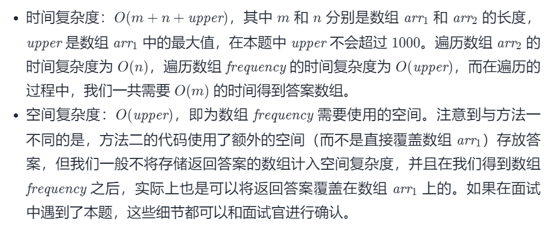

#### [1122. 数组的相对排序](https://leetcode-cn.com/problems/relative-sort-array/)

难度：简单

标签：[数组](../原理/数组.md)，[哈希表](../原理/哈希表.md)，[排序](../原理/排序.md)，计数排序

相同题目： [剑指 Offer II 075. 数组相对排序](https://leetcode-cn.com/problems/0H97ZC/)

给你两个数组，arr1 和 arr2，

arr2 中的元素各不相同
arr2 中的每个元素都出现在 arr1 中
对 arr1 中的元素进行排序，使 arr1 中项的相对顺序和 arr2 中的相对顺序相同。未在 arr2 中出现过的元素需要按照升序放在 arr1 的末尾。

 

示例：

输入：arr1 = [2,3,1,3,2,4,6,7,9,2,19], arr2 = [2,1,4,3,9,6]
输出：[2,2,2,1,4,3,3,9,6,7,19]


提示：

1 <= arr1.length, arr2.length <= 1000
0 <= arr1[i], arr2[i] <= 1000
arr2 中的元素 arr2[i] 各不相同
arr2 中的每个元素 arr2[i] 都出现在 arr1 中

#### 方法一：自定义排序

```python
class Solution:
    def relativeSortArray(self, arr1: List[int], arr2: List[int]) -> List[int]:
        def mycmp(x: int) -> (int, int):
            return (0, rank[x]) if x in rank else (1, x)
        
        rank = {x: i for i, x in enumerate(arr2)}
        arr1.sort(key=mycmp)
        return arr1
```

此外，由于题目中给定的元素都是正数，因此我们可以用 rank[x]−n 和 xx 分别代替 (0,rank[x]) 和 (1, x)，其中 n 是数组 arr2的长度（同时也是哈希表 rank 的大小）。这样做的正确性在于，rank[x]−n 一定是负数，而 x 一定是正数。

```python
class Solution:
    def relativeSortArray(self, arr1: List[int], arr2: List[int]) -> List[int]:
        def mycmp(x: int) -> (int, int):
            return rank[x] if x in rank else x
        
        n = len(arr2)
        rank = {x: i - n for i, x in enumerate(arr2)}
        arr1.sort(key=mycmp)
        return arr1
```


时间复杂度：O(mlogm+n)，其中 m 和 n 分别是数组 arr 1和arr2的长度。构造哈希表 rank 的时间复杂度为 O(n)，排序的时间复杂度为O(mlogm)。

空间复杂度：O(logm+n)，哈希表rank 需要的空间为O(n)，排序需要的栈空间为O(logm)。

#### 方法二：计数排序

注意到本题中元素的范围为 [0, 1000][0,1000]，这个范围不是很大，我们也可以考虑不基于比较的排序，例如「计数排序」。

具体地，我们使用一个长度为 1001（下标从 00 到 10001000）的数组 frequency，记录每一个元素在数组arr1中出现的次数。

随后我们遍历数组arr 2，当遍历到元素 x 时，我们将frequency[x] 个 x 加入答案中，并将frequency[x] 清零。当遍历结束后，所有在 arr 2中出现过的元素就已经有序了。

此时还剩下没有在arr 2中出现过的元素，因此我们还需要对整个数组 frequency 进行一次遍历。当遍历到元素 x 时，如果frequency[x] 不为 0，我们就将frequency[x] 个 x 加入答案中。

我们可以对空间复杂度进行一个小优化。实际上，我们不需要使用长度为1001 的数组，而是可以找出数组arr1中的最大值upper，使用长度为upper+1 的数组即可。

```python
class Solution:
    def relativeSortArray(self, arr1: List[int], arr2: List[int]) -> List[int]:
        upper = max(arr1)
        frequency = [0] * (upper + 1)
        for x in arr1:
            frequency[x] += 1
        
        ans = list()
        for x in arr2:
            ans.extend([x] * frequency[x])
            frequency[x] = 0
        for x in range(upper + 1):
            if frequency[x] > 0:
                ans.extend([x] * frequency[x])
        return ans
```




参考：https://leetcode-cn.com/problems/relative-sort-array/solution/shu-zu-de-xiang-dui-pai-xu-by-leetcode-solution/

