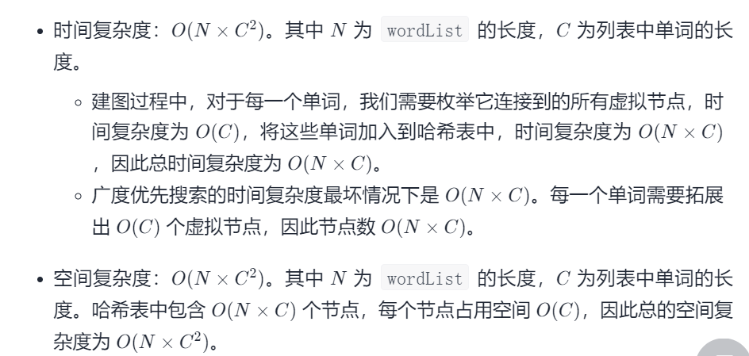
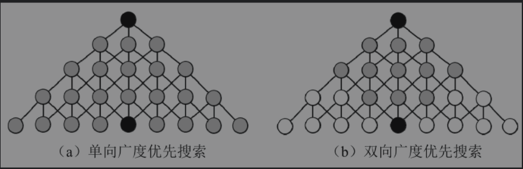

#### [127. 单词接龙](https://leetcode-cn.com/problems/word-ladder/)

难度：困难

标签：[广度优先搜索](../Topic/广度优先搜索.md)，[哈希表](../Topic/哈希表.md)，[字符串](../Topic/字符串.md)

相同题目： [剑指 Offer II 108. 单词演变](https://leetcode-cn.com/problems/om3reC/)

字典 wordList 中从单词 beginWord 和 endWord 的 转换序列 是一个按下述规格形成的序列：

序列中第一个单词是 beginWord 。
序列中最后一个单词是 endWord 。
每次转换只能改变一个字母。
转换过程中的中间单词必须是字典 wordList 中的单词。
给你两个单词 beginWord 和 endWord 和一个字典 wordList ，找到从 beginWord 到 endWord 的 最短转换序列 中的 单词数目 。如果不存在这样的转换序列，返回 0。


示例 1：

输入：beginWord = "hit", endWord = "cog", wordList = ["hot","dot","dog","lot","log","cog"]
输出：5
解释：一个最短转换序列是 "hit" -> "hot" -> "dot" -> "dog" -> "cog", 返回它的长度 5。
示例 2：

输入：beginWord = "hit", endWord = "cog", wordList = ["hot","dot","dog","lot","log"]
输出：0
解释：endWord "cog" 不在字典中，所以无法进行转换。


提示：

1 <= beginWord.length <= 10
endWord.length == beginWord.length
1 <= wordList.length <= 5000
wordList[i].length == beginWord.length
beginWord、endWord 和 wordList[i] 由小写英文字母组成
beginWord != endWord
wordList 中的所有字符串 互不相同

#### 方法一：广度优先搜索 + 优化建图

本题要求的是最短转换序列的长度，看到最短首先想到的就是广度优先搜索。想到广度优先搜索自然而然的就能想到图，但是本题并没有直截了当的给出图的模型，因此我们需要把它抽象成图的模型。

我们可以把每个单词都抽象为一个点，如果两个单词可以只改变一个字母进行转换，那么说明他们之间有一条双向边。因此我们只需要把满足转换条件的点相连，就形成了一张图。

基于该图，我们以 beginWord 为图的起点，以 endWord 为终点进行广度优先搜索，寻找 beginWord 到 endWord 的最短路径。


首先为了方便表示，我们先给每一个单词标号，即给每个单词分配一个 id。创建一个由单词 word 到 id 对应的映射 wordId，并将 beginWord 与 wordList 中所有的单词都加入这个映射中。之后我们检查 endWord 是否在该映射内，若不存在，则输入无解。我们可以使用哈希表实现上面的映射关系。

然后我们需要建图，依据朴素的思路，我们可以枚举每一对单词的组合，判断它们是否恰好相差一个字符，以判断这两个单词对应的节点是否能够相连。但是这样效率太低，我们可以优化建图。

具体地，我们可以创建虚拟节点。对于单词 hit，我们创建三个虚拟节点`*it、h*t、hi*`，并让 hit 向这三个虚拟节点分别连一条边即可。如果一个单词能够转化为 hit，那么该单词必然会连接到这三个虚拟节点之一。对于每一个单词，我们枚举它连接到的虚拟节点，把该单词对应的 id 与这些虚拟节点对应的 id 相连即可。

最后我们将起点加入队列开始广度优先搜索，当搜索到终点时，我们就找到了最短路径的长度。注意因为添加了虚拟节点，所以我们得到的距离为实际最短路径长度的两倍。同时我们并未计算起点对答案的贡献，所以我们应当返回距离的一半再加一的结果。

```python
import collections
class Solution:
    def ladderLength(self, beginWord: str, endWord: str, wordList: List[str]) -> int:
        def addWord(word: str):
            """字典wordId, key是单词，value是单词对应的id"""
            if word not in wordId:
                nonlocal nodeNum
                wordId[word] = nodeNum
                nodeNum += 1
        
        def addEdge(word: str):
            """字典edge,key是wordid,value是和word有边(只差一个字母)的虚拟单词"""
            addWord(word)
            id1 = wordId[word]
            chars = list(word)
            for i in range(len(chars)):
                tmp = chars[i]
                chars[i] = "*"
                newWord = "".join(chars)
                addWord(newWord)
                id2 = wordId[newWord]
                edge[id1].append(id2)
                edge[id2].append(id1)
                chars[i] = tmp

        wordId = dict()
        edge = collections.defaultdict(list)
        nodeNum = 0

        # 给列表里的每个单词及其虚拟单词以及beginWord创建边
        for word in wordList:
            addEdge(word)
        
        addEdge(beginWord)
        if endWord not in wordId:
            return 0
        
        dis = [float("inf")] * nodeNum
        beginId, endId = wordId[beginWord], wordId[endWord]
        dis[beginId] = 0

        que = collections.deque([beginId])   # 队列，先进先出
        while que:
            x = que.popleft()  # 当前单词
            if x == endId:   # 已经到达终点，因为有虚拟单词，所以除以2；因为beginWord没算在内，所以+1
                return dis[endId] // 2 + 1
            for it in edge[x]:  # 遍历和当前单词有边的虚拟单词
                if dis[it] == float("inf"):
                    dis[it] = dis[x] + 1  # 走到这个单词需要几步
                    que.append(it)   # 遍历所有的可能性，因为是队列所以是广度优先搜索
        
        return 0
```



剑指offer

不建图，记录每个单词的相邻单词

```python
from typing import List
from collections import deque


class Solution:
    def ladderLength(self, beginWord: str, endWord: str, wordList: List[str]) -> int:
        word_set = set(wordList)
        if len(word_set) == 0 or endWord not in word_set:
            return 0

        if beginWord in word_set:
            word_set.remove(beginWord)

        queue = deque()
        queue.append(beginWord)

        visited = set(beginWord)

        word_len = len(beginWord)
        step = 1
        while queue:
            current_size = len(queue)
            for i in range(current_size):
                word = queue.popleft()

                word_list = list(word)
                for j in range(word_len):
                    origin_char = word_list[j]

                    for k in range(26):
                        word_list[j] = chr(ord('a') + k)
                        next_word = ''.join(word_list)
                        if next_word in word_set:
                            if next_word == endWord:
                                return step + 1
                            if next_word not in visited:
                                queue.append(next_word)
                                visited.add(next_word)
                    word_list[j] = origin_char
            step += 1
        return 0


if __name__ == '__main__':
    beginWord = "hit"
    endWord = "cog"
    wordList = ["hot", "dot", "dog", "lot", "log", "cog"]
    solution = Solution()
    res = solution.ladderLength(beginWord, endWord, wordList)
    print(res)

作者：liweiwei1419
链接：https://leetcode-cn.com/problems/word-ladder/solution/yan-du-you-xian-bian-li-shuang-xiang-yan-du-you-2/
来源：力扣（LeetCode）
著作权归作者所有。商业转载请联系作者获得授权，非商业转载请注明出处。
```


#### 方法二：双向广度优先搜索

根据给定字典构造的图可能会很大，而广度优先搜索的搜索空间大小依赖于每层节点的分支数量。假如每个节点的分支数量相同，搜索空间会随着层数的增长指数级的增加。考虑一个简单的二叉树，每一层都是满二叉树的扩展，节点的数量会以 22 为底数呈指数增长。

如果使用两个同时进行的广搜可以有效地减少搜索空间。一边从 beginWord 开始，另一边从 endWord 开始。我们每次从两边各扩展一层节点，当发现某一时刻两边都访问过同一顶点时就停止搜索。这就是双向广度优先搜索，它可以可观地减少搜索空间大小，从而提高代码运行效率。



```python
class Solution:
    def ladderLength(self, beginWord: str, endWord: str, wordList: List[str]) -> int:
        def addWord(word: str):
            if word not in wordId:
                nonlocal nodeNum
                wordId[word] = nodeNum
                nodeNum += 1
        
        def addEdge(word: str):
            addWord(word)
            id1 = wordId[word]
            chars = list(word)
            for i in range(len(chars)):
                tmp = chars[i]
                chars[i] = "*"
                newWord = "".join(chars)
                addWord(newWord)
                id2 = wordId[newWord]
                edge[id1].append(id2)
                edge[id2].append(id1)
                chars[i] = tmp

        wordId = dict()
        edge = collections.defaultdict(list)
        nodeNum = 0

        for word in wordList:
            addEdge(word)
        
        addEdge(beginWord)
        if endWord not in wordId:
            return 0
        
        disBegin = [float("inf")] * nodeNum
        beginId = wordId[beginWord]
        disBegin[beginId] = 0
        queBegin = collections.deque([beginId])

        disEnd = [float("inf")] * nodeNum
        endId = wordId[endWord]
        disEnd[endId] = 0
        queEnd = collections.deque([endId])

        while queBegin or queEnd:
            queBeginSize = len(queBegin)
            for _ in range(queBeginSize):
                nodeBegin = queBegin.popleft()
                if disEnd[nodeBegin] != float("inf"):
                    return (disBegin[nodeBegin] + disEnd[nodeBegin]) // 2 + 1
                for it in edge[nodeBegin]:
                    if disBegin[it] == float("inf"):
                        disBegin[it] = disBegin[nodeBegin] + 1
                        queBegin.append(it)

            queEndSize = len(queEnd)
            for _ in range(queEndSize):
                nodeEnd = queEnd.popleft()
                if disBegin[nodeEnd] != float("inf"):
                    return (disBegin[nodeEnd] + disEnd[nodeEnd]) // 2 + 1
                for it in edge[nodeEnd]:
                    if disEnd[it] == float("inf"):
                        disEnd[it] = disEnd[nodeEnd] + 1
                        queEnd.append(it)
        
        return 0
```

时空复杂度同上

作者：LeetCode-Solution
链接：https://leetcode-cn.com/problems/word-ladder/solution/dan-ci-jie-long-by-leetcode-solution/
来源：力扣（LeetCode）
著作权归作者所有。商业转载请联系作者获得授权，非商业转载请注明出处。

剑指offer

```python
from typing import List
from collections import deque


class Solution:
    def ladderLength(self, beginWord: str, endWord: str, wordList: List[str]) -> int:
        word_set = set(wordList)
        if len(word_set) == 0 or endWord not in word_set:
            return 0

        if beginWord in word_set:
            word_set.remove(beginWord)

        visited = set()
        visited.add(beginWord)
        visited.add(endWord)

        begin_visited = set()
        begin_visited.add(beginWord)

        end_visited = set()
        end_visited.add(endWord)

        word_len = len(beginWord)
        step = 1
        # 简化成 while begin_visited 亦可
        while begin_visited and end_visited:
            # 打开帮助调试
            # print(begin_visited)
            # print(end_visited)

            if len(begin_visited) > len(end_visited):
                begin_visited, end_visited = end_visited, begin_visited

            next_level_visited = set()
            for word in begin_visited:
                word_list = list(word)

                for j in range(word_len):
                    origin_char = word_list[j]
                    for k in range(26):
                        word_list[j] = chr(ord('a') + k)
                        next_word = ''.join(word_list)
                        if next_word in word_set:
                            if next_word in end_visited:
                                return step + 1
                            if next_word not in visited:
                                next_level_visited.add(next_word)
                                visited.add(next_word)
                    word_list[j] = origin_char
            begin_visited = next_level_visited
            step += 1
        return 0


if __name__ == '__main__':
    beginWord = "hit"
    endWord = "cog"
    wordList = ["hot", "dot", "dog", "lot", "log", "cog"]

    solution = Solution()
    res = solution.ladderLength(beginWord, endWord, wordList)
    print(res)

作者：liweiwei1419
链接：https://leetcode-cn.com/problems/word-ladder/solution/yan-du-you-xian-bian-li-shuang-xiang-yan-du-you-2/
来源：力扣（LeetCode）
著作权归作者所有。商业转载请联系作者获得授权，非商业转载请注明出处。
```

其它参考：https://leetcode-cn.com/problems/word-ladder/solution/suan-fa-shi-xian-he-you-hua-javashuang-xiang-bfs23/
