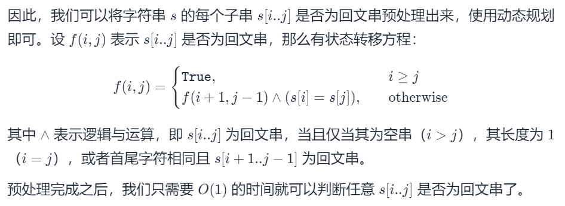
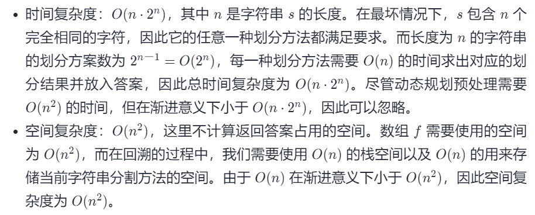

#### [131. 分割回文串](https://leetcode-cn.com/problems/palindrome-partitioning/)

难度：中等

标签：[深度优先搜索](../Topic/深度优先搜索.md)，[动态规划](../Topic/动态规划.md)，[回溯法](../Topic/回溯法.md)

给定一个字符串 *s*，将 *s* 分割成一些子串，使每个子串都是回文串。

返回 *s* 所有可能的分割方案。

**示例:**

```
输入: "aab"
输出:
[
  ["aa","b"],
  ["a","a","b"]
]
```

#### 方法一：回溯 + 动态规划预处理

由于需要求出字符串 s 的所有分割方案，因此我们考虑使用搜索 + 回溯的方法枚举所有可能的分割方法并进行判断。

假设我们当前搜索到字符串的第 ii 个字符，且 s[0..i-1]位置的所有字符已经被分割成若干个回文串，并且分割结果被放入了答案数组ans 中，那么我们就需要枚举下一个回文串的右边界 j，使得 s[i..j] 是一个回文串。

因此，我们可以从 i 开始，从小到大依次枚举 j。对于当前枚举的 j值，我们使用双指针的方法判断 s[i..j] 是否为回文串：如果 s[i..j]是回文串，那么就将其加入答案数组 ans 中，并以 j+1作为新的 i 进行下一层搜索，并在未来的回溯时将 s[i..j] 从ans 中移除。

如果我们已经搜索完了字符串的最后一个字符，那么就找到了一种满足要求的分割方法。

```python
class Solution:
    def partition(self, s: str) -> List[List[str]]:
        def checkPalindrome(str, left, right):
            while left < right:
                if str[left] != str[right]:
                    return False
                left += 1
                right -= 1
            return True

        def backtrack(s, start, len):
            if start == len:
                res.append(copy.deepcopy(stack))
                return
            for i in range(start, len):
                # 因为截取字符串是消耗性能的，因此，采用传子串索引的方式判断一个子串是否是回文子串
                # 不是的话，剪枝
                if not checkPalindrome(s, start, i):
                    continue

                stack.append(s[start:i+1])
                backtrack(s, i + 1, len)
                stack.pop()


        res = []
        n = len(s)
        if n == 0:
            return res
        stack = []
        backtrack(s, 0, n)
        return res
```

当我们在判断 s[i..j]是否为回文串时，常规的方法是使用双指针分别指向 i 和 j，每次判断两个指针指向的字符是否相同，直到两个指针相遇。然而这种方法会产生重复计算，例如下面这个例子：

当 s=aaba 时，对于前 2 个字符 aa，我们有 2 种分割方法[aa] 和[a,a]，当我们每一次搜索到字符串的第 i=2 个字符b 时，都需要对于每个 s[i..j] 使用双指针判断其是否为回文串，这就产生了重复计算。



```python
class Solution:
    def partition(self, s: str) -> List[List[str]]:
        n = len(s)
        f = [[True] * n for _ in range(n)]

        for i in range(n - 1, -1, -1):
            for j in range(i + 1, n):
                f[i][j] = (s[i] == s[j]) and f[i + 1][j - 1]

        ret = list()
        ans = list()

        def dfs(i: int):
            if i == n:
                ret.append(ans[:])
                return
            
            for j in range(i, n):
                if f[i][j]:
                    ans.append(s[i:j+1])
                    dfs(j + 1)
                    ans.pop()

        dfs(0)
        return ret
```



#### 方法二：回溯 + 记忆化搜索

方法一中的动态规划预处理计算出了任意的 s[i..j]是否为回文串，我们也可以将这一步改为记忆化搜索。

```python
class Solution:
    def partition(self, s: str) -> List[List[str]]:
        n = len(s)

        ret = list()
        ans = list()

        @cache
        def isPalindrome(i: int, j: int) -> int:
            if i >= j:
                return 1
            return isPalindrome(i + 1, j - 1) if s[i] == s[j] else -1

        def dfs(i: int):
            if i == n:
                ret.append(ans[:])
                return
            
            for j in range(i, n):
                if isPalindrome(i, j) == 1:
                    ans.append(s[i:j+1])
                    dfs(j + 1)
                    ans.pop()

        dfs(0)
        isPalindrome.cache_clear()
        return ret
```

时间空间复杂度与方法一相同

参考：https://leetcode-cn.com/problems/palindrome-partitioning/solution/fen-ge-hui-wen-chuan-by-leetcode-solutio-6jkv/

