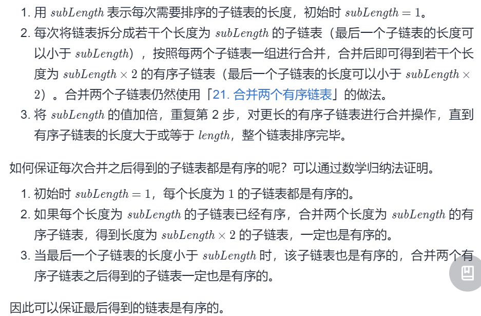

#### [148. 排序链表](https://leetcode-cn.com/problems/sort-list/)

难度：中等

标签：[链表](../Topic/链表.md)，[双指针](../Topic/双指针.md)，[分治算法](../Topic/分治算法.md)，[排序](../Topic/排序.md)，归并排序

相同题目：[剑指 Offer II 077. 链表排序](https://leetcode-cn.com/problems/7WHec2/)

给你链表的头结点 head ，请将其按 升序 排列并返回 排序后的链表 。

进阶：

你可以在 O(n log n) 时间复杂度和常数级空间复杂度下，对链表进行排序吗？


示例 1：


输入：head = [4,2,1,3]
输出：[1,2,3,4]
示例 2：


输入：head = [-1,5,3,4,0]
输出：[-1,0,3,4,5]
示例 3：

输入：head = []
输出：[]


提示：

链表中节点的数目在范围 [0, 5 * 10^4] 内
-10^5 <= Node.val <= 10^5


前面讨论的排序算法的输入都是数组。这个问题的输入是一个链表，所以需要找到一个最适合链表的排序算法。

由于题目没有限定数字的范围，因此计数排序就不太适合。但可以考虑使用插入排序、冒泡排序等算法对链表进行排序，这些算法比较直观，实现起来也比较简单。只是这些算法的时间复杂度是O（n2），未必是最高效的算法。

接下来考虑对数组进行排序的时间复杂度为O（nlogn）的排序算法，常用的有堆排序、快速排序和归并排序。

如果输入的是一个数组，那么堆排序用数组实现最大堆，该排序算法每次取出其中的最大值，再调整剩余的最大堆，直到所有数字都被取出。第9章已经介绍了如何用数组实现堆，其本质是将堆中的节点进行编号，数组的下标与节点的编号对应。可以根据某个数字的下标计算其父节点或子节点在数组中的下标。在数组中只需要O（1）的时间就能根据下标找到一个数字，但在链表中需要O（n）的时间才能根据节点的编号找到对应的节点。因此，不可能直接利用链表实现堆排序，但是如果链表的长度为n就可以创建一个长度为n的数组来实现堆，也就是说，通过O（n）的空间代价来实现堆排序。

接下来考虑快速排序。通常，快速排序算法首先随机生成一个下标，并以该下标对应的值作为中间值进行分区。如果输入的是数组，那么只需要O（1）的时间就能根据下标找到一个数字。但如果输入的是链表，那么需要O（n）的时间才能根据节点的编号找到对应的节点。快速排序也可以考虑不用随机的中间值，而是始终以某个固定位置的值作为中间值（如链表的头节点或尾节点），这样可能会出现每次分区时两个子链表的大小都不均衡，从而使时间复杂度退化为O（n2）。因此，虽然可以用快速排序算法对链表进行排序，但不如对数组排序高效。

那么归并排序是否适合链表？归并排序的主要思想是将链表分成两个子链表，在对两个子链表排序后再将它们合并成一个排序的链表。这看起来没有什么问题，所以可以尝试基于归并排序算法对链表进行排序。

#### 方法一：自顶向下归并排序

找到链表的中点，以中点为分界，将链表拆分成两个子链表。寻找链表的中点可以使用快慢指针的做法，快指针每次移动 2 步，慢指针每次移动 1 步，当快指针到达链表末尾时，慢指针指向的链表节点即为链表的中点。

对两个子链表分别排序。

将两个排序后的子链表合并，得到完整的排序后的链表。可以使用「21. 合并两个有序链表」的做法，将两个有序的子链表进行合并。

上述过程可以通过递归实现。递归的终止条件是链表的节点个数小于或等于 1，即当链表为空或者链表只包含 1个节点时，不需要对链表进行拆分和排序。

```python
class Solution:
    def sortList(self, head: ListNode) -> ListNode:
        def sortFunc(head: ListNode, tail: ListNode) -> ListNode:
            if not head:
                return head
            if head.next == tail:
                head.next = None
                return head
            # 寻找中间节点
            slow = fast = head
            while fast != tail:
                slow = slow.next
                fast = fast.next
                if fast != tail:
                    fast = fast.next
            mid = slow
            return merge(sortFunc(head, mid), sortFunc(mid, tail))
            
        def merge(head1: ListNode, head2: ListNode) -> ListNode:
            dummyHead = ListNode(0)
            temp, temp1, temp2 = dummyHead, head1, head2
            while temp1 and temp2:
                if temp1.val <= temp2.val:
                    temp.next = temp1
                    temp1 = temp1.next
                else:
                    temp.next = temp2
                    temp2 = temp2.next
                temp = temp.next
            if temp1:
                temp.next = temp1
            elif temp2:
                temp.next = temp2
            return dummyHead.next
        
        return sortFunc(head, None)
```


时间复杂度：O(nlogn)，其中 n 是链表的长度。

空间复杂度：O(logn)，其中 n 是链表的长度。空间复杂度主要取决于递归调用的栈空间。

也可以这么写

```python
class Solution:
    def sortList(self, head: ListNode) -> ListNode:
        if not head or not head.next: return head # termination.
        # cut the LinkedList at the mid index.
        slow, fast = head, head.next
        while fast and fast.next:
            fast, slow = fast.next.next, slow.next
        mid, slow.next = slow.next, None # save and cut.
        # recursive for cutting.
        left, right = self.sortList(head), self.sortList(mid)
        # merge `left` and `right` linked list and return it.
        h = res = ListNode(0)
        while left and right:
            if left.val < right.val: h.next, left = left, left.next
            else: h.next, right = right, right.next
            h = h.next
        h.next = left if left else right
        return res.next

作者：jyd
链接：https://leetcode-cn.com/problems/sort-list/solution/sort-list-gui-bing-pai-xu-lian-biao-by-jyd/
来源：力扣（LeetCode）
著作权归作者所有。商业转载请联系作者获得授权，非商业转载请注明出处。
```


#### 方法二：自底向上归并排序

使用自底向上的方法实现归并排序，则可以达到 O(1)的空间复杂度。

首先求得链表的长度*length*，然后将链表拆分成子链表进行合并。



```python
class Solution:
    def sortList(self, head: ListNode) -> ListNode:
        def merge(head1: ListNode, head2: ListNode) -> ListNode:
            dummyHead = ListNode(0)
            temp, temp1, temp2 = dummyHead, head1, head2
            while temp1 and temp2:
                if temp1.val <= temp2.val:
                    temp.next = temp1
                    temp1 = temp1.next
                else:
                    temp.next = temp2
                    temp2 = temp2.next
                temp = temp.next
            if temp1:
                temp.next = temp1
            elif temp2:
                temp.next = temp2
            return dummyHead.next
        
        if not head:
            return head
        
        length = 0
        node = head
        while node:
            length += 1
            node = node.next
        
        dummyHead = ListNode(0, head)
        subLength = 1
        while subLength < length:
            prev, curr = dummyHead, dummyHead.next
            while curr:
                head1 = curr
                for i in range(1, subLength):
                    if curr.next:
                        curr = curr.next
                    else:
                        break
                head2 = curr.next
                curr.next = None
                curr = head2
                for i in range(1, subLength):
                    if curr and curr.next:
                        curr = curr.next
                    else:
                        break
                
                succ = None
                if curr:
                    succ = curr.next
                    curr.next = None
                
                merged = merge(head1, head2)
                prev.next = merged
                while prev.next:
                    prev = prev.next
                curr = succ
            subLength <<= 1
        
        return dummyHead.next
```

- 时间复杂度：O*(*n*log*n*)，其中 n* 是链表的长度。
- 空间复杂度：O*(1)。

参考：https://leetcode-cn.com/problems/sort-list/solution/pai-xu-lian-biao-by-leetcode-solution/

或者

对于非递归的归并排序，需要使用迭代的方式替换`cut`环节

我们知道，cut环节本质上是通过二分法得到链表最小节点单元，再通过多轮合并得到排序结果。
每一轮合并merge操作针对的单元都有固定长度intv，例如：
第一轮合并时intv = 1，即将整个链表切分为多个长度为1的单元，并按顺序两两排序合并，合并完成的已排序单元长度为2。
第二轮合并时intv = 2，即将整个链表切分为多个长度为2的单元，并按顺序两两排序合并，合并完成已排序单元长度为4。
以此类推，直到单元长度intv >= 链表长度，代表已经排序完成。

根据以上推论，我们可以仅根据intv计算每个单元边界，并完成链表的每轮排序合并，例如:
当intv = 1时，将链表第1和第2节点排序合并，第3和第4节点排序合并，……。
当intv = 2时，将链表第1-2和第3-4节点排序合并，第5-6和第7-8节点排序合并，……。
当intv = 4时，将链表第1-4和第5-8节点排序合并，第9-12和第13-16节点排序合并，……。
此方法时间复杂度O(nlogn)，空间复杂度O(1)。

```python
class Solution:
    def sortList(self, head: ListNode) -> ListNode:
        h, length, intv = head, 0, 1
        while h: h, length = h.next, length + 1
        res = ListNode(0)
        res.next = head
        # merge the list in different intv.
        while intv < length:
            pre, h = res, res.next
            while h:
                # get the two merge head `h1`, `h2`
                h1, i = h, intv
                while i and h: h, i = h.next, i - 1
                if i: break # no need to merge because the `h2` is None.
                h2, i = h, intv
                while i and h: h, i = h.next, i - 1
                c1, c2 = intv, intv - i # the `c2`: length of `h2` can be small than the `intv`.
                # merge the `h1` and `h2`.
                while c1 and c2:
                    if h1.val < h2.val: pre.next, h1, c1 = h1, h1.next, c1 - 1
                    else: pre.next, h2, c2 = h2, h2.next, c2 - 1
                    pre = pre.next
                pre.next = h1 if c1 else h2
                while c1 > 0 or c2 > 0: pre, c1, c2 = pre.next, c1 - 1, c2 - 1
                pre.next = h 
            intv *= 2
        return res.next

作者：jyd
链接：https://leetcode-cn.com/problems/sort-list/solution/sort-list-gui-bing-pai-xu-lian-biao-by-jyd/
来源：力扣（LeetCode）
著作权归作者所有。商业转载请联系作者获得授权，非商业转载请注明出处。
```

