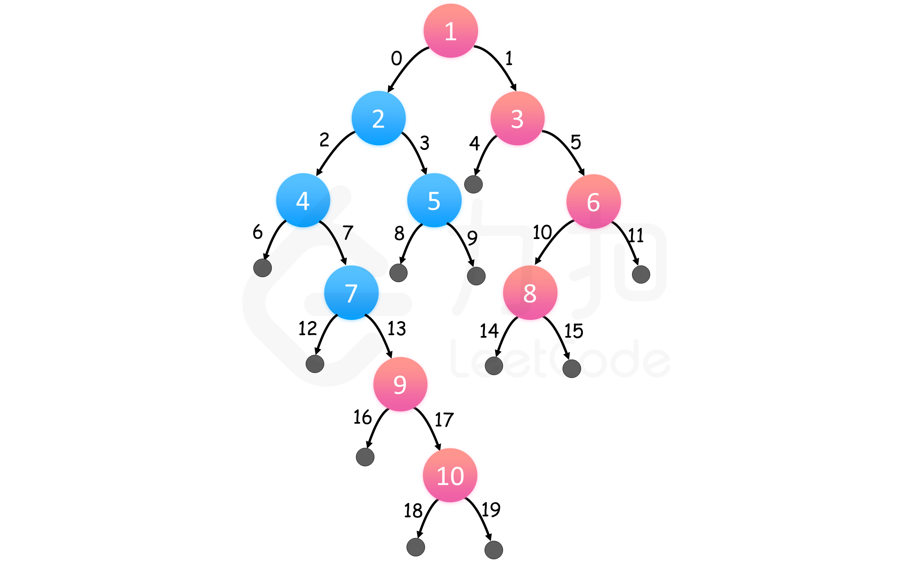

#### [199. 二叉树的右视图](https://leetcode-cn.com/problems/binary-tree-right-side-view/)

难度：中等

标签：[树](../Topic/树.md)，[深度优先搜索](../Topic/深度优先搜索.md)，[广度优先搜索](../Topic/广度优先搜索.md)，[递归](../Topic/递归.md)，[队列](../Topic/队列.md)

给定一棵二叉树，想象自己站在它的右侧，按照从顶部到底部的顺序，返回从右侧所能看到的节点值。

示例:

输入: [1,2,3,null,5,null,4]
输出: [1, 3, 4]
解释:

   1            <---
 /   \
2     3         <---
 \     \
  5     4       <---


####GFS

我们可以对二叉树进行层次遍历，那么对于每层来说，最右边的结点一定是最后被遍历到的。二叉树的层次遍历可以用广度优先搜索实现。

执行广度优先搜索，左结点排在右结点之前，这样，我们对每一层都从左到右访问。因此，只保留每个深度最后访问的结点，我们就可以在遍历完整棵树后得到每个深度最右的结点。



我的：

```python
class Solution:
    def rightSideView(self, root: TreeNode) -> List[int]:
        if not root:
            return []
        res = []
        queue = [root]
        while queue:
            res.append(queue[-1].val)
            newqueue = []
            for node in queue:
                if node.left:
                    newqueue.append(node.left)
                if node.right:
                    newqueue.append(node.right)
            queue = newqueue
        return res
```

官方

```python
class Solution:
    def rightSideView(self, root: TreeNode) -> List[int]:
        rightmost_value_at_depth = dict() # 深度为索引，存放节点的值
        max_depth = -1

        queue = deque([(root, 0)])
        while queue:
            node, depth = queue.popleft()

            if node is not None:
                # 维护二叉树的最大深度
                max_depth = max(max_depth, depth)

                # 由于每一层最后一个访问到的节点才是我们要的答案，因此不断更新对应深度的信息即可
                rightmost_value_at_depth[depth] = node.val

                queue.append((node.left, depth + 1))
                queue.append((node.right, depth + 1))

        return [rightmost_value_at_depth[depth] for depth in range(max_depth + 1)]
```

时间复杂度 : O(n)。 每个节点最多进队列一次，出队列一次，因此广度优先搜索的复杂度为线性。

空间复杂度 : O(n)。每个节点最多进队列一次，所以队列长度最大不不超过 nn，所以这里的空间代价为 O(n)。

注：deque 数据类型来自于collections 模块，支持从头和尾部的常数时间 append/pop 操作。若使用 Python 的 list，通过 list.pop(0) 去除头部会消耗 O(n)O(n) 的时间。


####官方DFS

**思路**

我们对树进行深度优先搜索，在搜索过程中，我们总是先访问右子树。那么对于每一层来说，我们在这层见到的第一个结点一定是最右边的结点。

这样一来，我们可以存储在每个深度访问的第一个结点，一旦我们知道了树的层数，就可以得到最终的结果数组。


```python
class Solution:
    def rightSideView(self, root: TreeNode) -> List[int]:
        rightmost_value_at_depth = dict() # 深度为索引，存放节点的值
        max_depth = -1

        # 存放(结点，深度)的元组
        stack = [(root, 0)]
        while stack:
            node, depth = stack.pop()

            if node is not None:
                # 维护二叉树的最大深度
                max_depth = max(max_depth, depth)

                # 如果不存在对应深度的节点我们才插入
                rightmost_value_at_depth.setdefault(depth, node.val)

                # 依次添加左子树和右子树
                stack.append((node.left, depth + 1))
                stack.append((node.right, depth + 1))

        return [rightmost_value_at_depth[depth] for depth in range(max_depth + 1)]
```

时间复杂度 : O(n)。深度优先搜索最多访问每个结点一次，因此是线性复杂度。

空间复杂度 : O(n)。最坏情况下，栈内会包含接近树高度的结点数量，占用 O(n) 的空间。


