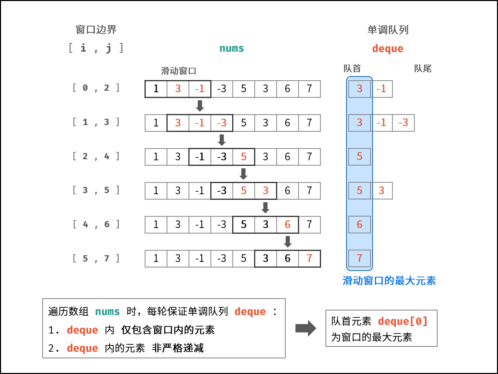

#### [239. 滑动窗口最大值](https://leetcode-cn.com/problems/sliding-window-maximum/)

和[剑指 Offer 59 - I. 滑动窗口的最大值](https://leetcode-cn.com/problems/hua-dong-chuang-kou-de-zui-da-zhi-lcof/)相同

难度：困难

标签：[队列](../原理/队列.md)，[Sliding Window](../原理/Sliding%20Window.md)

给你一个整数数组 nums，有一个大小为 k 的滑动窗口从数组的最左侧移动到数组的最右侧。你只可以看到在滑动窗口内的 k 个数字。滑动窗口每次只向右移动一位。

返回滑动窗口中的最大值。

 

示例 1：

输入：nums = [1,3,-1,-3,5,3,6,7], k = 3
输出：[3,3,5,5,6,7]
解释：
滑动窗口的位置                最大值

---------------               -----
[1  3  -1] -3  5  3  6  7       3
 1 [3  -1  -3] 5  3  6  7       3
 1  3 [-1  -3  5] 3  6  7       5
 1  3  -1 [-3  5  3] 6  7       5
 1  3  -1  -3 [5  3  6] 7       6
 1  3  -1  -3  5 [3  6  7]      7
示例 2：

输入：nums = [1], k = 1
输出：[1]
示例 3：

输入：nums = [1,-1], k = 1
输出：[1,-1]
示例 4：

输入：nums = [9,11], k = 2
输出：[11]
示例 5：

输入：nums = [4,-2], k = 2
输出：[4]


提示：

1 <= nums.length <= 10^5
-10^4 <= nums[i] <= 10^4
1 <= k <= nums.length

#### 解题思路一

遍历数组，将 数 存放在双向队列中，并用 L,R 来标记窗口的左边界和右边界。队列中保存的并不是真的 数，而是该数值对应的数组下标位置，并且数组中的数要从大到小排序。如果当前遍历的数比队尾的值大，则需要弹出队尾值，直到队列重新满足从大到小的要求。刚开始遍历时，L 和 R 都为 0，有一个形成窗口的过程，此过程没有最大值，L 不动，R 向右移。当窗口大小形成时，L 和 R 一起向右移，每次移动时，判断队首的值的数组下标是否在 [L,R] 中，如果不在则需要弹出队首的值，当前窗口的最大值即为队首的数。

输入: nums = [1,3,-1,-3,5,3,6,7], 和 k = 3
输出: [3,3,5,5,6,7]

解释过程中队列中都是具体的值，方便理解，具体见代码。
初始状态：L=R=0,队列:{}
i=0,nums[0]=1。队列为空,直接加入。队列：{1}
i=1,nums[1]=3。队尾值为1，3>1，弹出队尾值，加入3。队列：{3}
i=2,nums[2]=-1。队尾值为3，-1<3，直接加入。队列：{3,-1}。此时窗口已经形成，L=0,R=2，result=[3]
i=3,nums[3]=-3。队尾值为-1，-3<-1，直接加入。队列：{3,-1,-3}。队首3对应的下标为1，L=1,R=3，有效。result=[3,3]
i=4,nums[4]=5。队尾值为-3，5>-3，依次弹出后加入。队列：{5}。此时L=2,R=4，有效。result=[3,3,5]
i=5,nums[5]=3。队尾值为5，3<5，直接加入。队列：{5,3}。此时L=3,R=5，有效。result=[3,3,5,5]
i=6,nums[6]=6。队尾值为3，6>3，依次弹出后加入。队列：{6}。此时L=4,R=6，有效。result=[3,3,5,5,6]
i=7,nums[7]=7。队尾值为6，7>6，弹出队尾值后加入。队列：{7}。此时L=5,R=7，有效。result=[3,3,5,5,6,7]

通过示例发现 `R=i`，`L=k-R`。由于队列中的值是从大到小排序的，所以每次窗口变动时，只需要判断队首的值是否还在窗口中就行了。

链接：https://leetcode-cn.com/problems/sliding-window-maximum/solution/shuang-xiang-dui-lie-jie-jue-hua-dong-chuang-kou-2/

#### 单调队列

链接：https://leetcode-cn.com/problems/hua-dong-chuang-kou-de-zui-da-zhi-lcof/solution/mian-shi-ti-59-i-hua-dong-chuang-kou-de-zui-da-1-6/




**本题难点：** 如何在每次窗口滑动后，将 “获取窗口内最大值” 的时间复杂度从 O(k) 降低至 O(1) 。

```python
class Solution:
    def maxSlidingWindow(self, nums: List[int], k: int) -> List[int]:
        # 双端队列
        deque = collections.deque()
        res, n = [], len(nums)
        for i, j in zip(range(1 - k, n + 1 - k), range(n)):
            # 删除 deque 中对应的 nums[i-1]
            if i > 0 and deque[0] == nums[i - 1]:
                deque.popleft()
            # 保持 deque 递减
            while deque and deque[-1] < nums[j]:
                deque.pop()
            deque.append(nums[j])
            # 记录窗口最大值
            if i >= 0:
                res.append(deque[0])
        return res
```

优化

```python
class Solution:
    def maxSlidingWindow(self, nums: List[int], k: int) -> List[int]:
        if not nums or k == 0: return []
        deque = collections.deque()
        # 未形成窗口
		# 单调队列，push元素并且把队列中比当前元素小的都删掉，保持单调递减（不严格）
		# 初始化，第一个窗口的最大值及后面的元素
        for i in range(k):
            while deque and deque[-1] < nums[i]:
                deque.pop()
            deque.append(nums[i])
        res = [deque[0]]  # 第一个最大值
        # 形成窗口后
        for i in range(k, len(nums)):
            if deque[0] == nums[i - k]:  # 删掉不在窗口内的元素
                deque.popleft()
			# push元素并且把队列中比当前元素小的都删掉，保持单调递减（不严格）
            while deque and deque[-1] < nums[i]:
                deque.pop()
            deque.append(nums[i])
            res.append(deque[0])
        return res
```

链接：https://leetcode-cn.com/problems/hua-dong-chuang-kou-de-zui-da-zhi-lcof/solution/mian-shi-ti-59-i-hua-dong-chuang-kou-de-zui-da-1-6/

### 官方题解

#### 方法一：优先队列

对于「最大值」，我们可以想到一种非常合适的数据结构，那就是优先队列（堆），其中的大根堆可以帮助我们实时维护一系列元素中的最大值。

初始时，我们将数组 nums 的前 k 个元素放入优先队列中。每当我们向右移动窗口时，我们就可以把一个新的元素放入优先队列中，此时堆顶的元素就是堆中所有元素的最大值。然而这个最大值可能并不在滑动窗口中，在这种情况下，这个值在数组nums 中的位置出现在滑动窗口左边界的左侧。因此，当我们后续继续向右移动窗口时，这个值就永远不可能出现在滑动窗口中了，我们可以将其永久地从优先队列中移除。

链接：https://leetcode-cn.com/problems/sliding-window-maximum/solution/hua-dong-chuang-kou-zui-da-zhi-by-leetco-ki6m/

我们不断地移除堆顶的元素，直到其确实出现在滑动窗口中。此时，堆顶元素就是滑动窗口中的最大值。为了方便判断堆顶元素与滑动窗口的位置关系，我们可以在优先队列中存储二元组(num,index)，表示元素num 在数组中的下标为 index。

```python
class Solution:
    def maxSlidingWindow(self, nums: List[int], k: int) -> List[int]:
        n = len(nums)
        # 注意 Python 默认的优先队列是小根堆
        q = [(-nums[i], i) for i in range(k)]
        heapq.heapify(q)

        ans = [-q[0][0]]
        for i in range(k, n):
            heapq.heappush(q, (-nums[i], i))
            while q[0][1] <= i - k:
                heapq.heappop(q)
            ans.append(-q[0][0])
        
        return ans
```

时间复杂度：O(nlogn)，其中 n 是数组 nums 的长度。在最坏情况下，数组 nums 中的元素单调递增，那么最终优先队列中包含了所有元素，没有元素被移除。由于将一个元素放入优先队列的时间复杂度为 O(logn)，因此总时间复杂度为 O(nlogn)。

空间复杂度：O(n)，即为优先队列需要使用的空间。这里所有的空间复杂度分析都不考虑返回的答案需要的 O(n)空间，只计算额外的空间使用。

#### 方法二：单调队列

看这个解释更好：https://leetcode-cn.com/problems/sliding-window-maximum/solution/dan-diao-dui-lie-by-labuladong/

**思路与算法**

顺着方法一的思路继续进行优化。

由于我们需要求出的是滑动窗口的最大值，如果当前的滑动窗口中有两个下标 i 和 j，其中 i 在 j 的左侧（i < j），并且 i 对应的元素不大于 j 对应的元素（nums[i]≤nums[j]），那么会发生什么呢？

当滑动窗口向右移动时，只要 i 还在窗口中，那么 j 一定也还在窗口中，这是 i 在 j 的左侧所保证的。因此，由于 nums[j] 的存在，nums[i] 一定不会是滑动窗口中的最大值了，我们可以将nums[i] 永久地移除。

因此我们可以使用一个队列存储所有还没有被移除的下标。在队列中，这些下标按照从小到大的顺序被存储，并且它们在数组nums 中对应的值是严格单调递减的。因为如果队列中有两个相邻的下标，它们对应的值相等或者递增，那么令前者为 i，后者为 j，就对应了上面所说的情况，即nums[i] 会被移除，这就产生了矛盾。

当滑动窗口向右移动时，我们需要把一个新的元素放入队列中。为了保持队列的性质，我们会不断地将新的元素与队尾的元素相比较，如果前者大于等于后者，那么队尾的元素就可以被永久地移除，我们将其弹出队列。我们需要不断地进行此项操作，直到队列为空或者新的元素小于队尾的元素。

由于队列中下标对应的元素是严格单调递减的，因此此时队首下标对应的元素就是滑动窗口中的最大值。但与方法一中相同的是，此时的最大值可能在滑动窗口左边界的左侧，并且随着窗口向右移动，它永远不可能出现在滑动窗口中了。因此我们还需要不断从队首弹出元素，直到队首元素在窗口中为止。

为了可以同时弹出队首和队尾的元素，我们需要使用双端队列。满足这种单调性的双端队列一般称作「单调队列」。

作者：LeetCode-Solution
链接：https://leetcode-cn.com/problems/sliding-window-maximum/solution/hua-dong-chuang-kou-zui-da-zhi-by-leetco-ki6m/
来源：力扣（LeetCode）
著作权归作者所有。商业转载请联系作者获得授权，非商业转载请注明出处。

```python
class Solution:
    def maxSlidingWindow(self, nums: List[int], k: int) -> List[int]:
        n = len(nums)
        q = collections.deque()
		# 保存的是下标，而不是值
        for i in range(k):
            while q and nums[i] >= nums[q[-1]]:
                q.pop()
            q.append(i)

        ans = [nums[q[0]]]
        for i in range(k, n):
            while q and nums[i] >= nums[q[-1]]:
                q.pop()
            q.append(i)
            while q[0] <= i - k:
                q.popleft()
            ans.append(nums[q[0]])
        
        return ans
```

时间复杂度：O(n)，其中 n 是数组nums 的长度。每一个下标恰好被放入队列一次，并且最多被弹出队列一次，因此时间复杂度为 O(n)。

空间复杂度：O(k)。与方法一不同的是，在方法二中我们使用的数据结构是双向的，因此「不断从队首弹出元素」保证了队列中最多不会有超过k+1 个元素，因此队列使用的空间为 O(k)。

#### 方法三：分块 + 预处理

https://leetcode-cn.com/problems/sliding-window-maximum/solution/hua-dong-chuang-kou-zui-da-zhi-by-leetco-ki6m/

```python
class Solution:
    def maxSlidingWindow(self, nums: List[int], k: int) -> List[int]:
        n = len(nums)
        prefixMax, suffixMax = [0] * n, [0] * n
        for i in range(n):
            if i % k == 0:
                prefixMax[i] = nums[i]
            else:
                prefixMax[i] = max(prefixMax[i - 1], nums[i])
        for i in range(n - 1, -1, -1):
            if i == n - 1 or (i + 1) % k == 0:
                suffixMax[i] = nums[i]
            else:
                suffixMax[i] = max(suffixMax[i + 1], nums[i])

        ans = [max(suffixMax[i], prefixMax[i + k - 1]) for i in range(n - k + 1)]
        return ans
```

时间复杂度：O(n)，其中 n 是数组 nums 的长度。我们需要 O(n)的时间预处理出数组prefixMax，suffixMax 以及计算答案。

空间复杂度：O(n)，即为存储prefixMax 和suffixMax 需要的空间。


