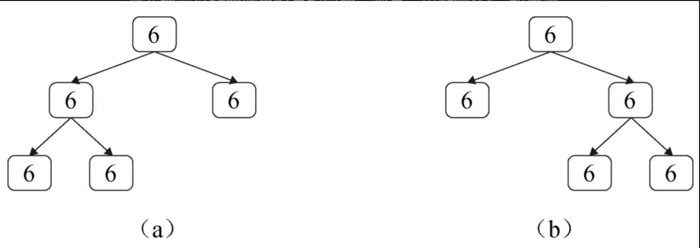

#### [297. 二叉树的序列化与反序列化](https://leetcode-cn.com/problems/serialize-and-deserialize-binary-tree/)

难度：困难

标签：[树](../Topic/树.md)，[深度优先搜索](../Topic/深度优先搜索.md)，[广度优先搜索](../Topic/广度优先搜索.md)，[设计](../Topic/设计.md)，[字符串](../Topic/字符串.md)

这道题和[剑指 Offer II 048. 序列化与反序列化二叉树](https://leetcode-cn.com/problems/h54YBf/)一样

序列化是将一个数据结构或者对象转换为连续的比特位的操作，进而可以将转换后的数据存储在一个文件或者内存中，同时也可以通过网络传输到另一个计算机环境，采取相反方式重构得到原数据。

请设计一个算法来实现二叉树的序列化与反序列化。这里不限定你的序列 / 反序列化算法执行逻辑，你只需要保证一个二叉树可以被序列化为一个字符串并且将这个字符串反序列化为原始的树结构。

提示: 输入输出格式与 LeetCode 目前使用的方式一致，详情请参阅 LeetCode 序列化二叉树的格式。你并非必须采取这种方式，你也可以采用其他的方法解决这个问题。

 

示例 1：


输入：root = [1,2,3,null,null,4,5]
输出：[1,2,3,null,null,4,5]

示例 2：

输入：root = []
输出：[]
示例 3：

输入：root = [1]
输出：[1]
示例 4：

输入：root = [1,2]
输出：[1,2]


提示：

树中结点数在范围 [0, 10^4] 内
-1000 <= Node.val <= 1000


## 剑指offer解法

先考虑如何将二叉树序列化为一个字符串。需要逐个遍历二叉树的每个节点，每遍历到一个节点就将节点的值序列化到字符串中。以前序遍历的顺序遍历二叉树最适合序列化。如果采用前序遍历的顺序，那么二叉树的根节点最先序列化到字符串中，然后是左子树，最后是右子树。这样做的好处是在反序列化时最方便，从字符串中读出的第1个数值一定是根节点的值。

实际上，只把节点的值序列化到字符串中是不够的。首先，要用一个分隔符（如逗号）把不同的节点分隔开。其次，还要考虑如何才能在反序列化的时候构建不同结构的二叉树。例如，图8.3（a）和图8.3（b）中的二叉树都有5个节点，并且每个节点的值都是6。如果只把节点的值序列化到字符串，那么序列化这两棵二叉树的结果将是相同的，都是一串数字"6"。如果这样，反序列化的时候就不能构建不同结构的二叉树。



说明：（a）序列化成字符串"6，6，6，＃，＃，6，＃，＃，6，＃，＃"的二叉树；（b）序列化成字符串"6，6，＃，＃，6，6，＃，＃，6，＃，＃"的二叉树

```python
class Codec:

    def serialize(self, root):
        """Encodes a tree to a single string.
        
        :type root: TreeNode
        :rtype: str
        """
        if not root:
            return "None"
        return str(root.val)+","+self.serialize(root.left)+","+self.serialize(root.right)
        

    def deserialize(self, data):
        """Decodes your encoded data to tree.
        
        :type data: str
        :rtype: TreeNode
        """
        nodestrs = data.split(",")
        i = [0]
        return self.dfs(nodestrs, i)
    
    def dfs(self, strs, i):
        tmpstr = strs[i[0]]
        i[0] += 1
        if tmpstr == "None":
            return None
        node = TreeNode(int(tmpstr))
        node.left = self.dfs(strs, i)
        node.right = self.dfs(strs, i)
        return node
```


时间复杂度：在序列化和反序列化函数中，我们只访问每个节点一次，因此时间复杂度为 O(n)，其中 n 是节点数，即树的大小。
空间复杂度：在序列化和反序列化函数中，我们递归会使用栈空间，故渐进空间复杂度为 O(n)。

## BFS


```python
from collections import deque
class Codec:
    def serialize(self, root):
        """Encodes a tree to a single string.
        
        :type root: TreeNode
        :rtype: str
        """
        if not root: return []
        q = deque()
        q.append(root)
        res = ''
        while q:
            node = q.popleft()
            if node != None:
                res += str(node.val) + ','
                q.append(node.left)
                q.append(node.right)
            else:
                res += 'X,'
        return res

        

    def deserialize(self, data):
        """Decodes your encoded data to tree.
        
        :type data: str
        :rtype: TreeNode
        """
        if not data: return None
        data = data.split(',')
        root = TreeNode(data.pop(0))
        q = [root]
        while q:
            node = q.pop(0)
            if data:
                val = data.pop(0)
                if val != 'X':
                    node.left = TreeNode(val)
                    q.append(node.left)
            if data:
                val = data.pop(0)
                if val != 'X':
                    node.right = TreeNode(val)
                    q.append(node.right)
        return root
```

