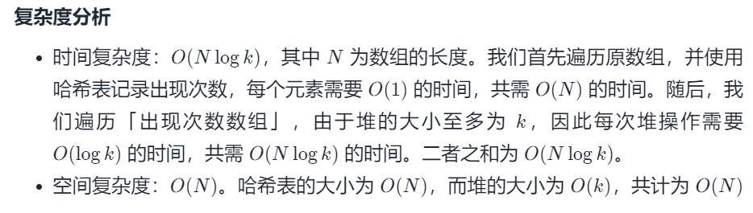
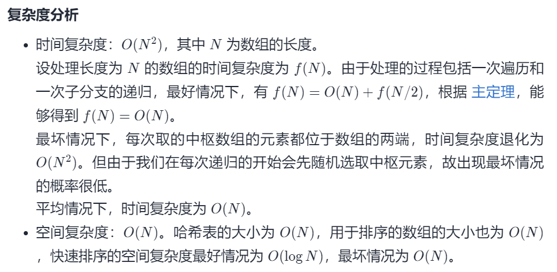

#### [347. 前 K 个高频元素](https://leetcode-cn.com/problems/top-k-frequent-elements/)

难度：中等

标签：[数组](../Topic/数组.md)，[哈希表](../Topic/哈希表.md)，[分治算法](../Topic/分治算法.md)，桶排序，计数，快速选择，[排序](../Topic/排序.md)，[堆](../Topic/堆.md)

相同题目：[剑指 Offer II 060. 出现频率最高的 k 个数字](https://leetcode-cn.com/problems/g5c51o/)

给你一个整数数组 nums 和一个整数 k ，请你返回其中出现频率前 k 高的元素。你可以按 任意顺序 返回答案。

 

示例 1:

输入: nums = [1,1,1,2,2,3], k = 2
输出: [1,2]
示例 2:

输入: nums = [1], k = 1
输出: [1]


提示：

1 <= nums.length <= 10^5
k 的取值范围是 [1, 数组中不相同的元素的个数]
题目数据保证答案唯一，换句话说，数组中前 k 个高频元素的集合是唯一的


进阶：你所设计算法的时间复杂度 必须 优于 O(n log n) ，其中 n 是数组大小。

#### 方法一：堆

```python
class Solution:
    def topKFrequent(self, nums: List[int], k: int) -> List[int]:
        '''
        nums_dict = {}
        for i in nums:
            nums_dict[i] = nums_dict.get(i,0) + 1
        sort_dict = sorted(nums_dict.items(),key=lambda x:x[1],reverse=True)
        return [i[0] for i in sort_dict][:k]
        '''
        
        count = collections.Counter(nums)
        # 运行时间短
        # heap = [(val, key) for key, val in count.items()]
        # return [item[1] for item in heapq.nlargest(k, heap)]

        heap = []
        for key, val in count.items():
            if len(heap) >= k:
                if val > heap[0][0]:
                    heapq.heapreplace(heap, (val, key))
            else:
                heapq.heappush(heap, (val, key))
        return [item[1] for item in heap]
```




手写实现

```python
class Solution:
    def topKFrequent(self, nums: List[int], k: int) -> List[int]:
        def sift_down(arr, root, k):
            """下沉log(k),如果新的根节点>子节点就一直下沉"""
            val = arr[root] # 用类似插入排序的赋值交换
            while root<<1 < k:
                child = root << 1
                # 选取左右孩子中小的与父节点交换
                if child|1 < k and arr[child|1][1] < arr[child][1]:
                    child |= 1
                # 如果子节点<新节点,交换,如果已经有序break
                if arr[child][1] < val[1]:
                    arr[root] = arr[child]
                    root = child
                else:
                    break
            arr[root] = val

        def sift_up(arr, child):
            """上浮log(k),如果新加入的节点<父节点就一直上浮"""
            val = arr[child]
            while child>>1 > 0 and val[1] < arr[child>>1][1]:
                arr[child] = arr[child>>1]
                child >>= 1
            arr[child] = val

        stat = collections.Counter(nums)
        stat = list(stat.items())
        heap = [(0,0)]

        # 构建规模为k+1的堆,新元素加入堆尾,上浮
        for i in range(k):
            heap.append(stat[i])
            sift_up(heap, len(heap)-1) 
        # 维护规模为k+1的堆,如果新元素大于堆顶,入堆,并下沉
        for i in range(k, len(stat)):
            if stat[i][1] > heap[1][1]:
                heap[1] = stat[i]
                sift_down(heap, 1, k+1) 
        return [item[0] for item in heap[1:]]

```

作者：xxinjiee
链接：https://leetcode-cn.com/problems/top-k-frequent-elements/solution/python-dui-pai-xu-by-xxinjiee/
来源：力扣（LeetCode）
著作权归作者所有。商业转载请联系作者获得授权，非商业转载请注明出处。

#### 方法二：基于快速排序

```python
class Solution:
    def topKFrequent(self, nums: List[int], k: int) -> List[int]:
        count = collections.Counter(nums)
        num_cnt = list(count.items())
        topKs = self.findTopK(num_cnt, k, 0, len(num_cnt) - 1)
        return [item[0] for item in topKs]
    
    def findTopK(self, num_cnt, k, low, high):
        pivot = random.randint(low, high)
        num_cnt[low], num_cnt[pivot] = num_cnt[pivot], num_cnt[low]
        base = num_cnt[low][1]
        i = low
        for j in range(low + 1, high + 1):
            if num_cnt[j][1] > base:
                num_cnt[i + 1], num_cnt[j] = num_cnt[j], num_cnt[i + 1]
                i += 1
        num_cnt[low], num_cnt[i] = num_cnt[i], num_cnt[low]
        if i == k - 1:
            return num_cnt[:k]
        elif i > k - 1:
            return self.findTopK(num_cnt, k, low, i - 1)
        else:
            return self.findTopK(num_cnt, k, i + 1, high)

作者：edelweisskoko
链接：https://leetcode-cn.com/problems/top-k-frequent-elements/solution/347-qian-k-ge-gao-pin-yuan-su-zhi-jie-pa-wemd/
来源：力扣（LeetCode）
著作权归作者所有。商业转载请联系作者获得授权，非商业转载请注明出处。
```



### 方法三：桶排序法

首先依旧使用哈希表统计频率，统计完成后，创建一个数组，将频率作为数组下标，对于出现频率不同的数字集合，存入对应的数组下标即可。

时间复杂度和空间复杂度都是O(n)
