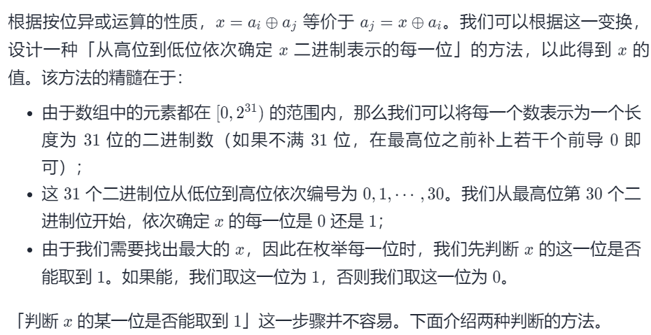
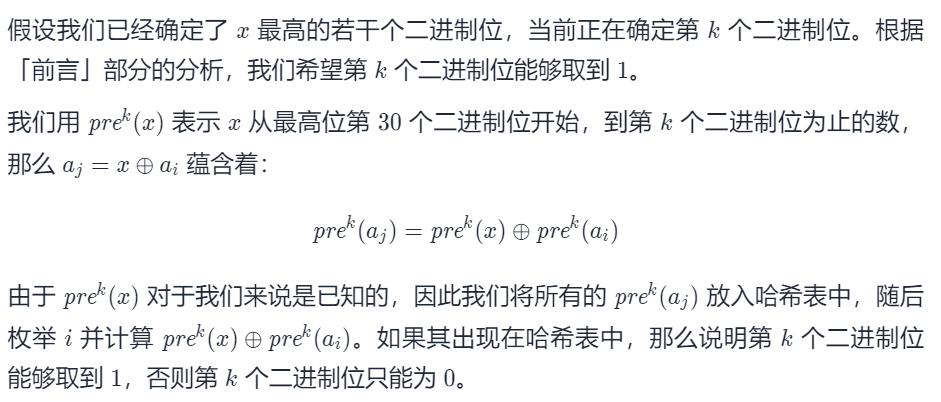
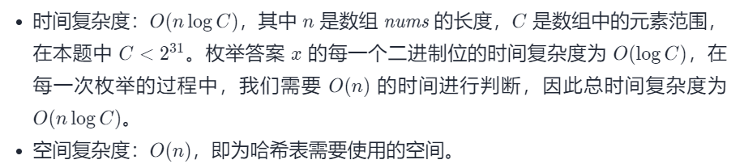
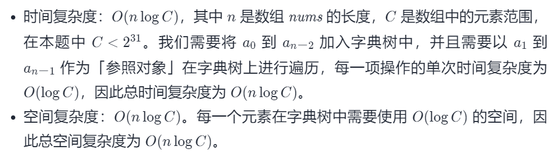

#### [421. 数组中两个数的最大异或值](https://leetcode-cn.com/problems/maximum-xor-of-two-numbers-in-an-array/)

难度：中等

标签：[字典树](../Topic/字典树.md)，[数组](../Topic/数组.md)，[哈希表](../Topic/哈希表.md)，[位运算](../Topic/位运算.md)

相同题目：[剑指 Offer II 067. 最大的异或](https://leetcode-cn.com/problems/ms70jA/)

给你一个整数数组 nums ，返回 nums[i] XOR nums[j] 的最大运算结果，其中 0 ≤ i ≤ j < n 。

进阶：你可以在 O(n) 的时间解决这个问题吗？

 

示例 1：

输入：nums = [3,10,5,25,2,8]
输出：28
解释：最大运算结果是 5 XOR 25 = 28.
示例 2：

输入：nums = [0]
输出：0
示例 3：

输入：nums = [2,4]
输出：6
示例 4：

输入：nums = [8,10,2]
输出：10
示例 5：

输入：nums = [14,70,53,83,49,91,36,80,92,51,66,70]
输出：127


提示：

1 <= nums.length <= 2 * 10^4
0 <= nums[i] <= 2^31 - 1



#### 方法一：哈希表



```python
class Solution:
    def findMaximumXOR(self, nums: List[int]) -> int:
        # 最高位的二进制位编号为 30
        HIGH_BIT = 30

        x = 0
        for k in range(HIGH_BIT, -1, -1):
            seen = set()
            # 将所有的 pre^k(a_j) 放入哈希表中
            for num in nums:
                # 如果只想保留从最高位开始到第 k 个二进制位为止的部分
                # 只需将其右移 k 位
                seen.add(num >> k)

            # 目前 x 包含从最高位开始到第 k+1 个二进制位为止的部分
            # 我们将 x 的第 k 个二进制位置为 1，即为 x = x*2+1
            x_next = x * 2 + 1
            found = False
            
            # 枚举 i
            for num in nums:
                if x_next ^ (num >> k) in seen:
                    found = True
                    break

            if found:
                x = x_next
            else:
                # 如果没有找到满足等式的 a_i 和 a_j，那么 x 的第 k 个二进制位只能为 0
                # 即为 x = x*2
                x = x_next - 1
        
        return x
```



#### 方法二：字典树


整数的异或有一个特点，如果两个相同数位异或的结果是0，那么两个相反的数位异或的结果为1。如果想找到某个整数k和其他整数的最大异或值，那么尽量找和k的数位不同的整数。

因此，这个问题可以转化为查找的问题，而且还是按照整数的二进制数位进行查找的问题。需要将整数的每个数位都保存下来。前缀树可以实现这种思路，前缀树的每个节点对应整数的一个数位，路径对应一个整数。

每个节点只有两个分别表示0和1的子节点

由于整数都是32位，它们在前缀树中对应的路径的长度都是一样的，因此没有必要用一个布尔值字段标记最后一个数位。

然后创建一棵能够保存整数的前缀树，这和保存字符串的前缀树类似。从左到右逐一取出整数的每个数位，并根据值0或1在必要的时候创建新的节点。

最后考虑如何基于前缀树的查找计算最大的异或值。从高位开始扫描整数num的每个数位。如果前缀树中存在某个整数的相同位置的数位和num的数位相反，则优先选择这个相反的数位，这是因为两个相反的数位异或的结果为1，比两个相同的数位异或的结果大。按照优先选择与整数num相反的数位的规则就能找出与num异或最大的整数。

```python
class Trie:
    def __init__(self):
        # 左子树指向表示 0 的子节点
        self.left = None
        # 右子树指向表示 1 的子节点
        self.right = None

class Solution:
    def findMaximumXOR(self, nums: List[int]) -> int:
        # 字典树的根节点
        root = Trie()
        # 最高位的二进制位编号为 30
        HIGH_BIT = 30

        def add(num: int):
            cur = root
            for k in range(HIGH_BIT, -1, -1):
                bit = (num >> k) & 1
                if bit == 0:
                    if not cur.left:
                        cur.left = Trie()
                    cur = cur.left
                else:
                    if not cur.right:
                        cur.right = Trie()
                    cur = cur.right

        def check(num: int) -> int:
            cur = root
            x = 0
            for k in range(HIGH_BIT, -1, -1):
                bit = (num >> k) & 1
                if bit == 0:
                    # a_i 的第 k 个二进制位为 0，应当往表示 1 的子节点 right 走
                    if cur.right:
                        cur = cur.right
                        x = x * 2 + 1
                    else:
                        cur = cur.left
                        x = x * 2
                else:
                    # a_i 的第 k 个二进制位为 1，应当往表示 0 的子节点 left 走
                    if cur.left:
                        cur = cur.left
                        x = x * 2 + 1
                    else:
                        cur = cur.right
                        x = x * 2
            return x

        n = len(nums)
        x = 0
        for i in range(1, n):
            # 将 nums[i-1] 放入字典树，此时 nums[0 .. i-1] 都在字典树中
            add(nums[i - 1])
            # 将 nums[i] 看作 ai，找出最大的 x 更新答案
            x = max(x, check(nums[i]))

        return x

```



作者：LeetCode-Solution
链接：https://leetcode-cn.com/problems/maximum-xor-of-two-numbers-in-an-array/solution/shu-zu-zhong-liang-ge-shu-de-zui-da-yi-h-n9m9/
来源：力扣（LeetCode）
著作权归作者所有。商业转载请联系作者获得授权，非商业转载请注明出处。

