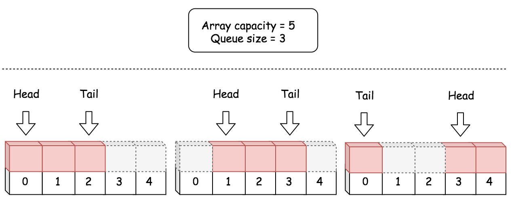

#### [622. 设计循环队列](https://leetcode-cn.com/problems/design-circular-queue/)

难度：中等

标签：[设计](../原理/设计.md)，[队列](../原理/队列.md)

设计你的循环队列实现。 循环队列是一种线性数据结构，其操作表现基于 FIFO（先进先出）原则并且队尾被连接在队首之后以形成一个循环。它也被称为“环形缓冲器”。

循环队列的一个好处是我们可以利用这个队列之前用过的空间。在一个普通队列里，一旦一个队列满了，我们就不能插入下一个元素，即使在队列前面仍有空间。但是使用循环队列，我们能使用这些空间去存储新的值。

你的实现应该支持如下操作：

MyCircularQueue(k): 构造器，设置队列长度为 k 。
Front: 从队首获取元素。如果队列为空，返回 -1 。
Rear: 获取队尾元素。如果队列为空，返回 -1 。
enQueue(value): 向循环队列插入一个元素。如果成功插入则返回真。
deQueue(): 从循环队列中删除一个元素。如果成功删除则返回真。
isEmpty(): 检查循环队列是否为空。
isFull(): 检查循环队列是否已满。


示例：

```java
MyCircularQueue circularQueue = new MyCircularQueue(3); // 设置长度为 3
circularQueue.enQueue(1);  // 返回 true
circularQueue.enQueue(2);  // 返回 true
circularQueue.enQueue(3);  // 返回 true
circularQueue.enQueue(4);  // 返回 false，队列已满
circularQueue.Rear();  // 返回 3
circularQueue.isFull();  // 返回 true
circularQueue.deQueue();  // 返回 true
circularQueue.enQueue(4);  // 返回 true
circularQueue.Rear();  // 返回 4
```


提示：

所有的值都在 0 至 1000 的范围内；
操作数将在 1 至 1000 的范围内；
请不要使用内置的队列库。

#### 方法一：数组

使用一维 ***数组*** 模拟，通过操作数组的索引构建一个 ***虚拟*** 的环。

对于一个固定大小的数组，任何位置都可以是队首，只要知道队列长度，就可以根据下面公式计算出队尾位置：

$\text{tailIndex} = (\text{headIndex} + \text{count} - 1) \mod \text{capacity}$

其中 capacity 是数组长度，count 是队列长度，headIndex 和 tailIndex 分别是队首 head 和队尾 tail 索引。



```python
# 构造器，设置队列长度为 k 
class MyCircularQueue:

    def __init__(self, k: int):
        """
        Initialize your data structure here. Set the size of the queue to be k.
        """
        # 数组，保存循环队列的元素
        self.queue = [0]*k
        # 队首 head 的索引
        self.headIndex = 0
        # 循环队列当前的长度
        self.count = 0
        # 循环队列的容量，即队列中最多可以容纳的元素数量，其实等于len(queue)，因为经常使用，这里就定义出来
        self.capacity = k

    def enQueue(self, value: int) -> bool:
        """
        Insert an element into the circular queue. Return true if the operation is successful.
        向循环队列插入一个元素。如果成功插入则返回真。
        """
        # 检查队列是否已满
        if self.count == self.capacity:
            return False
        # 将元素插入队尾后一位
        self.queue[(self.headIndex + self.count) % self.capacity] = value
        self.count += 1
        return True

    def deQueue(self) -> bool:
        """
        Delete an element from the circular queue. Return true if the operation is successful.
        从循环队列中删除一个元素。如果成功删除则返回真
        """
        # 检查队列是否为空
        if self.count == 0:
            return False
        # 先进先出，从队首“删除”一个元素
        self.headIndex = (self.headIndex + 1) % self.capacity
        self.count -= 1
        return True

    def Front(self) -> int:
        """
        Get the front item from the queue.
        从队首获取元素。如果队列为空，返回 -1
        """
        if self.count == 0:
            return -1
        return self.queue[self.headIndex]

    def Rear(self) -> int:
        """
        Get the last item from the queue.
        获取队尾元素。如果队列为空，返回 -1 
        """
        # empty queue
        if self.count == 0:
            return -1
        return self.queue[(self.headIndex + self.count - 1) % self.capacity]

    def isEmpty(self) -> bool:
        """
        Checks whether the circular queue is empty or not.
        检查循环队列是否为空
        """
        return self.count == 0

    def isFull(self) -> bool:
        """
        Checks whether the circular queue is full or not.
        检查循环队列是否为满
        """
        return self.count == self.capacity
```

时间复杂度O(1)，空间复杂度O(n)

改进：线程安全

```python
from threading import Lock

class MyCircularQueue:

    def __init__(self, k: int):
        """
        Initialize your data structure here. Set the size of the queue to be k.
        """
        self.queue = [0]*k
        self.headIndex = 0
        self.count = 0
        self.capacity = k
        # the additional attribute to protect the access of our queue
        self.queueLock = Lock()

    def enQueue(self, value: int) -> bool:
        """
        Insert an element into the circular queue. Return true if the operation is successful.
        """
        # automatically acquire the lock when entering the block
        with self.queueLock:
            if self.count == self.capacity:
                return False
            self.queue[(self.headIndex + self.count) % self.capacity] = value
            self.count += 1
        # automatically release the lock when leaving the block
        return True
```

另一种实现

```python
class MyCircularQueue:

    def __init__(self, k: int):
        """
        Initialize your data structure here. Set the size of the queue to be k.
        """
        # 指向队列头部第 1 个有效数据的位置
        self.front = 0
        # 指向队列尾部（即最后 1 个有效数据）的下一个位置，即下一个从队尾入队元素的位置。
        self.rear = 0
        self.capacity = k + 1
        self.arr = [0 for _ in range(self.capacity)]

    def enQueue(self, value: int) -> bool:
        """
        Insert an element into the circular queue. Return true if the operation is successful.
        """
        if self.isFull():
            return False
        self.arr[self.rear] = value
        self.rear = (self.rear + 1) % self.capacity
        return True

    def deQueue(self) -> bool:
        """
        Delete an element from the circular queue. Return true if the operation is successful.
        """
        if self.isEmpty():
            return False

        self.front = (self.front + 1) % self.capacity
        return True

    def Front(self) -> int:
        """
        Get the front item from the queue.
        """
        if self.isEmpty():
            return -1
        return self.arr[self.front]

    def Rear(self) -> int:
        """
        Get the last item from the queue.
        """
        if self.isEmpty():
            return -1
        return self.arr[(self.rear - 1 + self.capacity) % self.capacity]

    def isEmpty(self) -> bool:
        """
        Checks whether the circular queue is empty or not.
        """
        return self.front == self.rear

    def isFull(self) -> bool:
        """
        Checks whether the circular queue is full or not.
        """
        return (self.rear + 1) % self.capacity == self.front
```

链接：https://leetcode-cn.com/problems/design-circular-queue/solution/shu-zu-shi-xian-de-xun-huan-dui-lie-by-liweiwei141/

#### 方法二：单链表

单链表与数组实现方法的时间和空间复杂度相同，但是单链表的效率更高，因为这种方法不会预分配内存。

```python
class Node:
    def __init__(self, value, nextNode=None):
        self.value = value
        self.next = nextNode

class MyCircularQueue:

    def __init__(self, k: int):
        """
        Initialize your data structure here. Set the size of the queue to be k.
        """
        self.capacity = k
        self.head = None  # 队首元素索引
        self.tail = None  # 队尾元素索引
        self.count = 0

    def enQueue(self, value: int) -> bool:
        """
        Insert an element into the circular queue. Return true if the operation is successful.
        """
        if self.count == self.capacity:
            return False
        
        # 如果是空链表
        if self.count == 0:
            self.head = Node(value)
            self.tail = self.head
        else:
            newNode = Node(value)
            self.tail.next = newNode
            self.tail = newNode
        self.count += 1
        return True


    def deQueue(self) -> bool:
        """
        Delete an element from the circular queue. Return true if the operation is successful.
        """
        if self.count == 0:
            return False
        self.head = self.head.next
        self.count -= 1
        return True


    def Front(self) -> int:
        """
        Get the front item from the queue.
        """
        if self.count == 0:
            return -1
        return self.head.value

    def Rear(self) -> int:
        """
        Get the last item from the queue.
        """
        # empty queue
        if self.count == 0:
            return -1
        return self.tail.value
    
    def isEmpty(self) -> bool:
        """
        Checks whether the circular queue is empty or not.
        """
        return self.count == 0

    def isFull(self) -> bool:
        """
        Checks whether the circular queue is full or not.
        """
        return self.count == self.capacity
```

https://leetcode-cn.com/problems/design-circular-queue/solution/she-ji-xun-huan-dui-lie-by-leetcode/