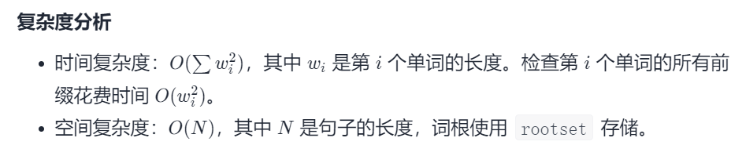

#### [648. 单词替换](https://leetcode-cn.com/problems/replace-words/)

难度：中等

标签：[字典树](../原理/字典树.md)，[数组](../原理/数组.md)，[哈希表](../原理/哈希表.md)，[字符串](../原理/字符串.md)

相同题目：[剑指 Offer II 063. 替换单词](https://leetcode-cn.com/problems/UhWRSj/)

在英语中，我们有一个叫做 词根(root)的概念，它可以跟着其他一些词组成另一个较长的单词——我们称这个词为 继承词(successor)。例如，词根an，跟随着单词 other(其他)，可以形成新的单词 another(另一个)。

现在，给定一个由许多词根组成的词典和一个句子。你需要将句子中的所有继承词用词根替换掉。如果继承词有许多可以形成它的词根，则用最短的词根替换它。

你需要输出替换之后的句子。

 

示例 1：

输入：dictionary = ["cat","bat","rat"], sentence = "the cattle was rattled by the battery"
输出："the cat was rat by the bat"
示例 2：

输入：dictionary = ["a","b","c"], sentence = "aadsfasf absbs bbab cadsfafs"
输出："a a b c"
示例 3：

输入：dictionary = ["a", "aa", "aaa", "aaaa"], sentence = "a aa a aaaa aaa aaa aaa aaaaaa bbb baba ababa"
输出："a a a a a a a a bbb baba a"
示例 4：

输入：dictionary = ["catt","cat","bat","rat"], sentence = "the cattle was rattled by the battery"
输出："the cat was rat by the bat"
示例 5：

输入：dictionary = ["ac","ab"], sentence = "it is abnormal that this solution is accepted"
输出："it is ab that this solution is ac"


提示：

1 <= dictionary.length <= 1000
1 <= dictionary[i].length <= 100
dictionary[i] 仅由小写字母组成。
1 <= sentence.length <= 10^6
sentence 仅由小写字母和空格组成。
sentence 中单词的总量在范围 [1, 1000] 内。
sentence 中每个单词的长度在范围 [1, 1000] 内。
sentence 中单词之间由一个空格隔开。
sentence 没有前导或尾随空格。

#### 方法一：前缀哈希【通过】

```python
def replaceWords(self, roots, sentence):
    rootset = set(roots)

    def replace(word):
        for i in xrange(1, len(word)):
            if word[:i] in rootset:
                return word[:i]
        return word

    return " ".join(map(replace, sentence.split()))
```



#### 方法二：前缀树【通过】

把所有的词根放入前缀树中，在树上查找每个单词的最短词根，该操作可在线性时间内完成。

```python
class Solution(object):
    def replaceWords(self, roots, sentence):
        Trie = lambda: collections.defaultdict(Trie)
        trie = Trie()
        END = True

        for root in roots:
            reduce(dict.__getitem__, root, trie)[END] = root

        def replace(word):
            cur = trie
            for letter in word:
                # 没有该前缀或者找到了前缀
                if letter not in cur or END in cur: break
                cur = cur[letter]
            return cur.get(END, word)

        return " ".join(map(replace, sentence.split()))
```

- 时间复杂度：O(N)，其中 N*N* 是 `sentence` 的长度。每次查询操作为线性时间复杂度。
- 空间复杂度：O(N)，前缀树的大小。

```python
class Solution(object):
    def replaceWords(self, dic, sentence):
        """
        :type dic: List[str]
        :type sentence: str
        :rtype: str
        """
        trie = {}
        
        for word in dic:
            t = trie
            for ch in word:
                if ch not in t:
                    t[ch] = {}
                t = t[ch]
            t['#'] = '#'
        
        def process(string):
            t = trie
            for i,ch in enumerate(string):
                if ch not in t:
                    break
                t = t[ch]
                if '#' in t:
                    return string[:i+1]
            return string
        
        return ' '.join(map(process, sentence.split()))
```

