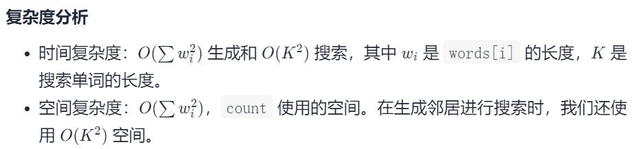

#### [676. 实现一个魔法字典](https://leetcode-cn.com/problems/implement-magic-dictionary/)

难度：中等

标签：[设计](../原理/设计.md)，[字典树](../原理/字典树.md)，[哈希表](../原理/哈希表.md)，[字符串](../原理/字符串.md)

相同题目： [剑指 Offer II 064. 神奇的字典](https://leetcode-cn.com/problems/US1pGT/)

设计一个使用单词列表进行初始化的数据结构，单词列表中的单词 互不相同 。 如果给出一个单词，请判定能否只将这个单词中一个字母换成另一个字母，使得所形成的新单词存在于你构建的字典中。

实现 MagicDictionary 类：

MagicDictionary() 初始化对象
void buildDict(String[] dictionary) 使用字符串数组 dictionary 设定该数据结构，dictionary 中的字符串互不相同
bool search(String searchWord) 给定一个字符串 searchWord ，判定能否只将字符串中 一个 字母换成另一个字母，使得所形成的新字符串能够与字典中的任一字符串匹配。如果可以，返回 true ；否则，返回 false 。


示例：

输入
["MagicDictionary", "buildDict", "search", "search", "search", "search"]
[[], [["hello", "leetcode"]], ["hello"], ["hhllo"], ["hell"], ["leetcoded"]]
输出
[null, null, false, true, false, false]

解释
MagicDictionary magicDictionary = new MagicDictionary();
magicDictionary.buildDict(["hello", "leetcode"]);
magicDictionary.search("hello"); // 返回 False
magicDictionary.search("hhllo"); // 将第二个 'h' 替换为 'e' 可以匹配 "hello" ，所以返回 True
magicDictionary.search("hell"); // 返回 False
magicDictionary.search("leetcoded"); // 返回 False


提示：

1 <= dictionary.length <= 100
1 <= dictionary[i].length <= 100
dictionary[i] 仅由小写英文字母组成
dictionary 中的所有字符串 互不相同
1 <= searchWord.length <= 100
searchWord 仅由小写英文字母组成
buildDict 仅在 search 之前调用一次
最多调用 100 次 search

#### 方法一：暴力法

- 如果一个字符中只有一个字符可以更改，即它们的汉明距离为 1。
- 在搜索新单词时，我们只检查长度相同的单词。

```python
class MagicDictionary(object):
    def __init__(self):
        self.buckets = collections.defaultdict(list)

    def buildDict(self, words):
        for word in words:
            self.buckets[len(word)].append(word)

    def search(self, word):
        return any(sum(a!=b for a,b in zip(word, candidate)) == 1
                   for candidate in self.buckets[len(word)])
```

时间复杂度：O(S) 构建和 O(NK)搜索，其中 N 是魔法字典中的单词数，S 是其中的字母总数，K 是搜索单词的长度。
空间复杂度：O(S)。

#### 方法二：广义邻居

如果一个单词中只有一个字符可以更改以使字符串相等，那么两个单词就是邻居。

让我们假设一个词 “apple” 具有广义邻居 “pple”、“aple”、“aple”、“appe” 和 “appl”。在搜索像 apply 这样的词是否有像 apple 这样的邻居时，我们只需要知道它们是否有一个广义邻居。

继续上述思考，一个问题是 “apply” 不是自身的邻居，而是具有相同的广义邻居 “\*pply”。为了解决这个问题，我们将计算生成 “\*pply” 的源的数量。如果有 2 个或更多，则其中一个不会是 “apply”。如果只有一个，我们应该检查它不是 “apply”。无论是哪种情况，我们都可以确定有一些神奇的单词生成了 “*pply”，而不是 “apply”。

```python
class MagicDictionary(object):
    def _genneighbors(self, word):
        for i in range(len(word)):
            yield word[:i] + '*' + word[i+1:]

    def buildDict(self, words):
        self.words = set(words)
        self.count = collections.Counter(nei for word in words
                                        for nei in self._genneighbors(word))

    def search(self, word):
        return any(self.count[nei] > 1 or
                   self.count[nei] == 1 and word not in self.words
                   for nei in self._genneighbors(word))
```



参考：https://leetcode-cn.com/problems/implement-magic-dictionary/solution/shi-xian-yi-ge-mo-fa-zi-dian-by-leetcode/

#### 方法三：前缀树(字典树)

着重讨论如何在前缀树中查找只修改一个字符的字符串。可以根据深度优先的顺序搜索前缀树的每条路径。如果到达的节点与字符串中的字符不匹配，则表示此时修改了字符串中的一个字符以匹配前缀树中的路径。如果到达对应字符串最后一个字符对应的节点时该节点的isWord字段的值为true，而且此时正好修改了字符串中的一个字符，那么就找到了修改字符串中一个字符对应的路径，符合题目的条件，可以返回true。

```python
class MagicDictionary:

    def __init__(self):
        """
        Initialize your data structure here.
        """
        self.children = [None] *26
        self.isEnd = False


    def buildDict(self, dictionary: List[str]) -> None:
        for word in dictionary:
          node = self
          for w in word:
            index = ord(w)-ord('a')
            if not node.children[index]:
              node.children[index] = MagicDictionary()
            node = node.children[index]
          node.isEnd = True


    def search(self, searchWord: str) -> bool:
      return self.dfs(self, searchWord, 0, 0)
    
    def dfs(self, root, word, i, editt):
      if not root:
        return False
      if root.isEnd and i == len(word) and editt==1:
        return True
      if i < len(word) and editt <= 1:
        found = False
        j = 0
        while j < 26 and (not found):
          next = editt
          if j != ord(word[i]) - ord('a'):
            next = editt + 1
          found = self.dfs(root.children[j], word, i+1, next)
          j += 1
        return found
      return False
```

runtime方法一最快。20210904
