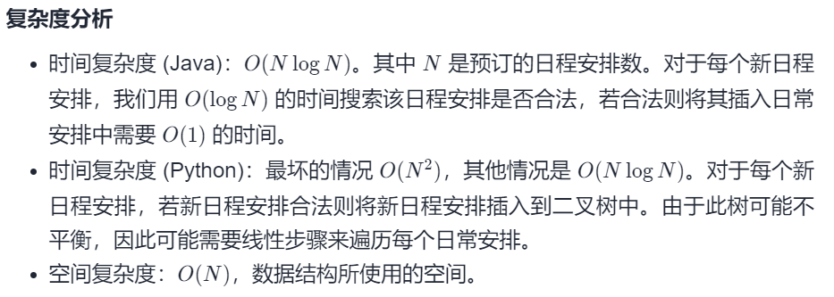

#### [729. 我的日程安排表 I](https://leetcode-cn.com/problems/my-calendar-i/)

难度：中等

标签：[设计](../Topic/设计.md)，线段树，有序集合

和[剑指 Offer II 058. 日程表](https://leetcode-cn.com/problems/fi9suh/)一样

实现一个 MyCalendar 类来存放你的日程安排。如果要添加的时间内没有其他安排，则可以存储这个新的日程安排。

MyCalendar 有一个 book(int start, int end)方法。它意味着在 start 到 end 时间内增加一个日程安排，注意，这里的时间是半开区间，即 [start, end), 实数 x 的范围为，  start <= x < end。

当两个日程安排有一些时间上的交叉时（例如两个日程安排都在同一时间内），就会产生重复预订。

每次调用 MyCalendar.book方法时，如果可以将日程安排成功添加到日历中而不会导致重复预订，返回 true。否则，返回 false 并且不要将该日程安排添加到日历中。

请按照以下步骤调用 MyCalendar 类: MyCalendar cal = new MyCalendar(); MyCalendar.book(start, end)

示例 1:

MyCalendar();
MyCalendar.book(10, 20); // returns true
MyCalendar.book(15, 25); // returns false
MyCalendar.book(20, 30); // returns true
解释: 
第一个日程安排可以添加到日历中.  第二个日程安排不能添加到日历中，因为时间 15 已经被第一个日程安排预定了。
第三个日程安排可以添加到日历中，因为第一个日程安排并不包含时间 20 。
说明:

每个测试用例，调用 MyCalendar.book 函数最多不超过 1000次。
调用函数 MyCalendar.book(start, end)时， start 和 end 的取值范围为 [0, 10^9]。

#### 方法一：暴力法

我们将维护一个日程安排列表（不一定要排序）。当且仅当其中一个日程安排在另一个日程安排结束后开始时，两个日程安排 [s1，e1) 和 [s2，e2) 不冲突：e1<=s2 或 e2<=s1。这意味着当 s1<e2 和 s2<e1 时，日程安排发生冲突。

```python
class MyCalendar(object):
    def __init__(self):
        self.calendar = []

    def book(self, start, end):
        for s, e in self.calendar:
            if s < end and start < e:
                return False
        self.calendar.append((start, end))
        return True
```

时间复杂度：O(N^2)。N 指的是日常安排的数量，对于每个新的日常安排，我们检查新的日常安排是否发生冲突来决定是否可以预订新的日常安排。所以时间复杂度为 $\sum_k^N O(k) = O(N^2)$
空间复杂度：O(n)，calendar 所使用的空间大小。

#### 方法二：平衡树

如果我们按时间顺序维护日程安排，则可以通过二分查找日程安排的情况来检查新日常安排是否可以预订，时间复杂度为 O(logN) （其中 N 是已预订的日常安排数），若可以预定则我们还需要在排序结构中插入日常安排。

- 我们需要一个数据结构能够保持元素排序和支持快速插入。在 `java` 中，`TreeMap `是最适合的。在 `python` 中，我们可以构建自己的二叉树结构。

```python
class Node:
    __slots__ = 'start', 'end', 'left', 'right'
    def __init__(self, start, end):
        self.start = start
        self.end = end
        self.left = self.right = None

    def insert(self, node):
        if node.start >= self.end:
            if not self.right:
                self.right = node
                return True
            return self.right.insert(node)
        elif node.end <= self.start:
            if not self.left:
                self.left = node
                return True
            return self.left.insert(node)
        else:
            return False

class MyCalendar(object):
    def __init__(self):
        self.root = None

    def book(self, start, end):
        if self.root is None:
            self.root = Node(start, end)
            return True
        return self.root.insert(Node(start, end))
```



参考：https://leetcode-cn.com/problems/my-calendar-i/solution/wo-de-ri-cheng-an-pai-biao-i-by-leetcode/

```python
class MyCalendar:
    def __init__(self):
        from sortedcontainers import SortedList
        self.date = SortedList()

    def book(self, start: int, end: int) -> bool:
        idx = self.date.bisect_right(start)
        if idx == len(self.date) or idx%2==0 and self.date[idx] >= end:
            self.date.add(start)
            self.date.add(end)
            return True
        return False 
```

