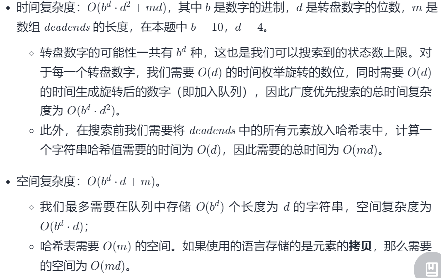

#### [752. 打开转盘锁](https://leetcode-cn.com/problems/open-the-lock/)

难度：中等

标签：[广度优先搜索](../Topic/广度优先搜索.md)，[数组](../Topic/数组.md)，[哈希表](../Topic/哈希表.md)，[字符串](../Topic/字符串.md)

相同题目：[剑指 Offer II 109. 开密码锁](https://leetcode-cn.com/problems/zlDJc7/)

你有一个带有四个圆形拨轮的转盘锁。每个拨轮都有10个数字： '0', '1', '2', '3', '4', '5', '6', '7', '8', '9' 。每个拨轮可以自由旋转：例如把 '9' 变为 '0'，'0' 变为 '9' 。每次旋转都只能旋转一个拨轮的一位数字。

锁的初始数字为 '0000' ，一个代表四个拨轮的数字的字符串。

列表 deadends 包含了一组死亡数字，一旦拨轮的数字和列表里的任何一个元素相同，这个锁将会被永久锁定，无法再被旋转。

字符串 target 代表可以解锁的数字，你需要给出解锁需要的最小旋转次数，如果无论如何不能解锁，返回 -1 。

 

示例 1:

输入：deadends = ["0201","0101","0102","1212","2002"], target = "0202"
输出：6
解释：
可能的移动序列为 "0000" -> "1000" -> "1100" -> "1200" -> "1201" -> "1202" -> "0202"。
注意 "0000" -> "0001" -> "0002" -> "0102" -> "0202" 这样的序列是不能解锁的，
因为当拨动到 "0102" 时这个锁就会被锁定。
示例 2:

输入: deadends = ["8888"], target = "0009"
输出：1
解释：
把最后一位反向旋转一次即可 "0000" -> "0009"。
示例 3:

输入: deadends = ["8887","8889","8878","8898","8788","8988","7888","9888"], target = "8888"
输出：-1
解释：
无法旋转到目标数字且不被锁定。
示例 4:

输入: deadends = ["0000"], target = "8888"
输出：-1


提示：

1 <= deadends.length <= 500
deadends[i].length == 4
target.length == 4
target 不在 deadends 之中
target 和 deadends[i] 仅由若干位数字组成

#### 方法一：广度优先搜索

密码锁4个转轮上的数字定义了密码锁的状态，转动密码锁的转轮可以改变密码锁的状态。一般而言，如果一个问题是关于某事物状态的改变，那么可以考虑把问题转换成图搜索的问题。事物的每个状态是图中的一个节点，如果一个状态能够转变到另一个状态，那么这两个状态对应的节点之间有一条边相连。

由于题目要求的是找出节点"0000"到密码的对应节点的最短路径的长度，因此应该采用广度优先搜索。这是因为广度优先搜索是从起始节点开始首先达到所有距离为1的节点，接着到达所有距离为2节点。广度优先搜索一定是从起始节点沿着最短路径到达目标节点的。

搜索密码锁对应的图时还要注意避开死锁状态对应的节点，因为一旦到达这些节点之后就不能继续向下搜索。

```python
class Solution:
    def openLock(self, deadends: List[str], target: str) -> int:
        if target == "0000":
            return 0

        dead = set(deadends)
        if "0000" in dead:
            return -1
        
        def num_prev(x: str) -> str:
            return "9" if x == "0" else str(int(x) - 1)
        
        def num_succ(x: str) -> str:
            return "0" if x == "9" else str(int(x) + 1)
        
        # 枚举 status 通过一次旋转得到的数字
        def get(status: str) -> Generator[str, None, None]:
            s = list(status)
            for i in range(4):
                num = s[i]
                s[i] = num_prev(num)
                yield "".join(s)
                s[i] = num_succ(num)
                yield "".join(s)
                s[i] = num

        q = deque([("0000", 0)])
        seen = {"0000"}
        while q:
            status, step = q.popleft()
            for next_status in get(status):
                if next_status not in seen and next_status not in dead:
                    if next_status == target:
                        return step + 1
                    q.append((next_status, step + 1))
                    seen.add(next_status)
        
        return -1
```



#### 方法二：启发式搜索

我们可以使用启发式搜索更快地找到最小旋转次数。这里我们可以使用A* 算法。

#td

```python
class AStar:
    # 计算启发函数
    @staticmethod
    def getH(status: str, target: str) -> int:
        ret = 0
        for i in range(4):
            dist = abs(int(status[i]) - int(target[i]))
            ret += min(dist, 10 - dist)
        return ret

    def __init__(self, status: str, target: str, g: str) -> None:
        self.status = status
        self.g = g
        self.h = AStar.getH(status, target)
        self.f = self.g + self.h
    
    def __lt__(self, other: "AStar") -> bool:
        return self.f < other.f

class Solution:
    def openLock(self, deadends: List[str], target: str) -> int:
        if target == "0000":
            return 0

        dead = set(deadends)
        if "0000" in dead:
            return -1
        
        def num_prev(x: str) -> str:
            return "9" if x == "0" else str(int(x) - 1)
        
        def num_succ(x: str) -> str:
            return "0" if x == "9" else str(int(x) + 1)
        
        def get(status: str) -> Generator[str, None, None]:
            s = list(status)
            for i in range(4):
                num = s[i]
                s[i] = num_prev(num)
                yield "".join(s)
                s[i] = num_succ(num)
                yield "".join(s)
                s[i] = num

        q = [AStar("0000", target, 0)]
        seen = {"0000"}
        while q:
            node = heapq.heappop(q)
            for next_status in get(node.status):
                if next_status not in seen and next_status not in dead:
                    if next_status == target:
                        return node.g + 1
                    heapq.heappush(q, AStar(next_status, target, node.g + 1))
                    seen.add(next_status)
        
        return -1


```

作者：LeetCode-Solution
链接：https://leetcode-cn.com/problems/open-the-lock/solution/da-kai-zhuan-pan-suo-by-leetcode-solutio-l0xo/
来源：力扣（LeetCode）
著作权归作者所有。商业转载请联系作者获得授权，非商业转载请注明出处。
