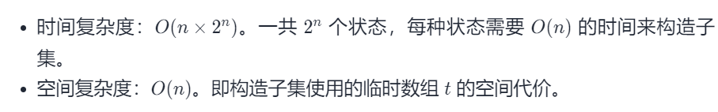
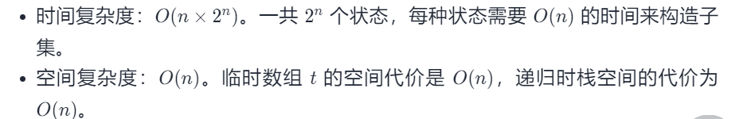

#### [78. 子集](https://leetcode-cn.com/problems/subsets/)

难度：中等

标签：[位运算](../Topic/位运算.md)，[数组](../Topic/数组.md)，[回溯法](../Topic/回溯法.md)

相同题目： [剑指 Offer II 079. 所有子集](https://leetcode-cn.com/problems/TVdhkn/)

给你一个整数数组 nums ，数组中的元素 互不相同 。返回该数组所有可能的子集（幂集）。

解集 不能 包含重复的子集。你可以按 任意顺序 返回解集。

 

示例 1：

输入：nums = [1,2,3]
输出：[[],[1],[2],[1,2],[3],[1,3],[2,3],[1,2,3]]
示例 2：

输入：nums = [0]
输出：[[],[0]]


提示：

1 <= nums.length <= 10
-10 <= nums[i] <= 10
nums 中的所有元素 互不相同

#### 方法一：迭代法实现子集枚举

记原序列中元素的总数为 n。原序列中的每个数字 a_i的状态可能有两种，即「在子集中」和「不在子集中」。我们用 1 表示「在子集中」，0 表示不在子集中，那么每一个子集可以对应一个长度为 n 的 0/1 序列，第 i位表示 a_i是否在子集中。

```java
class Solution {
    List<Integer> t = new ArrayList<Integer>();
    List<List<Integer>> ans = new ArrayList<List<Integer>>();

    public List<List<Integer>> subsets(int[] nums) {
        int n = nums.length;
        for (int mask = 0; mask < (1 << n); ++mask) {
            t.clear();
            for (int i = 0; i < n; ++i) {
                if ((mask & (1 << i)) != 0) {
                    t.add(nums[i]);
                }
            }
            ans.add(new ArrayList<Integer>(t));
        }
        return ans;
    }
}

作者：LeetCode-Solution
链接：https://leetcode-cn.com/problems/subsets/solution/zi-ji-by-leetcode-solution/
来源：力扣（LeetCode）
著作权归作者所有。商业转载请联系作者获得授权，非商业转载请注明出处。
```



#### 方法二：递归法实现子集枚举

```python
class Solution:
    def subsets(self, nums: List[int]) -> List[List[int]]:
        def dfs(index, tmp):
            # 停止条件
            if index == n:
                res.append(copy.deepcopy(tmp))
            else:
                dfs(index+1, tmp)  # 不添加当前元素的情况
                tmp.append(nums[index]) # 添加当前元素的情况
                dfs(index+1, tmp)
                tmp.pop()  # 记得恢复状态
        res = []
        n = len(nums)
        dfs(0, [])
        return res
```




其它

思路一:库函数

```python
class Solution:
    def subsets(self, nums: List[int]) -> List[List[int]]:
        res = []
        for i in range(len(nums)+1):
            for tmp in itertools.combinations(nums, i):
                res.append(tmp)
        return res

作者：powcai
链接：https://leetcode-cn.com/problems/subsets/solution/hui-su-suan-fa-by-powcai-5/
来源：力扣（LeetCode）
著作权归作者所有。商业转载请联系作者获得授权，非商业转载请注明出处。
```

思路二:迭代

```python
class Solution:
    def subsets(self, nums: List[int]) -> List[List[int]]:
        res = [[]]
        for i in nums:
            res = res + [[i] + num for num in res]
        return res

作者：powcai
链接：https://leetcode-cn.com/problems/subsets/solution/hui-su-suan-fa-by-powcai-5/
来源：力扣（LeetCode）
著作权归作者所有。商业转载请联系作者获得授权，非商业转载请注明出处。
```

思路三:递归(回溯算法)

```python
class Solution:
    def subsets(self, nums: List[int]) -> List[List[int]]:
        res = []
        n = len(nums)
        
        def helper(i, tmp):
            res.append(tmp)
            for j in range(i, n):
                helper(j + 1,tmp + [nums[j]] )
        helper(0, [])
        return res  

作者：powcai
链接：https://leetcode-cn.com/problems/subsets/solution/hui-su-suan-fa-by-powcai-5/
来源：力扣（LeetCode）
著作权归作者所有。商业转载请联系作者获得授权，非商业转载请注明出处。
```

