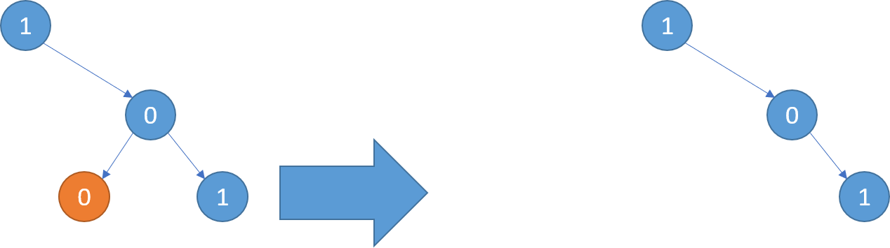

#### [814. 二叉树剪枝](https://leetcode-cn.com/problems/binary-tree-pruning/)

难度：中等

标签：[树](../Topic/树.md)，[深度优先搜索](../Topic/深度优先搜索.md)

这道题和[剑指 Offer II 047. 二叉树剪枝](https://leetcode-cn.com/problems/pOCWxh/)一样

给定二叉树根结点 root ，此外树的每个结点的值要么是 0，要么是 1。

返回移除了所有不包含 1 的子树的原二叉树。

( 节点 X 的子树为 X 本身，以及所有 X 的后代。)

示例1:
输入: [1,null,0,0,1]
输出: [1,null,0,null,1]

解释: 
只有红色节点满足条件“所有不包含 1 的子树”。
右图为返回的答案。




示例2:
输入: [1,0,1,0,0,0,1]
输出: [1,null,1,null,1]


示例3:
输入: [1,1,0,1,1,0,1,0]
输出: [1,1,0,1,1,null,1]


说明:

给定的二叉树最多有 200 个节点。
每个节点的值只会为 0 或 1 。


## 官方解法

```python
class Solution(object):
    def pruneTree(self, root):
        def containsOne(node):
            if not node: return False
            a1 = containsOne(node.left)
            a2 = containsOne(node.right)
            if not a1: node.left = None
            if not a2: node.right = None
            return node.val == 1 or a1 or a2

        return root if containsOne(root) else None
```


- 时间复杂度：O(N)，其中 N 是树中节点的个数。
- 空间复杂度：O(H)，其中 H是树的高度，为我们在递归时使用的栈空间大小。

## 剑指offer解法

总结什么样的节点可以被删除。首先，这个节点的值应该是0。其次，如果它有子树，那么它的子树的所有节点的值都为0。也就是说，如果一个节点可以被删除，那么它的子树的所有节点都可以被删除。

由此发现，后序遍历最适合用来解决这个问题。如果用后序遍历的顺序遍历到某个节点，那么它的左右子树的节点一定已经遍历过了。每遍历到一个节点，就要确定它是否有左右子树，如果左右子树都是空的，并且节点的值是0，那么也就可以删除这个节点。

```python
class Solution:
    def pruneTree(self, root: TreeNode) -> TreeNode:
        if not root:
            return None
        root.left = self.pruneTree(root.left)
        root.right = self.pruneTree(root.right)
        if (not root.left) and (not root.right) and root.val == 0:
            return None
        return root
```


上述代码实质上是实现了递归的后序遍历。每当遍历到一个节点，如果该节点符合条件，则将该节点删除。由于是后序遍历，因此先对根节点root的左右子树递归调用函数pruneTree删除左右子树中节点值全是0的子树。只有当root的左右子树全部为空，并且它自己的值也是0时，这个节点才能被删除。所谓删除一个节点，就是返回null给它的父节点，这样这个节点就从这棵二叉树中消失。
