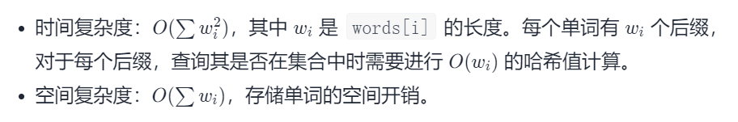
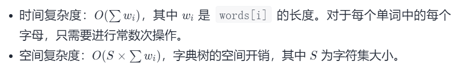

#### [820. 单词的压缩编码](https://leetcode-cn.com/problems/short-encoding-of-words/)

难度：中等

标签：[字典树](../Topic/字典树.md)，[数组](../Topic/数组.md)，[哈希表](../Topic/哈希表.md)，[字符串](../Topic/字符串.md)

相同题目： [剑指 Offer II 065. 最短的单词编码](https://leetcode-cn.com/problems/iSwD2y/)

单词数组 words 的 有效编码 由任意助记字符串 s 和下标数组 indices 组成，且满足：

words.length == indices.length
助记字符串 s 以 '#' 字符结尾
对于每个下标 indices[i] ，s 的一个从 indices[i] 开始、到下一个 '#' 字符结束（但不包括 '#'）的 子字符串 恰好与 words[i] 相等
给你一个单词数组 words ，返回成功对 words 进行编码的最小助记字符串 s 的长度 。

 

示例 1：

输入：words = ["time", "me", "bell"]
输出：10
解释：一组有效编码为 s = "time#bell#" 和 indices = [0, 2, 5] 。
words[0] = "time" ，s 开始于 indices[0] = 0 到下一个 '#' 结束的子字符串，如加粗部分所示 "time#bell#"
words[1] = "me" ，s 开始于 indices[1] = 2 到下一个 '#' 结束的子字符串，如加粗部分所示 "time#bell#"
words[2] = "bell" ，s 开始于 indices[2] = 5 到下一个 '#' 结束的子字符串，如加粗部分所示 "time#bell#"
示例 2：

输入：words = ["t"]
输出：2
解释：一组有效编码为 s = "t#" 和 indices = [0] 。


提示：

1 <= words.length <= 2000
1 <= words[i].length <= 7
words[i] 仅由小写字母组成

#### 方法一：存储后缀

如果单词 X 是 Y 的后缀，那么单词 X 就不需要考虑了，因为编码 Y 的时候就同时将 X 编码了。例如，如果 words 中同时有 "me" 和 "time"，我们就可以在不改变答案的情况下不考虑 "me"。

如果单词 Y 不在任何别的单词 X 的后缀中出现，那么 Y 一定是编码字符串的一部分。

因此，目标就是保留所有不是其他单词后缀的单词，最后的结果就是这些单词长度加一的总和，因为每个单词编码后后面还需要跟一个 # 符号。

由数据范围可知一个单词最多含有 7 个后缀，所以我们可以枚举单词所有的后缀。对于每个后缀，如果其存在 words 列表中，我们就将其从列表中删除。为了高效删除，我们将 words 用哈希集合来存储。

```python
class Solution:
    def minimumLengthEncoding(self, words: List[str]) -> int:
        good = set(words)
        for word in words:
            for k in range(1, len(word)):
                good.discard(word[k:])

        return sum(len(word) + 1 for word in good)
```



#### 方法二：字典树

目标就是保留所有**不是其他单词后缀**的单词。

去找到是否不同的单词具有相同的后缀，我们可以将其反序之后插入字典树中。例如，我们有 "time" 和 "me"，可以将 "emit" 和 "em" 插入字典树中。

然后，字典树的叶子节点（没有孩子的节点）就代表没有后缀的单词，统计叶子节点代表的单词长度加一的和即为我们要的答案。

```python
class Solution:
    def minimumLengthEncoding(self, words: List[str]) -> int:
        words = list(set(words)) #remove duplicates
        #Trie is a nested dictionary with nodes created
        # when fetched entries are missing
        Trie = lambda: collections.defaultdict(Trie)
        trie = Trie()

        #reduce(..., S, trie) is trie[S[0]][S[1]][S[2]][...][S[S.length - 1]]
        nodes = [reduce(dict.__getitem__, word[::-1], trie)
                 for word in words]

        #Add word to the answer if it's node has no neighbors
        return sum(len(word) + 1
                   for i, word in enumerate(words)
                   if len(nodes[i]) == 0)
```



作者：LeetCode-Solution
链接：https://leetcode-cn.com/problems/short-encoding-of-words/solution/dan-ci-de-ya-suo-bian-ma-by-leetcode-solution/
来源：力扣（LeetCode）
著作权归作者所有。商业转载请联系作者获得授权，非商业转载请注明出处。

```python
class Trie:
    def __init__(self):
        self.child = [None for _ in range(26)]
        self.cnt = 0        #经过这个结点的单词个数

    def insert(self, word: str) -> None:
        root = self
        for c in word[::-1]:
            ID = ord(c) - ord('a')
            if root.child[ID] == None:
                root.child[ID] = Trie()
                root.cnt += 1
            root = root.child[ID]
        root.cnt += 1

    def search(self, word: str) -> int:
        root = self
        for c in word[::-1]:
            ID = ord(c) - ord('a')
            root = root.child[ID]
        return root.cnt 


class Solution:
    def minimumLengthEncoding(self, words: List[str]) -> int:
        T = Trie()

        words_us = set(words)

        for word in words_us:
            T.insert(word)
        
        res = 0
        for word in words_us:
            if T.search(word) == 1:       #是Trie树里一条路径最长的那个单词
                res += len(word) + 1
        return res

作者：Hanxin_Hanxin
链接：https://leetcode-cn.com/problems/iSwD2y/solution/cpython3java-1wu-xu-ji-he-bao-li-shan-di-gj2e/
来源：力扣（LeetCode）
著作权归作者所有。商业转载请联系作者获得授权，非商业转载请注明出处。
```


#### 方法三（最快）

```python
def minimumLengthEncoding(self, words: List[str]) -> int:
    N = len(words)
    # 反转每个单词
    reversed_words = []
    for word in words:
        reversed_words.append(word[::-1])
    # 字典序排序    
    reversed_words.sort()
    
    res = 0
    for i in range(N):
        if i+1 < N and reversed_words[i+1].startswith(reversed_words[i]):
            # 当前单词是下一个单词的前缀，丢弃
            pass
        else:
            res += len(reversed_words[i]) + 1 # 单词加上一个 '#' 的长度
    
    return res
```


改进

```python
def minimumLengthEncoding(self, words: List[str]) -> int:
    N = len(words)
    # 逆序字典序排序    
    words.sort(key=lambda word: word[::-1])
    
    res = 0
    for i in range(N):
        if i+1 < N and words[i+1].endswith(words[i]):
            # 当前单词是下一个单词的后缀，丢弃
            pass
        else:
            res += len(words[i]) + 1 # 单词加上一个 '#' 的长度
    
    return res

```

作者：nettee
链接：https://leetcode-cn.com/problems/short-encoding-of-words/solution/wu-xu-zi-dian-shu-qing-qing-yi-fan-zhuan-jie-guo-j/
来源：力扣（LeetCode）
著作权归作者所有。商业转载请联系作者获得授权，非商业转载请注明出处。
