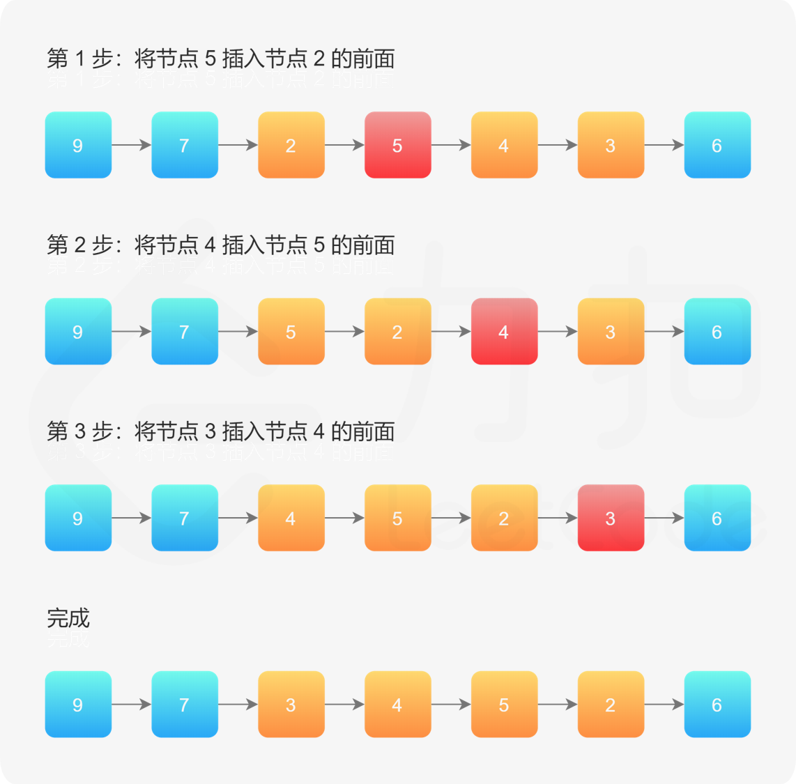

#### [92. 反转链表 II](https://leetcode-cn.com/problems/reverse-linked-list-ii/)

难度：中等

标签：[链表](../原理/链表.md)

解题记录

- 2021/08/12 答案辅助解题

给你单链表的头指针 head 和两个整数 left 和 right ，其中 left <= right 。请你反转从位置 left 到位置 right 的链表节点，返回 反转后的链表 。


示例 1：

输入：head = [1,2,3,4,5], left = 2, right = 4
输出：[1,4,3,2,5]
示例 2：

输入：head = [5], left = 1, right = 1
输出：[5]


提示：

链表中节点数目为 n
1 <= n <= 500
-500 <= Node.val <= 500
1 <= left <= right <= n

#### 方法一：穿针引线

使用「[206. 反转链表](https://leetcode-cn.com/problems/reverse-linked-list/)」的解法，反转 `left` 到 `right` 部分以后，再拼接起来。我们还需要记录 `left` 的前一个节点，和 `right` 的后一个节点。


```python
class Solution:
    def reverseBetween(self, head: ListNode, left: int, right: int) -> ListNode:
        def reverse_linked_list(head: ListNode):
            # 也可以使用递归反转一个链表
            pre = None
            cur = head
            while cur:
                next = cur.next
                cur.next = pre
                pre = cur
                cur = next

        # 因为头节点有可能发生变化，使用虚拟头节点可以避免复杂的分类讨论
        dummy_node = ListNode(-1)
        dummy_node.next = head
        pre = dummy_node
        # 第 1 步：从虚拟头节点走 left - 1 步，来到 left 节点的前一个节点
        # 建议写在 for 循环里，语义清晰
        for _ in range(left - 1):
            pre = pre.next

        # 第 2 步：从 pre 再走 right - left + 1 步，来到 right 节点
        right_node = pre
        for _ in range(right - left + 1):
            right_node = right_node.next
        # 第 3 步：切断出一个子链表（截取链表）
        left_node = pre.next
        curr = right_node.next

        # 注意：切断链接
        pre.next = None
        right_node.next = None

        # 第 4 步：同第 206 题，反转链表的子区间
        reverse_linked_list(left_node)
        # 第 5 步：接回到原来的链表中
        pre.next = right_node
        left_node.next = curr
        return dummy_node.next
```

#### 方法二：一次遍历「穿针引线」反转链表（头插法）

方法一的缺点是：如果 left 和 right 的区域很大，恰好是链表的头节点和尾节点时，找到 left 和 right 需要遍历一次，反转它们之间的链表还需要遍历一次，虽然总的时间复杂度为 O(N)，但遍历了链表 2 次

作者：LeetCode-Solution
链接：https://leetcode-cn.com/problems/reverse-linked-list-ii/solution/fan-zhuan-lian-biao-ii-by-leetcode-solut-teyq/
来源：力扣（LeetCode）
著作权归作者所有。商业转载请联系作者获得授权，非商业转载请注明出处。

整体思想是：在需要反转的区间里，每遍历到一个节点，让这个新节点来到反转部分的起始位置。下面的图展示了整个流程。




```python
class Solution:
    def reverseBetween(self, head: ListNode, left: int, right: int) -> ListNode:
        # 设置 dummyNode 是这一类问题的一般做法
        dummy_node = ListNode(-1)
        dummy_node.next = head
        pre = dummy_node
        for _ in range(left - 1):
            pre = pre.next

        cur = pre.next
        # 插入结点
        for _ in range(right - left):
            next = cur.next
            cur.next = next.next
            next.next = pre.next
            pre.next = next
        return dummy_node.next
```

### [迭代解法](https://labuladong.online/algo/data-structure/reverse-linked-list-recursion/#%E8%BF%AD%E4%BB%A3%E8%A7%A3%E6%B3%95-1)

纯迭代的思路比较直接，可以先找到第 `m - 1` 个节点，然后复用之前[206. 反转链表](206.%20反转链表.md)实现的 `reverseN` 函数就行了：

```python
class Solution:
    def reverseBetween(self, head: ListNode, m: int, n: int) -> ListNode:
        if m == 1:
            return self.reverseN(head, n)
        # 找到第 m 个节点的前驱
        pre = head
        for i in range(1, m - 1):
            pre = pre.next
        # 从第 m 个节点开始反转
        pre.next = self.reverseN(pre.next, n - m + 1)
        return head

    def reverseN(self, head: ListNode, n: int) -> ListNode:
        if head is None or head.next is None:
            return head
        pre, cur, nxt = None, head, head.next
        while n > 0:
            cur.next = pre
            pre = cur
            cur = nxt
            if nxt is not None:
                nxt = nxt.next
            n -= 1
        # 此时的 cur 是第 n + 1 个节点，head 是反转后的尾结点
        head.next = cur 
        # 此时的 pre 是反转后的头结点
        return pre
```

### [递归解法](https://labuladong.online/algo/data-structure/reverse-linked-list-recursion/#%E9%80%92%E5%BD%92%E8%A7%A3%E6%B3%95-1)

纯递归解法，依然是找到第 `m - 1` 个节点，然后复用之前实现的 `reverseN` 函数就行了。

关键是，如何通过递归的方式找到第 `m - 1` 个节点呢？

如果我们把 `head` 的索引视为 1，那么我们是想从第 `m` 个元素开始反转对吧；如果把 `head.next` 的索引视为 1 呢？那么相对于 `head.next`，反转的区间应该是从第 `m - 1` 个元素开始的；那么对于 `head.next.next` 呢……

这其实就是用递归的方式来进行迭代。我们可以这样写代码：

```python
class Solution:
    def __init__(self):
        # 后驱节点
        self.successor = None

    def reverseBetween(self, head, m, n):
        # base case
        if m == 1:
            return self.reverseN(head, n)
        # 前进到反转的起点触发 base case
        head.next = self.reverseBetween(head.next, m - 1, n - 1)
        return head

    # 反转以 head 为起点的 n 个节点，返回新的头结点
    def reverseN(self, head, n):
        if n == 1:
            # 记录第 n + 1 个节点
            self.successor = head.next
            return head

        last = self.reverseN(head.next, n - 1)

        head.next.next = head
        head.next = self.successor
        return last
```

