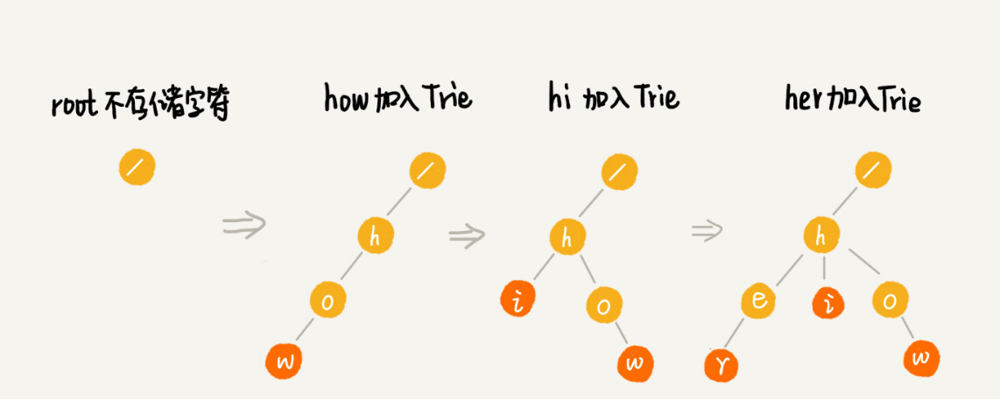
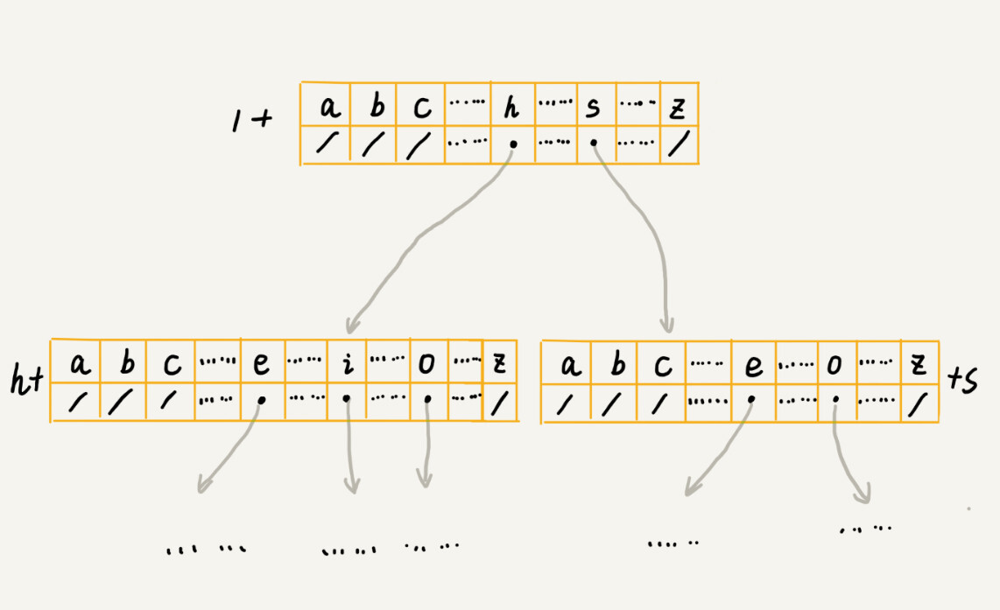
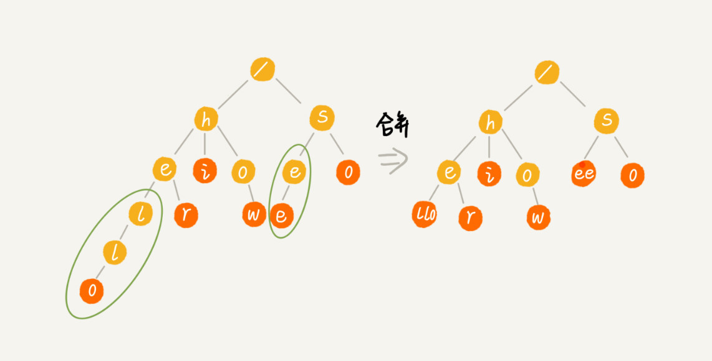

Trie 树，也叫“字典树”，前缀树。顾名思义，它是一个树形结构。它是一种专门处理字符串匹配的数据结构，用来解决在一组字符串集合中快速查找某个字符串的问题。

当然，这样一个问题可以有多种解决方法，比如散列表、红黑树，或者我们前面几节讲到的一些字符串匹配算法，但是，Trie 树在这个问题的解决上，有它特有的优点。不仅如此，Trie 树能解决的问题也不限于此

我举个简单的例子来说明一下。我们有 6 个字符串，它们分别是：how，hi，her，hello，so，see。我们希望在里面多次查找某个字符串是否存在。如果每次查找，都是拿要查找的字符串跟这 6 个字符串依次进行字符串匹配，那效率就比较低，有没有更高效的方法呢？

这个时候，我们就可以先对这 6 个字符串做一下预处理，组织成 Trie 树的结构，之后每次查找，都是在 Trie 树中进行匹配查找。Trie 树的本质，就是利用字符串之间的公共前缀，将重复的前缀合并在一起。最后构造出来的就是下面这个图中的样子。


其中，根节点不包含任何信息。每个节点表示一个字符串中的字符，从根节点到红色节点的一条路径表示一个字符串（注意：红色节点并不都是叶子节点）。

构造过程的每一步，都相当于往 Trie 树中插入一个字符串。当所有字符串都插入完成之后，Trie 树就构造好了。




当我们在 Trie 树中查找一个字符串的时候，比如查找字符串“her”，那我们将要查找的字符串分割成单个的字符 h，e，r，然后从 Trie 树的根节点开始匹配。

## 如何实现一棵 Trie 树

Trie 树主要有两个操作，一个是将字符串集合构造成 Trie 树。这个过程分解开来的话，就是一个将字符串插入到 Trie 树的过程。另一个是在 Trie 树中查询一个字符串。

如何存储一个 Trie 树？从前面的图中，我们可以看出，Trie 树是一个多叉树。我们知道，二叉树中，一个节点的左右子节点是通过两个指针来存储的。那对于多叉树来说，我们怎么存储一个节点的所有子节点的指针呢？

我先介绍其中一种存储方式，也是经典的存储方式，大部分数据结构和算法书籍中都是这么讲的。还记得我们前面讲到的散列表吗？借助散列表的思想，我们通过一个下标与字符一一映射的数组，来存储子节点的指针。



假设我们的字符串中只有从 a 到 z 这 26 个小写字母，我们在数组中下标为 0 的位置，存储指向子节点 a 的指针，下标为 1 的位置存储指向子节点 b 的指针，以此类推，下标为 25 的位置，存储的是指向的子节点 z 的指针。如果某个字符的子节点不存在，我们就在对应的下标的位置存储 null。

```java

class TrieNode {
  char data;
  TrieNode children[26];
}
```

当我们在 Trie 树中查找字符串的时候，我们就可以通过字符的 ASCII 码减去“a”的 ASCII 码，迅速找到匹配的子节点的指针。比如，d 的 ASCII 码减去 a 的 ASCII 码就是 3，那子节点 d 的指针就存储在数组中下标为 3 的位置中。

```java

public class Trie {
  private TrieNode root = new TrieNode('/'); // 存储无意义字符

  // 往Trie树中插入一个字符串
  public void insert(char[] text) {
    TrieNode p = root;
    for (int i = 0; i < text.length; ++i) {
      int index = text[i] - 'a';
      if (p.children[index] == null) {
        TrieNode newNode = new TrieNode(text[i]);
        p.children[index] = newNode;
      }
      p = p.children[index];
    }
    p.isEndingChar = true;
  }

  // 在Trie树中查找一个字符串
  public boolean find(char[] pattern) {
    TrieNode p = root;
    for (int i = 0; i < pattern.length; ++i) {
      int index = pattern[i] - 'a';
      if (p.children[index] == null) {
        return false; // 不存在pattern
      }
      p = p.children[index];
    }
    if (p.isEndingChar == false) return false; // 不能完全匹配，只是前缀
    else return true; // 找到pattern
  }

  public class TrieNode {
    public char data;
    public TrieNode[] children = new TrieNode[26];
    public boolean isEndingChar = false;
    public TrieNode(char data) {
      this.data = data;
    }
  }
}
```

在 Trie 树中，查找某个字符串的时间复杂度是多少？

如果要在一组字符串中，频繁地查询某些字符串，用 Trie 树会非常高效。构建 Trie 树的过程，需要扫描所有的字符串，时间复杂度是 O(n)（n 表示所有字符串的长度和）。但是一旦构建成功之后，后续的查询操作会非常高效。

每次查询时，如果要查询的字符串长度是 k，那我们只需要比对大约 k 个节点，就能完成查询操作。跟原本那组字符串的长度和个数没有任何关系。所以说，构建好 Trie 树后，在其中查找字符串的时间复杂度是 O(k)，k 表示要查找的字符串的长度。

## Trie 树真的很耗内存吗？

刚刚我们在讲 Trie 树的实现的时候，讲到用数组来存储一个节点的子节点的指针。如果字符串中包含从 a 到 z 这 26 个字符，那每个节点都要存储一个长度为 26 的数组，并且每个数组元素要存储一个 8 字节指针（或者是 4 字节，这个大小跟 CPU、操作系统、编译器等有关）。而且，即便一个节点只有很少的子节点，远小于 26 个，比如 3、4 个，我们也要维护一个长度为 26 的数组。

我们前面讲过，Trie 树的本质是避免重复存储一组字符串的相同前缀子串，但是现在每个字符（对应一个节点）的存储远远大于 1 个字节。按照我们上面举的例子，数组长度为 26，每个元素是 8 字节，那每个节点就会额外需要 26*8=208 个字节。而且这还是只包含 26 个字符的情况。

如果字符串中不仅包含小写字母，还包含大写字母、数字、甚至是中文，那需要的存储空间就更多了。所以，也就是说，在某些情况下，Trie 树不一定会节省存储空间。在重复的前缀并不多的情况下，Trie 树不但不能节省内存，还有可能会浪费更多的内存。

当然，我们不可否认，Trie 树尽管有可能很浪费内存，但是确实非常高效。那为了解决这个内存问题，我们是否有其他办法呢？

我们可以稍微牺牲一点查询的效率，将每个节点中的数组换成其他数据结构，来存储一个节点的子节点指针。用哪种数据结构呢？我们的选择其实有很多，比如有序数组、跳表、散列表、红黑树等。

假设我们用有序数组，数组中的指针按照所指向的子节点中的字符的大小顺序排列。查询的时候，我们可以通过二分查找的方法，快速查找到某个字符应该匹配的子节点的指针。但是，在往 Trie 树中插入一个字符串的时候，我们为了维护数组中数据的有序性，就会稍微慢了点。

实际上，Trie 树的变体有很多，都可以在一定程度上解决内存消耗的问题。比如，缩点优化，就是对只有一个子节点的节点，而且此节点不是一个串的结束节点，可以将此节点与子节点合并。这样可以节省空间，但却增加了编码难度。这里我就不展开详细讲解了，你如果感兴趣，可以自行研究下。



## Trie 树与散列表、红黑树的比较

实际上，字符串的匹配问题，笼统上讲，其实就是数据的查找问题。对于支持动态数据高效操作的数据结构，我们前面已经讲过好多了，比如散列表、红黑树、跳表等等。实际上，这些数据结构也可以实现在一组字符串中查找字符串的功能。我们选了两种数据结构，散列表和红黑树，跟 Trie 树比较一下，看看它们各自的优缺点和应用场景。

在刚刚讲的这个场景，在一组字符串中查找字符串，Trie 树实际上表现得并不好。它对要处理的字符串有极其严苛的要求。

第一，字符串中包含的字符集不能太大。我们前面讲到，如果字符集太大，那存储空间可能就会浪费很多。即便可以优化，但也要付出牺牲查询、插入效率的代价。

第二，要求字符串的前缀重合比较多，不然空间消耗会变大很多。

第三，如果要用 Trie 树解决问题，那我们就要自己从零开始实现一个 Trie 树，还要保证没有 bug，这个在工程上是将简单问题复杂化，除非必须，一般不建议这样做。

第四，我们知道，通过指针串起来的数据块是不连续的，而 Trie 树中用到了指针，所以，对缓存并不友好，性能上会打个折扣。

综合这几点，针对在一组字符串中查找字符串的问题，我们在工程中，更倾向于用散列表或者红黑树。因为这两种数据结构，我们都不需要自己去实现，直接利用编程语言中提供的现成类库就行了。

Trie 树只是不适合精确匹配查找，这种问题更适合用散列表或者红黑树来解决。Trie 树比较适合的是查找前缀匹配的字符串，也就是类似开篇问题的那种场景。

## 如何利用 Trie 树，实现搜索关键词的提示功能？

我们假设关键词库由用户的热门搜索关键词组成。我们将这个词库构建成一个 Trie 树。当用户输入其中某个单词的时候，把这个词作为一个前缀子串在 Trie 树中匹配。为了讲解方便，我们假设词库里只有 hello、her、hi、how、so、see 这 6 个关键词。当用户输入了字母 h 的时候，我们就把以 h 为前缀的 hello、her、hi、how 展示在搜索提示框内。当用户继续键入字母 e 的时候，我们就把以 he 为前缀的 hello、her 展示在搜索提示框内。这就是搜索关键词提示的最基本的算法原理。

不过，我讲的只是最基本的实现原理，实际上，搜索引擎的搜索关键词提示功能远非我讲的这么简单。如果再稍微深入一点，你就会想到，上面的解决办法遇到下面几个问题：

- 我刚讲的思路是针对英文的搜索关键词提示，对于更加复杂的中文来说，词库中的数据又该如何构建成 Trie 树呢？
- 如果词库中有很多关键词，在搜索提示的时候，用户输入关键词，作为前缀在 Trie 树中可以匹配的关键词也有很多，如何选择展示哪些内容呢？
- 像 Google 这样的搜索引擎，用户单词拼写错误的情况下，Google 还是可以使用正确的拼写来做关键词提示，这个又是怎么做到的呢？

实际上，Trie 树的这个应用可以扩展到更加广泛的一个应用上，就是自动输入补全，比如输入法自动补全功能、IDE 代码编辑器自动补全功能、浏览器网址输入的自动补全功能等等。

## 思考

我们今天有讲到，Trie 树应用场合对数据要求比较苛刻，比如字符串的字符集不能太大，前缀重合比较多等。如果现在给你一个很大的字符串集合，比如包含 1 万条记录，如何通过编程量化分析这组字符串集合是否比较适合用 Trie 树解决呢？也就是如何统计字符串的字符集大小，以及前缀重合的程度呢？

