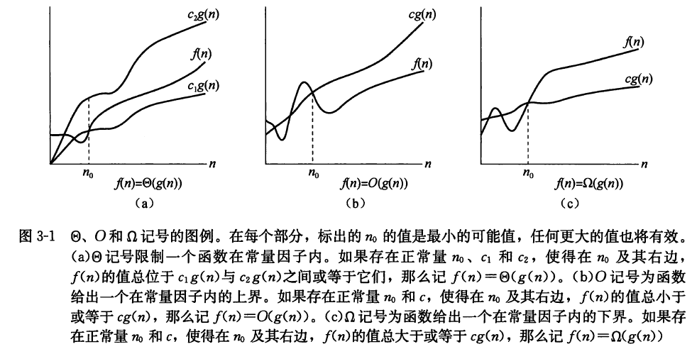
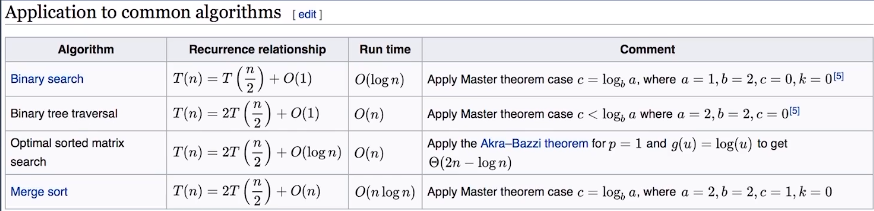

本文是数据结构与算法系列的第2篇

数据结构和算法本身解决的是“快”和“省”的问题，即如何让代码运行得更快，如何让代码更省存储空间。所以，执行效率是算法一个非常重要的考量指标。

### 为什么需要复杂度分析？

在工作中，算法的执行效率直接影响到我们的应用性能，比如一个APP响应速度很慢，很有可能用户会投诉，会因此流失一批用户，给用户的体验也不佳。而要想应用有高性能，里面的算法的执行效率必须高，但是如何判断一个算法的执行效率呢？

你可能会想，把代码跑一遍，通过统计、监控，就能得到算法执行的时间和占用的内存大小啊。这种评估算法执行效率的方法称为事后统计法，虽然正确，但是有非常大的局限性：

1.测试结果非常依赖测试环境

测试环境中硬件的不同会对测试结果有很大的影响，比如不同处理器下的速度不一样，两段代码执行速度的比较结果在不同机器上可能截然相反。举个例子，同一个应用在不同的手机上的响应速度通常是有差异的。

2.测试结果受数据规模的影响很大

比如对于一个排序算法，待排序数据的有序度不一样，测试数据的规模大小不一样都会导致执行时间的差异。如果待排序数据已经是有序的，那排序算法什么都不用做，此时执行时间就会很短。如果测试数据规模太小，测试结果可能无法真实地反映算法的性能，比如小规模下插入排序可能比快速排序快。

所以，需要有一个不受数据规模影响，也不依赖测试环境的评估方法，时间复杂度、空间复杂度分析就是这样的方法。

### 大O复杂度表示法

算法的执行效率就是算法代码执行的时间（粗略地说）。

先来看一段简单的代码，求1,2,3，...，n的累加和(部分例子采用C语言举例，易读性比较强)：

```c
int cal(int n){
    int sum = 0;
    int i = 1;
    for (;i <= n;++i){
        sum = sum + i;
    }
    return sum;
}
```

从CPU的角度来看，这段代码的每一行都执行着“读数据-运算-写数据”这样的操作。尽管每行代码对应的CPU执行的个数、执行的时间都不一样，但是，我们这里只是粗略估计，所以可以假设每行代码执行的时间都一样，为unit_time。在这个假设的基础之上，这段代码的总执行时间是多少呢？

第2、3行代码分别需要1个unit_time的执行时间，第4、5行都运行了n遍，所以需要2\*n\*unit_time的执行时间，所以总的执行时间就是(2n+2)\*unit_time。

可以发现，**所有代码的执行时间T(n)与每行代码的执行次数n成正比**，比率就是unit_time。

$T(n)=O(f(n))$

T(n)表示代码的执行时间，n表示数据规模的大小，f(n)表示每行代码执行的次数总和，是一个公式，O表示T(n)与f(n)表达式成正比。

比如$T(n)=O(2n+2)，T(n)=O(2n^2+2n+3)$。这就是大O时间复杂度表示法。

大O时间复杂度实际上并不具体表示代码真正的执行时间，而是表示**代码执行时间随数据规模增长的变化趋势**，所以也叫做渐进时间复杂度（asymptotic time complexity），简称时间复杂度。

当n很大时，公式中的低阶、常量、系数三部分并不左右增长趋势，所以都可以忽略，只需要记录一个最大量级。比如上述的可以记为$T(n)=O(n)，T(n)=O(n^2)$

### 时间复杂度分析

如何分析一段代码的时间复杂度呢？有三个实用的方法：

**1.只关注循环执行次数最多的一段代码**

因为常量、低阶、系数都可以忽略，只需要记录一个最大阶的量级。比如前面累加和的例子中，只需要关注for循环部分的时间复杂度。

注意即使一段代码循环执行了1万次，十万次，只要执行次数是一个已知数，与n无关，就是一个常量级的执行时间，可以忽略。

**2.加法法则：总复杂度等于量级最大的那段代码的复杂度**

如果 $T1(n)=O(f(n))，T2(n)=O(g(n))$；那么 $T(n)=T1(n)+T2(n)=max(O(f(n)), O(g(n))) =O(max(f(n), g(n)))$.

**3.乘法法则：嵌套代码的复杂度等于嵌套内外代码复杂度的乘积**

如果 $T1(n)=O(f(n))，T2(n)=O(g(n))$；那么 $T(n)=T1(n)*T2(n)=O(f(n))*O(g(n))=O(f(n)*g(n))$.

比如下面这个例子：

```c
int cal(int n) {
   int ret = 0; 
   int i = 1;
   for (; i < n; ++i) {
     ret = ret + f(i);
   } 
 } 
 
 int f(int n) {
 int sum = 0;
 int i = 1;
 for (; i < n; ++i) {
    sum = sum + i;
  } 
  return sum;
 }
```

这里可以将cal()函数的时间复杂度先看作是$T1(n)=O(n)$(假设f()只是一个普通操作)，由于f()不是一个简单操作，它的时间复杂度是$T2(n)=O(n)$，所以整个cal()函数的时间复杂度就是：

$T(n)=T1(n)*T2(n)=O(n*n)=O(n^2)$


### 几种常见时间复杂度实例分析
复杂度量级(按数量级递增)
- 常量阶O(1)：一般情况下，只要算法中不存在循环语句、递归语句，即使有成千上万行代码，其时间复杂度也是O(1)

- 对数阶O(logn)：不管以2为底，以3为底，还是以10为底，可以把所有对数阶的时间复杂度都记为O(logn)，对数之间是可以相互转换的，转换成常量系数乘以对数。比如$log_3n=log_32*log_2n$

- 线性阶O(n)

- 线性对数阶O(nlogn)：很常见，归并排序、快速排序的时间复杂度都是 O(nlogn)。

- 平方阶$O(n^2)$，立方阶$O(n^3)$，..., k次方阶$O(n^k)$

- <u>指数阶$O(2^n)$</u>

- <u>阶乘阶O(n!)</u>

后面两个是**非多项式量级**，其它都是**多项式量级**

时间复杂度为非多项式量级的算法问题叫做**NP**(Non-Deterministic Polynomial，非确定多项式)问题。

当数据规模 n 越来越大时，非多项式量级算法的执行时间会急剧增加，求解问题的执行时间会无限增长。所以，非多项式时间复杂度的算法其实是非常低效的算法。

另外还有O(m+n)、O(m\*n)，代码的复杂度由两个数据的规模来决定，无法事先评估 m 和 n 谁的量级大

针对这种情况，原来的加法法则就不正确了，我们需要将加法规则改为：$T1(m) + T2(n) = O(f(m) + g(n))$。但是乘法法则继续有效：$T1(m)*T2(n) = O(f(m) * f(n))$。

附：O(f(n))的大小关系

$ O(1)<O(logn)<O(n)<O(nlogn)<O(n^2)<O(n^3)<O(2^n)<O(n!)<O(n^n)$


### 空间复杂度分析

空间复杂度全称是渐进空间复杂度(asymptotic space complexity)，**表示算法的存储空间与数据规模之间的增长关系**。

常见的空间复杂度是$O(1)、O(n)、O(n^2)$等。比如申请一个大小为n的int类型数组：

int[] a = new int[n]

这段代码的空间复杂度就是O(n)


总之，时间复杂度和空间复杂度是用来分析算法执行效率与数据规模之间的增长关系的。越高阶复杂度的算法，执行效率越低。


### 最好、最坏、平均时间复杂度

先来看段代码：

```python
def find(array, n, x):
    pos = -1
    for i in range(n):
        if array[i] == x:
            pos = i
            break
    return pos
```

最好情况时间复杂度（best case time complexity）就是在最理想的情况下，执行这段代码的时间复杂度。上述例子中，如果数组的第一个元素就是要查找的变量x，那for循环只需要执行一次即可，所以它的最好时间复杂度是O(1)。

最坏情况时间复杂度（worst case time complexity）是在最糟糕的情况下，执行这段代码的时间复杂度。上述例子中，如果数组中没有要查找的变量x，则需要遍历整个数组，所以它的最坏时间复杂度就是O(n)。

平均情况时间复杂度（average case time complexity）则需要考虑每种情况的概率（可以简单假设一下），所以全称是叫加权平均时间复杂度或者期望时间复杂度。

上述例子中，要查找的变量 x 在数组中的位置，有 n+1 种情况：**在数组的 0～n-1 位置中和不在数组中**。我们把每种情况下，查找需要遍历的元素个数累加起来，然后再除以 n+1，就可以得到需要遍历的元素个数的平均值，即：

(1+2+3+...+n+n)/(n+1)=n(n+3)/2(n+1)

简化之后得到平均时间复杂度O(n)

这个结论虽然是正确的，但是计算过程稍微有点儿问题。你能发现问题所在吗？


实际上，这 n+1 种情况，出现的概率并不是一样的。

我们知道，要查找的变量 x，要么在数组里，要么就不在数组里。这两种情况对应的概率统计起来很麻烦，为了方便理解，我们假设在数组中与不在数组中的概率都为 1/2。另外，要查找的数据出现在 0～n-1 这 n 个位置的概率也是一样的，为 1/n。所以，根据概率乘法法则，要查找的数据出现在 0～n-1 中任意位置的概率就是 1/(2n)。

如果我们把每种情况发生的概率考虑进去，那平均时间复杂度的计算过程就变成了这样：

$1\times\frac{1}{2n}+2\times\frac{1}{2n}+3\times\frac{1}{2n}+...+n\times\frac{1}{2n}+n\times\frac{1}{2}=\frac{3n+1}{4}$

这个值就是概率论中的加权平均值，也叫作期望值，所以平均时间复杂度的全称应该叫加权平均时间复杂度或者期望时间复杂度。

这段代码的加权平均时间复杂度仍然是O(n)。

在大多数情况下，我们并不需要区分最好、最坏、平均情况时间复杂度三种情况，很多时候，我们使用一个复杂度就可以满足需求了。只有同一块代码在不同的情况下，时间复杂度有量级的差距，才会使用这三种复杂度表示法来区分。

### 均摊时间复杂度

还是先举个例子：
```c
 // array表示一个长度为n的数组
 // 代码中的array.length就等于n
 int[] array = new int[n];
 int count = 0;
 
 void insert(int val) {
    if (count == array.length) {
       int sum = 0;
       for (int i = 0; i < array.length; ++i) {
          sum = sum + array[i];
       }
       array[0] = sum;
       count = 1;
    }

    array[count] = val;
    ++count;
 }
```
这段代码实现了一个往数组中插入数据的功能。count用来标记数组是否已满。当数组满了之后，也就是代码中的 count == array.length 时，我们用 for 循环遍历数组求和，并清空数组，将求和之后的 sum 值放到数组的第一个位置，然后再将新的数据插入到第二个位置。但如果数组一开始就有空闲空间，则直接将数据插入数组。

最理想的情况下，数组中有空闲空间，我们只需要将数据插入到数组下标为 count 的位置就可以了，所以最好情况时间复杂度为 O(1)。最坏的情况下，数组中没有空闲空间了，我们需要先做一次数组的遍历求和，然后再将数据插入，所以最坏情况时间复杂度为 O(n)。


那平均时间复杂度是多少呢？答案是 O(1)。

假设数组的长度是 n，根据数据插入的位置的不同，我们可以分为 n 种情况，每种情况的时间复杂度是 O(1)。除此之外，还有一种“额外”的情况，就是在数组没有空闲空间时插入一个数据，这个时候的时间复杂度是 O(n)。而且，这 n+1 种情况发生的概率一样，都是 1/(n+1)。所以，根据加权平均的计算方法，我们求得的平均时间复杂度就是：

$1\times\frac{1}{n+1}+1\times\frac{1}{n+1}+...+1\times\frac{1}{n+1}+n\times\frac{1}{n+1}=O(1)$

其实这个例子里的平均复杂度分析其实并不需要这么复杂，不需要引入概率论的知识。

针对这种特殊的场景，我们引入了一种更加简单的分析方法：摊还分析法，通过摊还分析得到的时间复杂度我们起了一个名字，叫均摊时间复杂度（amortized time complexity）。

每一次 O(n) 的插入操作，都会跟着 n-1 次 O(1) 的插入操作，所以把耗时多的那次操作均摊到接下来的 n-1 次耗时少的操作上，均摊下来，这一组连续的操作的均摊时间复杂度就是 O(1)。这就是均摊分析的大致思路。

**对一个数据结构进行一组连续操作中，大部分情况下时间复杂度都很低，只有个别情况下时间复杂度比较高，而且这些操作之间存在前后连贯的时序关系，这个时候，我们就可以将这一组操作放在一块儿分析，看是否能将较高时间复杂度那次操作的耗时，平摊到其他那些时间复杂度比较低的操作上。而且，在能够应用均摊时间复杂度分析的场合，一般均摊时间复杂度就等于最好情况时间复杂度。**


### 扩展内容

#### 渐进记号

$\Theta$记号——渐进紧确界

对一个给定的函数g(n)，用$\Theta(g(n))$来表示以下函数的集合：

$\Theta(g(n))$={$f(n)$:存在正常量$c_1, c_2,n_0$, 使得对所有$n\geq n_0$, 有$0\leq c_1g(n)\leq f(n)\leq c_2g(n)$}

函数f(n)可以记为$f(n)\in \Theta(g(n))$，作为替代，通常记$f(n)= \Theta(g(n))$表达相同的概念。我们称g(n)是f(n)的一个**渐进紧确界**(asymptotically tight bound)。

例如$\frac12n^2-3n=\Theta(n^2), 6n^3\neq \Theta(n^2)$

一般来说，对任意多项式$p(n)=\sum_{i=0}^da_in^i$，其中$a_i$为常量且$a_d>0$，我们有$p(n)=\Theta(n^d)$。


O记号——渐进上界

$\Theta$记号渐进地给出一个函数的上界和下界。当只有一个**渐进上界**时，使用O记号。对于给定的函数g(n)，用O(g(n))(读作“大Og(n)”，有时仅读作“Og(n)”)来表示以下函数的集合：

O(g(n))={f(n)：存在正常量$c, n_0$, 使得对所有$n\geq n_0$, 有$0\leq f(n)\leq cg(n)$}

$f(n)= \Theta(g(n))$蕴含着$f(n)= O(g(n))$，有$\Theta(g(n))\in O(g(n))$。

o记号表示**非渐进紧确的上界**：

o(g(n))={f(n)：对任意正常量c>0, 存在常量$n_0>0$, 使得对所有$n\geq n_0$, 有$0\leq f(n)\lt cg(n)$}


$\Omega$记号——渐进下界

$\Omega$记号提供了**渐进下界**。对于给定的函数g(n)，用$\Omega(g(n))$来表示以下函数的集合：

$\Omega (g(n))$={f(n): 存在正常量$c, n_0$, 使得对所有$n\geq n_0$, 有$0\leq cg(n)\leq f(n)$}

$\omega$记号表示一个**非渐进紧确的下界**：

$\omega (g(n))$={f(n): 对任意正常量c>0, 存在常量$n_0>0$, 使得对所有$n\geq n_0$, 有$0\leq cg(n)\lt f(n)$}



定理：

对任意两个函数f(n)和g(n)，我们有$f(n)=\Theta(g(n))$，当且仅当$f(n)=O(g(n))$且$f(n)=\Omega(g(n))$。

当称一个算法的运行时间为$\Omega(g(n))$时，我们指，对每个n值，不管选择什么特定规模为n的输入，只要n足够大，对那个输入的运行时间至少是g(n)的常量倍。

总结：

$f(n)=O(g(n))$类似于$a\leq b$——“大欧”是上界——谐音记法：欧尚(上海的一个购物超市)

$f(n)=\Omega(g(n))$类似于$a\geq b$——“大欧米伽”是下界——谐音记法：虾米

$f(n)=\Theta(g(n))$类似于$a= b$——“西塔”是紧确界

$f(n)=o(g(n))$类似于$a\lt b$——“小欧”是非紧的上界

$f(n)=\omega(g(n))$类似于$a\gt b$——“小欧米伽”是非紧的下界


### 练习

 下面说法错误的是()

(1)算法原地工作的含义是指不需要任何额外的辅助空间

(2)在相同的规模 n 下,复杂度 O(n)的算法在时间上总是优于复杂度 O(2n)的算法

(3)所谓时间复杂度是指最坏情况下,估算算法执行时间的一个上界

(4)同一个算法,实现语言的级别越高,执行效率就越低


------------答案分割线----------


答案：(1)
解析：算法原地工作的含义是指不需要任何额外的辅助,算法所需要的辅助空间不随着问题的规模而变化，是一个确定的值。所以 (1)不正确。


### 参考资料：

- 极客时间专栏《数据结构与算法之美》

- 算法导论


### 递归的时间复杂度

一般地，当递归方程为T(n) = aT(n/c) + O(n), T(n)的解为： 
O(n) (a<c && c>1) 
$O(nlog_2n)$ (a=c && c>1) //以2为底 
$O(nlog_ca)$ (a>c && c>1) //n的$(log_ca)$次方，以c为底

### 主定理



## 参考链接

- [如何理解算法时间复杂度的表示法](http://www.zhihu.com/question/21387264)
- [Master theorem](http://en.wikipedia.org/wiki/Master_theorem_(analysis_of_algorithms))
- [主定理](http://zh.wikipedia.org/wiki/主定理)

