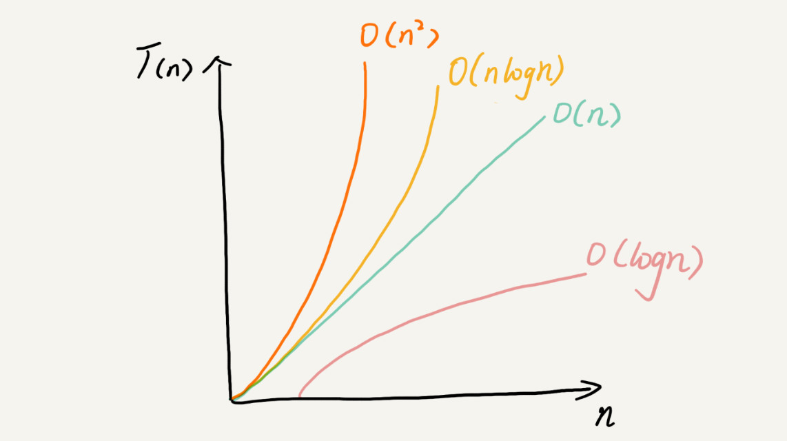

#### 为什么需要复杂度分析？

把代码跑一遍，通过统计、监控，就能得到算法执行的时间和占用的内存，这种事后统计法的评估算法执行效率的方法是正确的，但是这种统计方法有非常大的局限性。

1.测试结果非常依赖测试环境

硬件的不同会对测试结果有很大的影响，比如不同处理器下的速度不一样，不同机器对两端代码的执行速度比较的结果可能截然相反。

2.测试结果受数据规模的影响很大

比如对于一个排序算法，待排序数据的有序度不一样，测试数据规模不一样都会导致执行时间的差异。如果测试数据规模太小，测试结果可能无法真实地反映算法的性能，比如小规模下插入排序可能比快速排序快。

#### 大O复杂度表示法

算法的执行效率就是算法代码执行的时间（粗略地说）。

所有代码的执行时间T(n)与每行代码的执行次数n成正比。

T(n)=O(f(n))

f(n)表示每行代码执行的次数总和，O表示代码的执行时间T(n)与f(n)表达式成正比。

比如T(n)=O(2n+2)，T(n)=O(2n^2+2n+3)。

大O时间复杂度实际上并不具体表示代码真正的执行时间，而是表示**代码执行时间随数据规模增长的变化趋势**，所以也叫做渐进时间复杂度（asymptotic time complexity），简称时间复杂度。

当n很大时，公式中的低阶、常量、系数三部分并不左右增长趋势，所以都可以忽略，只需要记录一个最大量级。比如上述的可以记为T(n)=O(n)，T(n)=O(n^2)

#### 时间复杂度分析

实用的方法：

1.只关注循环执行次数最多的一段代码

2.加法法则：总复杂度等于量级最大的那段代码的复杂度

如果 T1(n)=O(f(n))，T2(n)=O(g(n))；那么 T(n)=T1(n)+T2(n)=max(O(f(n)), O(g(n))) =O(max(f(n), g(n))).

3.乘法法则：嵌套代码的复杂度等于嵌套内外代码复杂度的乘积

如果 T1(n)=O(f(n))，T2(n)=O(g(n))；那么 T(n)=T1(n)\*T2(n)=O(f(n))\*O(g(n))=O(f(n)*g(n)).

```
int cal(int n) {
   int ret = 0; 
   int i = 1;
   for (; i < n; ++i) {
     ret = ret + f(i);
   } 
 } 
 
 int f(int n) {
 int sum = 0;
 int i = 1;
 for (; i < n; ++i) {
    sum = sum + i;
  } 
  return sum;
 }
```

这里T(n)=T1(n)\*T2(n)=O(n\*n)=O(n^2)

#### 几种常见时间复杂度实例分析
复杂度量级(按数量级递增)
- 常量阶O(1)：一般情况下，只要算法中不存在循环语句、递归语句，即使有成千上万行代码，其时间复杂度也是O(1)

- 对数阶O(logn)：不管以2为底，以3为底，还是以10为底，可以把所有对数阶的时间复杂度都记为O(logn)，对数之间是可以相互转换的，转换成常量系数乘以对数。归并排序、快速排序的时间复杂度都是 O(nlogn)。

- 线性阶O(n)

- 线性对数阶O(nlogn)

- 平方阶O(n^2)，立方阶O(n^3)，...k次方阶O(n^k)

- 指数阶O(2^n)

- 阶乘阶O(n!)

后面两个是**非多项式量级**，其它都是**多项式量级**

时间复杂度为非多项式量级的算法问题叫做**NP**(Non-Deterministic Polynomial，非确定多项式)问题。

当数据规模 n 越来越大时，非多项式量级算法的执行时间会急剧增加，求解问题的执行时间会无限增长。所以，非多项式时间复杂度的算法其实是非常低效的算法。

另外还有O(m+n)、O(m\*n)，代码的复杂度由两个数据的规模来决定，无法事先评估 m 和 n 谁的量级大

针对这种情况，原来的加法法则就不正确了，我们需要将加法规则改为：T1(m) + T2(n) = O(f(m) + g(n))。但是乘法法则继续有效：T1(m)*T2(n) = O(f(m) * f(n))。

#### 空间复杂度分析

空间复杂度全称是渐进空间复杂度(asymptotic space complexity)，**表示算法的存储空间与数据规模之间的增长关系**。

常见的空间复杂度是O(1)、O(n)、O(n^2)等。



#### 最好、最坏、平均时间复杂度

最好情况时间复杂度（best case time complexity）、最坏情况时间复杂度（worst case time complexity）、平均情况时间复杂度（average case time complexity）。
平均时间复杂度需要考虑每种情况的概率（可以简单假设一下），所以全称是叫加权平均时间复杂度或者期望时间复杂度。

举例：
要查找的变量 x 在数组中的位置，有 n+1 种情况：**在数组的 0～n-1 位置中和不在数组中**。我们把每种情况下，查找需要遍历的元素个数累加起来，然后再除以 n+1，就可以得到需要遍历的元素个数的平均值，即：
(1+2+3+...+n+n)/(n+1)=n(n+3)/2(n+1)
简化之后得到平均时间复杂度O(n)

这个结论虽然是正确的，但是计算过程稍微有点儿问题。这 n+1 种情况，出现的概率并不是一样的。

我们知道，要查找的变量 x，要么在数组里，要么就不在数组里。这两种情况对应的概率统计起来很麻烦，为了方便你理解，我们假设在数组中与不在数组中的概率都为 1/2。另外，要查找的数据出现在 0～n-1 这 n 个位置的概率也是一样的，为 1/n。所以，根据概率乘法法则，要查找的数据出现在 0～n-1 中任意位置的概率就是 1/(2n)。

如果我们把每种情况发生的概率也考虑进去，那平均时间复杂度的计算过程就变成了这样：

$1\times\frac{1}{2n}+2\times\frac{1}{2n}+3\times\frac{1}{2n}+...+n\times\frac{1}{2n}+n\times\frac{1}{2}=\frac{3n+1}{4}$

这个值就是概率论中的加权平均值，也叫作期望值，所以平均时间复杂度的全称应该叫加权平均时间复杂度或者期望时间复杂度。

#### 均摊时间复杂度

均摊时间复杂度（amortized time complexity）
举例：
```
 // array表示一个长度为n的数组
 // 代码中的array.length就等于n
 int[] array = new int[n];
 int count = 0;
 
 void insert(int val) {
    if (count == array.length) {
       int sum = 0;
       for (int i = 0; i < array.length; ++i) {
          sum = sum + array[i];
       }
       array[0] = sum;
       count = 1;
    }

    array[count] = val;
    ++count;
 }
```
这段代码实现了一个往数组中插入数据的功能。count用来标记数组是否已满。当数组满了之后，也就是代码中的 count == array.length 时，我们用 for 循环遍历数组求和，并清空数组，将求和之后的 sum 值放到数组的第一个位置，然后再将新的数据插入。但如果数组一开始就有空闲空间，则直接将数据插入数组。

最理想的情况下，数组中有空闲空间，我们只需要将数据插入到数组下标为 count 的位置就可以了，所以最好情况时间复杂度为 O(1)。最坏的情况下，数组中没有空闲空间了，我们需要先做一次数组的遍历求和，然后再将数据插入，所以最坏情况时间复杂度为 O(n)。


那平均时间复杂度是多少呢？答案是 O(1)。

假设数组的长度是 n，根据数据插入的位置的不同，我们可以分为 n 种情况，每种情况的时间复杂度是 O(1)。除此之外，还有一种“额外”的情况，就是在数组没有空闲空间时插入一个数据，这个时候的时间复杂度是 O(n)。而且，这 n+1 种情况发生的概率一样，都是 1/(n+1)。所以，根据加权平均的计算方法，我们求得的平均时间复杂度就是：

$1\times\frac{1}{n+1}+1\times\frac{1}{n+1}+...+1\times\frac{1}{n+1}+n\times\frac{1}{n+1}=O(1)$

其实这个例子里的平均复杂度分析其实并不需要这么复杂，不需要引入概率论的知识。

针对这种特殊的场景，我们引入了一种更加简单的分析方法：摊还分析法，通过摊还分析得到的时间复杂度我们起了一个名字，叫均摊时间复杂度。

每一次 O(n) 的插入操作，都会跟着 n-1 次 O(1) 的插入操作，所以把耗时多的那次操作均摊到接下来的 n-1 次耗时少的操作上，均摊下来，这一组连续的操作的均摊时间复杂度就是 O(1)。这就是均摊分析的大致思路。

对一个数据结构进行一组连续操作中，大部分情况下时间复杂度都很低，只有个别情况下时间复杂度比较高，而且这些操作之间存在前后连贯的时序关系，这个时候，我们就可以将这一组操作放在一块儿分析，看是否能将较高时间复杂度那次操作的耗时，平摊到其他那些时间复杂度比较低的操作上。而且，在能够应用均摊时间复杂度分析的场合，一般均摊时间复杂度就等于最好情况时间复杂度。

#### 递归的时间复杂度

一般地，当递归方程为T(n) = aT(n/c) + O(n), T(n)的解为： 
O(n) (a<c && c>1) 
$O(nlog_2n)$ (a=c && c>1) //以2为底 
$O(nlog_ca)$ (a>c && c>1) //n的$(log_ca)$次方，以c为底


#### 扩展
$O(f(n))$

$O(1)<O(logn)<O(n)<O(nlogn)<O(n^2)<O(n^3)<O(2^n)<O(n!)<O(n^n)$

O代表了运行时间函数的一个渐进上界，即T(n)在数量级上小于等于f(n)

**计算算法复杂度大O的方法**

一、得出运行时间的函数                              

二、对函数进行简化                                    

①用常数1来取代运行时间中所有加法常数  

②修改后的函数中，只保留最高阶项            

③如果最高阶项存在且不是1，则忽略这个项的系数 

 **下面说法错误的是()**
(1)算法原地工作的含义是指不需要任何额外的辅助空间
(2)在相同的规模 n 下,复杂度 O(n)的算法在时间上总是优于复杂度 O(2n)的算法
(3)所谓时间复杂度是指最坏情况下,估算算法执行时间的一个上界
(4)同一个算法,实现语言的级别越高,执行效率就越低
A.1
B.1,2
C.1,4
D.3
答案：A
解析：
算法原地工作的含义是指不需要任何额外的辅助,算法所需要的辅助空间不随着问题的规模而变化，是一个确定的值。所以 A 不正确。