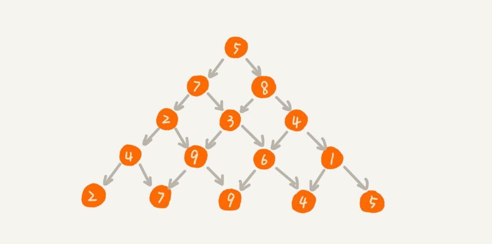
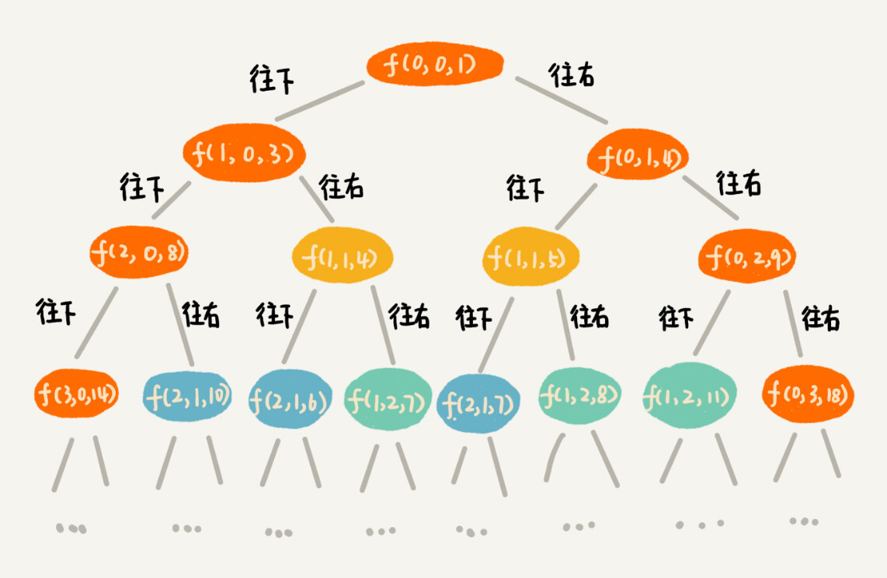
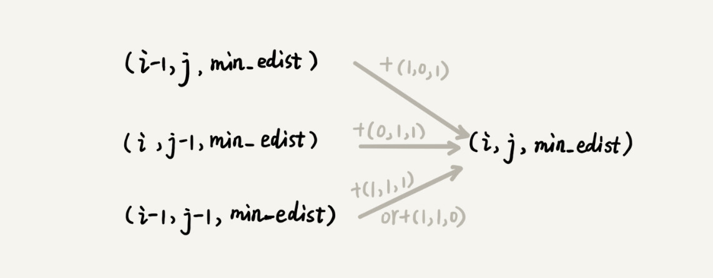

动态规划比较适合用来求解最优问题，比如求最大值、最小值等等。它可以非常显著地降低时间复杂度，提高代码的执行效率。

## 0-1 背包问题

对于一组不同重量、不可分割的物品，我们需要选择一些装入背包，在满足背包最大重量限制的前提下，背包中物品总重量的最大值是多少呢？

关于这个问题，我们上一节讲了回溯的解决方法，也就是穷举搜索所有可能的装法，然后找出满足条件的最大值。不过，回溯算法的复杂度比较高，是指数级别的。那有没有什么规律，可以有效降低时间复杂度呢？我们一起来看看。

```java

// 回溯算法实现。注意：我把输入的变量都定义成了成员变量。
private int maxW = Integer.MIN_VALUE; // 结果放到maxW中
private int[] weight = {2，2，4，6，3};  // 物品重量
private int n = 5; // 物品个数
private int w = 9; // 背包承受的最大重量
public void f(int i, int cw) { // 调用f(0, 0)
  if (cw == w || i == n) { // cw==w表示装满了，i==n表示物品都考察完了
    if (cw > maxW) maxW = cw;
    return;
  }
  f(i+1, cw); // 选择不装第i个物品
  if (cw + weight[i] <= w) {
    f(i+1,cw + weight[i]); // 选择装第i个物品
  }
}
```

规律是不是不好找？那我们就举个例子、画个图看看。我们假设背包的最大承载重量是 9。我们有 5 个不同的物品，每个物品的重量分别是 2，2，4，6，3。如果我们把这个例子的回溯求解过程，用递归树画出来，就是下面这个样子：


递归树中的每个节点表示一种状态，我们用（i, cw）来表示。其中，i 表示将要决策第几个物品是否装入背包，cw 表示当前背包中物品的总重量。比如，（2，2）表示我们将要决策第 2 个物品是否装入背包，在决策前，背包中物品的总重量是 2。

从递归树中，你应该能会发现，有些子问题的求解是重复的，比如图中 f(2, 2) 和 f(3,4) 都被重复计算了两次。我们可以借助递归那一节讲的“备忘录”的解决方式，记录已经计算好的 f(i, cw)，当再次计算到重复的 f(i, cw) 的时候，可以直接从备忘录中取出来用，就不用再递归计算了，这样就可以避免冗余计算。

```java

private int maxW = Integer.MIN_VALUE; // 结果放到maxW中
private int[] weight = {2，2，4，6，3};  // 物品重量
private int n = 5; // 物品个数
private int w = 9; // 背包承受的最大重量
private boolean[][] mem = new boolean[5][10]; // 备忘录，默认值false
public void f(int i, int cw) { // 调用f(0, 0)
  if (cw == w || i == n) { // cw==w表示装满了，i==n表示物品都考察完了
    if (cw > maxW) maxW = cw;
    return;
  }
  if (mem[i][cw]) return; // 重复状态
  mem[i][cw] = true; // 记录(i, cw)这个状态
  f(i+1, cw); // 选择不装第i个物品
  if (cw + weight[i] <= w) {
    f(i+1,cw + weight[i]); // 选择装第i个物品
  }
}
```

这种解决方法非常好。实际上，它已经跟动态规划的执行效率基本上没有差别。但是，多一种方法就多一种解决思路，我们现在来看看动态规划是怎么做的。

我们把整个求解过程分为 n 个阶段，每个阶段会决策一个物品是否放到背包中。每个物品决策（放入或者不放入背包）完之后，背包中的物品的重量会有多种情况，也就是说，会达到多种不同的状态，对应到递归树中，就是有很多不同的节点。

我们把每一层重复的状态（节点）合并，只记录不同的状态，然后基于上一层的状态集合，来推导下一层的状态集合。我们可以通过合并每一层重复的状态，这样就保证每一层不同状态的个数都不会超过 w 个（w 表示背包的承载重量），也就是例子中的 9。于是，我们就成功避免了每层状态个数的指数级增长。

我们用一个二维数组 states\[n][w+1]，来记录每层可以达到的不同状态。

第 0 个（下标从 0 开始编号）物品的重量是 2，要么装入背包，要么不装入背包，决策完之后，会对应背包的两种状态，背包中物品的总重量是 0 或者 2。我们用 states\[0][0]=true 和 states\[0][2]=true 来表示这两种状态。

第 1 个物品的重量也是 2，基于之前的背包状态，在这个物品决策完之后，不同的状态有 3 个，背包中物品总重量分别是 0(0+0)，2(0+2 or 2+0)，4(2+2)。我们用 states\[1][0]=true，states\[1][2]=true，states\[1][4]=true 来表示这三种状态。

以此类推，直到考察完所有的物品后，整个 states 状态数组就都计算好了。我把整个计算的过程画了出来，你可以看看。图中 0 表示 false，1 表示 true。我们只需要在最后一层，找一个值为 true 的最接近 w（这里是 9）的值，就是背包中物品总重量的最大值。


```java

// weight:物品重量，n:物品个数，w:背包可承载重量
public int knapsack(int[] weight, int n, int w) {
  boolean[][] states = new boolean[n][w+1]; // 默认值false
  states[0][0] = true;  // 第一行的数据要特殊处理，可以利用哨兵优化
  if (weight[0] <= w) {
    states[0][weight[0]] = true;
  }
  for (int i = 1; i < n; ++i) { // 动态规划状态转移
    for (int j = 0; j <= w; ++j) {// 不把第i个物品放入背包
      if (states[i-1][j] == true) states[i][j] = states[i-1][j];
    }
    for (int j = 0; j <= w-weight[i]; ++j) {//把第i个物品放入背包
      if (states[i-1][j]==true) states[i][j+weight[i]] = true;
    }
  }
  for (int i = w; i >= 0; --i) { // 输出结果
    if (states[n-1][i] == true) return i;
  }
  return 0;
}
```

实际上，这就是一种用动态规划解决问题的思路。我们把问题分解为多个阶段，每个阶段对应一个决策。我们记录每一个阶段可达的状态集合（去掉重复的），然后通过当前阶段的状态集合，来推导下一个阶段的状态集合，动态地往前推进。

这个代码的时间复杂度非常好分析，耗时最多的部分就是代码中的两层 for 循环，所以时间复杂度是 O(n*w)。n 表示物品个数，w 表示背包可以承载的总重量。

从理论上讲，指数级的时间复杂度肯定要比 O(n*w) 高很多

尽管动态规划的执行效率比较高，但是就刚刚的代码实现来说，我们需要额外申请一个 n 乘以 w+1 的二维数组，对空间的消耗比较多。所以，有时候，我们会说，动态规划是一种空间换时间的解决思路。你可能要问了，有什么办法可以降低空间消耗吗？

实际上，我们只需要一个大小为 w+1 的一维数组就可以解决这个问题。动态规划状态转移的过程，都可以基于这个一维数组来操作。

```java

public static int knapsack2(int[] items, int n, int w) {
  boolean[] states = new boolean[w+1]; // 默认值false
  states[0] = true;  // 第一行的数据要特殊处理，可以利用哨兵优化
  if (items[0] <= w) {
    states[items[0]] = true;
  }
  for (int i = 1; i < n; ++i) { // 动态规划
    for (int j = w-items[i]; j >= 0; --j) {//把第i个物品放入背包
      if (states[j]==true) states[j+items[i]] = true;
    }
  }
  for (int i = w; i >= 0; --i) { // 输出结果
    if (states[i] == true) return i;
  }
  return 0;
}

```

这里我特别强调一下代码中的第 8 行，j 需要从大到小来处理。如果我们按照 j 从小到大处理的话，会出现 for 循环重复计算的问题。

## 0-1 背包问题升级版

我们刚刚讲的背包问题，只涉及背包重量和物品重量。我们现在引入物品价值这一变量。对于一组不同重量、不同价值、不可分割的物品，我们选择将某些物品装入背包，在满足背包最大重量限制的前提下，背包中可装入物品的总价值最大是多少呢？

这个问题依旧可以用回溯算法来解决。

```java

private int maxV = Integer.MIN_VALUE; // 结果放到maxV中
private int[] items = {2，2，4，6，3};  // 物品的重量
private int[] value = {3，4，8，9，6}; // 物品的价值
private int n = 5; // 物品个数
private int w = 9; // 背包承受的最大重量
public void f(int i, int cw, int cv) { // 调用f(0, 0, 0)
  if (cw == w || i == n) { // cw==w表示装满了，i==n表示物品都考察完了
    if (cv > maxV) maxV = cv;
    return;
  }
  f(i+1, cw, cv); // 选择不装第i个物品
  if (cw + weight[i] <= w) {
    f(i+1,cw+weight[i], cv+value[i]); // 选择装第i个物品
  }
}
```

针对上面的代码，我们还是照例画出递归树。在递归树中，每个节点表示一个状态。现在我们需要 3 个变量（i, cw, cv）来表示一个状态。其中，i 表示即将要决策第 i 个物品是否装入背包，cw 表示当前背包中物品的总重量，cv 表示当前背包中物品的总价值。


我们发现，在递归树中，有几个节点的 i 和 cw 是完全相同的，比如 f(2,2,4) 和 f(2,2,3)。在背包中物品总重量一样的情况下，f(2,2,4) 这种状态对应的物品总价值更大，我们可以舍弃 f(2,2,3) 这种状态，只需要沿着 f(2,2,4) 这条决策路线继续往下决策就可以。

也就是说，对于 (i, cw) 相同的不同状态，那我们只需要保留 cv 值最大的那个，继续递归处理，其他状态不予考虑。

思路说完了，但是代码如何实现呢？如果用回溯算法，这个问题就没法再用“备忘录”解决了。所以，我们就需要换一种思路，看看动态规划是不是更容易解决这个问题？

我们还是把整个求解过程分为 n 个阶段，每个阶段会决策一个物品是否放到背包中。每个阶段决策完之后，背包中的物品的总重量以及总价值，会有多种情况，也就是会达到多种不同的状态。

我们用一个二维数组 states[n][w+1]，来记录每层可以达到的不同状态。不过这里数组存储的值不再是 boolean 类型的了，而是当前状态对应的最大总价值。我们把每一层中 (i, cw) 重复的状态（节点）合并，只记录 cv 值最大的那个状态，然后基于这些状态来推导下一层的状态。

```java

public static int knapsack3(int[] weight, int[] value, int n, int w) {
  int[][] states = new int[n][w+1];
  for (int i = 0; i < n; ++i) { // 初始化states
    for (int j = 0; j < w+1; ++j) {
      states[i][j] = -1;
    }
  }
  states[0][0] = 0;
  if (weight[0] <= w) {
    states[0][weight[0]] = value[0];
  }
  for (int i = 1; i < n; ++i) { //动态规划，状态转移
    for (int j = 0; j <= w; ++j) { // 不选择第i个物品
      if (states[i-1][j] >= 0) states[i][j] = states[i-1][j];
    }
    for (int j = 0; j <= w-weight[i]; ++j) { // 选择第i个物品
      if (states[i-1][j] >= 0) {
        int v = states[i-1][j] + value[i];
        if (v > states[i][j+weight[i]]) {
          states[i][j+weight[i]] = v;
        }
      }
    }
  }
  // 找出最大值
  int maxvalue = -1;
  for (int j = 0; j <= w; ++j) {
    if (states[n-1][j] > maxvalue) maxvalue = states[n-1][j];
  }
  return maxvalue;
}
```

时间复杂度是 O(n*w)，空间复杂度也是 O(n*w)。跟上一个例子类似，空间复杂度也是可以优化的

## 思考题

淘宝的“双十一”购物节有各种促销活动，比如“满 200 元减 50 元”。假设你女朋友的购物车中有 n 个（n>100）想买的商品，她希望从里面选几个，在凑够满减条件的前提下，让选出来的商品价格总和最大程度地接近满减条件（200 元），这样就可以极大限度地“薅羊毛”。作为程序员的你，能不能编个代码来帮她搞定呢？

对于这个问题，你当然可以利用回溯算法，穷举所有的排列组合，看大于等于 200 并且最接近 200 的组合是哪一个？但是，这样效率太低了点，时间复杂度非常高，是指数级的。当 n 很大的时候，可能“双十一”已经结束了，你的代码还没有运行出结果，这显然会让你在女朋友心中的形象大大减分。

实际上，它跟第一个例子中讲的 0-1 背包问题很像，只不过是把“重量”换成了“价格”而已。购物车中有 n 个商品。我们针对每个商品都决策是否购买。每次决策之后，对应不同的状态集合。我们还是用一个二维数组 states[n][x]，来记录每次决策之后所有可达的状态。不过，这里的 x 值是多少呢？

0-1 背包问题中，我们找的是小于等于 w 的最大值，x 就是背包的最大承载重量 w+1。对于这个问题来说，我们要找的是大于等于 200（满减条件）的值中最小的，所以就不能设置为 200 加 1 了。就这个实际的问题而言，如果要购买的物品的总价格超过 200 太多，比如 1000，那这个羊毛“薅”得就没有太大意义了。所以，我们可以限定 x 值为 1001。

不过，这个问题不仅要求大于等于 200 的总价格中的最小的，我们还要找出这个最小总价格对应都要购买哪些商品。实际上，我们可以利用 states 数组，倒推出这个被选择的商品序列。我先把代码写出来，待会再照着代码给你解释。

```java

// items商品价格，n商品个数, w表示满减条件，比如200
public static void double11advance(int[] items, int n, int w) {
  boolean[][] states = new boolean[n][3*w+1];//超过3倍就没有薅羊毛的价值了
  states[0][0] = true;  // 第一行的数据要特殊处理
  if (items[0] <= 3*w) {
    states[0][items[0]] = true;
  }
  for (int i = 1; i < n; ++i) { // 动态规划
    for (int j = 0; j <= 3*w; ++j) {// 不购买第i个商品
      if (states[i-1][j] == true) states[i][j] = states[i-1][j];
    }
    for (int j = 0; j <= 3*w-items[i]; ++j) {//购买第i个商品
      if (states[i-1][j]==true) states[i][j+items[i]] = true;
    }
  }

  int j;
  for (j = w; j < 3*w+1; ++j) { 
    if (states[n-1][j] == true) break; // 输出结果大于等于w的最小值
  }
  if (j == 3*w+1) return; // 没有可行解
  for (int i = n-1; i >= 1; --i) { // i表示二维数组中的行，j表示列
    if(j-items[i] >= 0 && states[i-1][j-items[i]] == true) {
      System.out.print(items[i] + " "); // 购买这个商品
      j = j - items[i];
    } // else 没有购买这个商品，j不变。
  }
  if (j != 0) System.out.print(items[0]);
}
```

代码的前半部分跟 0-1 背包问题没有什么不同，我们着重看后半部分，看它是如何打印出选择购买哪些商品的。

状态 (i, j) 只有可能从 (i-1, j) 或者 (i-1, j-value[i]) 两个状态推导过来。所以，我们就检查这两个状态是否是可达的，也就是 states\[i-1][j]或者 states\[i-1][j-value[i]]是否是 true。

如果 states\[i-1][j]可达，就说明我们没有选择购买第 i 个商品，如果 states\[i-1][j-value[i]]可达，那就说明我们选择了购买第 i 个商品。我们从中选择一个可达的状态（如果两个都可达，就随意选择一个），然后，继续迭代地考察其他商品是否有选择购买。


大部分动态规划能解决的问题，都可以通过回溯算法来解决，只不过回溯算法解决起来效率比较低，时间复杂度是指数级的。动态规划算法，在执行效率方面，要高很多。尽管执行效率提高了，但是动态规划的空间复杂度也提高了，所以，很多时候，我们会说，动态规划是一种空间换时间的算法思想。


“杨辉三角”不知道你听说过吗？我们现在对它进行一些改造。每个位置的数字可以随意填写，经过某个数字只能到达下面一层相邻的两个数字。

假设你站在第一层，往下移动，我们把移动到最底层所经过的所有数字之和，定义为路径的长度。请你编程求出从最高层移动到最底层的最短路径长度。




## 动态规划

“一个模型三个特征”

什么是“一个模型”？它指的是动态规划适合解决的问题的模型。我把这个模型定义为“多阶段决策最优解模型”。

我们一般是用动态规划来解决最优问题。而解决问题的过程，需要经历多个决策阶段。每个决策阶段都对应着一组状态。然后我们寻找一组决策序列，经过这组决策序列，能够产生最终期望求解的最优值。

现在，我们再来看，什么是“三个特征”？它们分别是最优子结构、无后效性和重复子问题。

最优子结构指的是，问题的最优解包含子问题的最优解。反过来说就是，我们可以通过子问题的最优解，推导出问题的最优解。如果我们把最优子结构，对应到我们前面定义的动态规划问题模型上，那我们也可以理解为，后面阶段的状态可以通过前面阶段的状态推导出来。

无后效性有两层含义，第一层含义是，在推导后面阶段的状态的时候，我们只关心前面阶段的状态值，不关心这个状态是怎么一步一步推导出来的。第二层含义是，某阶段状态一旦确定，就不受之后阶段的决策影响。无后效性是一个非常“宽松”的要求。只要满足前面提到的动态规划问题模型，其实基本上都会满足无后效性。

重复子问题：不同的决策序列，到达某个相同的阶段时，可能会产生重复的状态。

## 两种动态规划解题思路总结

### 1.状态转移表法

一般能用动态规划解决的问题，都可以使用回溯算法的暴力搜索解决。所以，当我们拿到问题的时候，我们可以先用简单的回溯算法解决，然后定义状态，每个状态表示一个节点，然后对应画出递归树。从递归树中，我们很容易可以看出来，是否存在重复子问题，以及重复子问题是如何产生的。以此来寻找规律，看是否能用动态规划解决。

找到重复子问题之后，接下来，我们有两种处理思路，第一种是直接用回溯加“备忘录”的方法，来避免重复子问题。从执行效率上来讲，这跟动态规划的解决思路没有差别。第二种是使用动态规划的解决方法，状态转移表法。第一种思路，我就不讲了，你可以看看上一节的两个例子。我们重点来看状态转移表法是如何工作的。

我们先画出一个状态表。状态表一般都是二维的，所以你可以把它想象成二维数组。其中，每个状态包含三个变量，行、列、数组值。我们根据决策的先后过程，从前往后，根据递推关系，分阶段填充状态表中的每个状态。最后，我们将这个递推填表的过程，翻译成代码，就是动态规划代码了。

尽管大部分状态表都是二维的，但是如果问题的状态比较复杂，需要很多变量来表示，那对应的状态表可能就是高维的，比如三维、四维。那这个时候，我们就不适合用状态转移表法来解决了。一方面是因为高维状态转移表不好画图表示，另一方面是因为人脑确实很不擅长思考高维的东西。

现在，我们来看一下，如何套用这个状态转移表法，来解决之前那个矩阵最短路径的问题？

从起点到终点，我们有很多种不同的走法。我们可以穷举所有走法，然后对比找出一个最短走法。不过如何才能无重复又不遗漏地穷举出所有走法呢？我们可以用回溯算法这个比较有规律的穷举算法。

```java

private int minDist = Integer.MAX_VALUE; // 全局变量或者成员变量
// 调用方式：minDistBacktracing(0, 0, 0, w, n);
public void minDistBT(int i, int j, int dist, int[][] w, int n) {
  // 到达了n-1, n-1这个位置了，这里看着有点奇怪哈，你自己举个例子看下
  if (i == n && j == n) {
    if (dist < minDist) minDist = dist;
    return;
  }
  if (i < n) { // 往下走，更新i=i+1, j=j
    minDistBT(i + 1, j, dist+w[i][j], w, n);
  }
  if (j < n) { // 往右走，更新i=i, j=j+1
    minDistBT(i, j+1, dist+w[i][j], w, n);
  }
}
```

有了回溯代码之后，接下来，我们要画出递归树，以此来寻找重复子问题。在递归树中，一个状态（也就是一个节点）包含三个变量 (i, j, dist)，其中 i，j 分别表示行和列，dist 表示从起点到达 (i, j) 的路径长度。从图中，我们看出，尽管 (i, j, dist) 不存在重复的，但是 (i, j) 重复的有很多。对于 (i, j) 重复的节点，我们只需要选择 dist 最小的节点，继续递归求解，其他节点就可以舍弃了。



既然存在重复子问题，我们就可以尝试看下，是否可以用动态规划来解决呢？

我们画出一个二维状态表，表中的行、列表示棋子所在的位置，表中的数值表示从起点到这个位置的最短路径。我们按照决策过程，通过不断状态递推演进，将状态表填好。为了方便代码实现，我们按行来进行依次填充。

```java

public int minDistDP(int[][] matrix, int n) {
  int[][] states = new int[n][n];
  int sum = 0;
  for (int j = 0; j < n; ++j) { // 初始化states的第一行数据
    sum += matrix[0][j];
    states[0][j] = sum;
  }
  sum = 0;
  for (int i = 0; i < n; ++i) { // 初始化states的第一列数据
    sum += matrix[i][0];
    states[i][0] = sum;
  }
  for (int i = 1; i < n; ++i) {
    for (int j = 1; j < n; ++j) {
      states[i][j] = 
            matrix[i][j] + Math.min(states[i][j-1], states[i-1][j]);
    }
  }
  return states[n-1][n-1];
}
```

### 2. 状态转移方程法

状态转移方程法有点类似递归的解题思路。我们需要分析，某个问题如何通过子问题来递归求解，也就是所谓的最优子结构。根据最优子结构，写出递归公式，也就是所谓的状态转移方程。有了状态转移方程，代码实现就非常简单了。一般情况下，我们有两种代码实现方法，一种是递归加“备忘录”，另一种是迭代递推。

状态转移方程

```

min_dist(i, j) = w[i][j] + min(min_dist(i, j-1), min_dist(i-1, j))
```

状态转移方程是解决动态规划的关键。如果我们能写出状态转移方程，那动态规划问题基本上就解决一大半了，而翻译成代码非常简单。但是很多动态规划问题的状态本身就不好定义，状态转移方程也就更不好想到。

下面我用递归加“备忘录”的方式，将状态转移方程翻译成来代码，你可以看看。对于另一种实现方式，跟状态转移表法的代码实现是一样的，只是思路不同。

```java

private int[][] matrix = 
         {{1，3，5，9}, {2，1，3，4}，{5，2，6，7}，{6，8，4，3}};
private int n = 4;
private int[][] mem = new int[4][4];
public int minDist(int i, int j) { // 调用minDist(n-1, n-1);
  if (i == 0 && j == 0) return matrix[0][0];
  if (mem[i][j] > 0) return mem[i][j];
  int minLeft = Integer.MAX_VALUE;
  if (j-1 >= 0) {
    minLeft = minDist(i, j-1);
  }
  int minUp = Integer.MAX_VALUE;
  if (i-1 >= 0) {
    minUp = minDist(i-1, j);
  }
  
  int currMinDist = matrix[i][j] + Math.min(minLeft, minUp);
  mem[i][j] = currMinDist;
  return currMinDist;
}
```

两种动态规划解题思路到这里就讲完了。我要强调一点，不是每个问题都同时适合这两种解题思路。有的问题可能用第一种思路更清晰，而有的问题可能用第二种思路更清晰，所以，你要结合具体的题目来看，到底选择用哪种解题思路。


状态转移表法解题思路大致可以概括为，回溯算法实现 - 定义状态 - 画递归树 - 找重复子问题 - 画状态转移表 - 根据递推关系填表 - 将填表过程翻译成代码。状态转移方程法的大致思路可以概括为，找最优子结构 - 写状态转移方程 - 将状态转移方程翻译成代码。

## 贪心、分治、回溯和动态规划

如果我们将这四种算法思想分一下类，那贪心、回溯、动态规划可以归为一类，而分治单独可以作为一类，因为它跟其他三个都不大一样。为什么这么说呢？前三个算法解决问题的模型，都可以抽象成我们今天讲的那个多阶段决策最优解模型，而分治算法解决的问题尽管大部分也是最优解问题，但是，大部分都不能抽象成多阶段决策模型。

回溯算法是个“万金油”。基本上能用的动态规划、贪心解决的问题，我们都可以用回溯算法解决。回溯算法相当于穷举搜索。穷举所有的情况，然后对比得到最优解。不过，回溯算法的时间复杂度非常高，是指数级别的，只能用来解决小规模数据的问题。对于大规模数据的问题，用回溯算法解决的执行效率就很低了。

尽管动态规划比回溯算法高效，但是，并不是所有问题，都可以用动态规划来解决。能用动态规划解决的问题，需要满足三个特征，最优子结构、无后效性和重复子问题。在重复子问题这一点上，动态规划和分治算法的区分非常明显。分治算法要求分割成的子问题，不能有重复子问题，而动态规划正好相反，动态规划之所以高效，就是因为回溯算法实现中存在大量的重复子问题。

贪心算法实际上是动态规划算法的一种特殊情况。它解决问题起来更加高效，代码实现也更加简洁。不过，它可以解决的问题也更加有限。它能解决的问题需要满足三个条件，最优子结构、无后效性和贪心选择性（这里我们不怎么强调重复子问题）。

其中，最优子结构、无后效性跟动态规划中的无异。“贪心选择性”的意思是，通过局部最优的选择，能产生全局的最优选择。每一个阶段，我们都选择当前看起来最优的决策，所有阶段的决策完成之后，最终由这些局部最优解构成全局最优解。

## 课后思考

硬币找零问题，我们在贪心算法那一节中讲过一次。我们今天来看一个新的硬币找零问题。假设我们有几种不同币值的硬币 v1，v2，……，vn（单位是元）。如果我们要支付 w 元，求最少需要多少个硬币。比如，我们有 3 种不同的硬币，1 元、3 元、5 元，我们要支付 9 元，最少需要 3 个硬币（3 个 3 元的硬币）。

可以看做爬阶梯问题，分别可以走1.3.5步，怎么最少走到9步，动态转移方程为f(9)=1+min(f(8),f(6),f(4))

## 如何实现搜索引擎中的拼写纠错功能？

如何量化两个字符串的相似度？

有一个非常著名的量化方法，那就是编辑距离（Edit Distance）。顾名思义，编辑距离指的就是，将一个字符串转化成另一个字符串，需要的最少编辑操作次数（比如增加一个字符、删除一个字符、替换一个字符）。编辑距离越大，说明两个字符串的相似程度越小；相反，编辑距离就越小，说明两个字符串的相似程度越大。对于两个完全相同的字符串来说，编辑距离就是 0。

根据所包含的编辑操作种类的不同，编辑距离有多种不同的计算方式，比较著名的有莱文斯坦距离（Levenshtein distance）和最长公共子串长度（Longest common substring length）。其中，莱文斯坦距离允许增加、删除、替换字符这三个编辑操作，最长公共子串长度只允许增加、删除字符这两个编辑操作。

而且，莱文斯坦距离和最长公共子串长度，从两个截然相反的角度，分析字符串的相似程度。莱文斯坦距离的大小，表示两个字符串差异的大小；而最长公共子串的大小，表示两个字符串相似程度的大小。


如何编程计算莱文斯坦距离？

这个问题是求把一个字符串变成另一个字符串，需要的最少编辑次数。整个求解过程，涉及多个决策阶段，我们需要依次考察一个字符串中的每个字符，跟另一个字符串中的字符是否匹配，匹配的话如何处理，不匹配的话又如何处理。所以，这个问题符合多阶段决策最优解模型。

我们前面讲了，贪心、回溯、动态规划可以解决的问题，都可以抽象成这样一个模型。要解决这个问题，我们可以先看一看，用最简单的回溯算法，该如何来解决。

回溯是一个递归处理的过程。如果 a[i]与 b[j]匹配，我们递归考察 a[i+1]和 b[j+1]。如果 a[i]与 b[j]不匹配，那我们有多种处理方式可选：

可以删除 a[i]，然后递归考察 a[i+1]和 b[j]；
可以删除 b[j]，然后递归考察 a[i]和 b[j+1]；
可以在 a[i]前面添加一个跟 b[j]相同的字符，然后递归考察 a[i]和 b[j+1];
可以在 b[j]前面添加一个跟 a[i]相同的字符，然后递归考察 a[i+1]和 b[j]；可以将 a[i]替换成 b[j]，或者将 b[j]替换成 a[i]，然后递归考察 a[i+1]和 b[j+1]。


```java

private char[] a = "mitcmu".toCharArray();
private char[] b = "mtacnu".toCharArray();
private int n = 6;
private int m = 6;
private int minDist = Integer.MAX_VALUE; // 存储结果
// 调用方式 lwstBT(0, 0, 0);
public lwstBT(int i, int j, int edist) {
  if (i == n || j == m) {
    if (i < n) edist += (n-i);
    if (j < m) edist += (m - j);
    if (edist < minDist) minDist = edist;
    return;
  }
  if (a[i] == b[j]) { // 两个字符匹配
    lwstBT(i+1, j+1, edist);
  } else { // 两个字符不匹配
    lwstBT(i + 1, j, edist + 1); // 删除a[i]或者b[j]前添加一个字符
    lwstBT(i, j + 1, edist + 1); // 删除b[j]或者a[i]前添加一个字符
    lwstBT(i + 1, j + 1, edist + 1); // 将a[i]和b[j]替换为相同字符
  }
}
```

根据回溯算法的代码实现，我们可以画出递归树，看是否存在重复子问题。如果存在重复子问题，那我们就可以考虑能否用动态规划来解决；如果不存在重复子问题，那回溯就是最好的解决方法。


在递归树中，每个节点代表一个状态，状态包含三个变量 (i, j, edist)，其中，edist 表示处理到 a[i]和 b[j]时，已经执行的编辑操作的次数。

在递归树中，(i, j) 两个变量重复的节点很多，比如 (3, 2) 和 (2, 3)。对于 (i, j) 相同的节点，我们只需要保留 edist 最小的，继续递归处理就可以了，剩下的节点都可以舍弃。所以，状态就从 (i, j, edist) 变成了 (i, j, min_edist)，其中 min_edist 表示处理到 a[i]和 b[j]，已经执行的最少编辑次数。

看到这里，你有没有觉得，这个问题跟上两节讲的动态规划例子非常相似？不过，这个问题的状态转移方式，要比之前两节课中讲到的例子都要复杂很多。上一节我们讲的矩阵最短路径问题中，到达状态 (i, j) 只能通过 (i-1, j) 或 (i, j-1) 两个状态转移过来，而今天这个问题，状态 (i, j) 可能从 (i-1, j)，(i, j-1)，(i-1, j-1) 三个状态中的任意一个转移过来。



基于刚刚的分析，我们可以尝试着将把状态转移的过程，用公式写出来。这就是我们前面讲的状态转移方程。

```

如果：a[i]!=b[j]，那么：min_edist(i, j)就等于：
min(min_edist(i-1,j)+1, min_edist(i,j-1)+1, min_edist(i-1,j-1)+1)

如果：a[i]==b[j]，那么：min_edist(i, j)就等于：
min(min_edist(i-1,j)+1, min_edist(i,j-1)+1，min_edist(i-1,j-1))

其中，min表示求三数中的最小值。     
```

了解了状态与状态之间的递推关系，我们画出一个二维的状态表，按行依次来填充状态表中的每个值。


我们现在既有状态转移方程，又理清了完整的填表过程，代码实现就非常简单了。我将代码贴在下面，你可以对比着文字解释，一起看下。

```java

public int lwstDP(char[] a, int n, char[] b, int m) {
  int[][] minDist = new int[n][m];
  for (int j = 0; j < m; ++j) { // 初始化第0行:a[0..0]与b[0..j]的编辑距离
    if (a[0] == b[j]) minDist[0][j] = j;
    else if (j != 0) minDist[0][j] = minDist[0][j-1]+1;
    else minDist[0][j] = 1;
  }
  for (int i = 0; i < n; ++i) { // 初始化第0列:a[0..i]与b[0..0]的编辑距离
    if (a[i] == b[0]) minDist[i][0] = i;
    else if (i != 0) minDist[i][0] = minDist[i-1][0]+1;
    else minDist[i][0] = 1;
  }
  for (int i = 1; i < n; ++i) { // 按行填表
    for (int j = 1; j < m; ++j) {
      if (a[i] == b[j]) minDist[i][j] = min(
          minDist[i-1][j]+1, minDist[i][j-1]+1, minDist[i-1][j-1]);
      else minDist[i][j] = min(
          minDist[i-1][j]+1, minDist[i][j-1]+1, minDist[i-1][j-1]+1);
    }
  }
  return minDist[n-1][m-1];
}

private int min(int x, int y, int z) {
  int minv = Integer.MAX_VALUE;
  if (x < minv) minv = x;
  if (y < minv) minv = y;
  if (z < minv) minv = z;
  return minv;
}
```

当我们拿到一个问题的时候，我们可以先不思考，计算机会如何实现这个问题，而是单纯考虑“人脑”会如何去解决这个问题。人脑比较倾向于思考具象化的、摸得着看得见的东西，不适合思考过于抽象的问题。所以，我们需要把抽象问题具象化。那如何具象化呢？我们可以实例化几个测试数据，通过人脑去分析具体实例的解，然后总结规律，再尝试套用学过的算法，看是否能够解决。

除此之外，我还有一个非常有效、但也算不上技巧的东西，我也反复强调过，那就是多练。实际上，等你做多了题目之后，自然就会有感觉，看到问题，立马就能想到能否用动态规划解决，然后直接就可以寻找最优子结构，写出动态规划方程，然后将状态转移方程翻译成代码。

### 如何编程计算最长公共子串长度？

前面我们讲到，最长公共子串作为编辑距离中的一种，只允许增加、删除字符两种编辑操作。从名字上，你可能觉得它看起来跟编辑距离没什么关系。实际上，从本质上来说，它表征的也是两个字符串之间的相似程度。

这个问题的解决思路，跟莱文斯坦距离的解决思路非常相似，也可以用动态规划解决。我刚刚已经详细讲解了莱文斯坦距离的动态规划解决思路，所以，针对这个问题，我直接定义状态，然后写状态转移方程。

每个状态还是包括三个变量 (i, j, max_lcs)，max_lcs 表示 a[0...i]和 b[0...j]的最长公共子串长度。那 (i, j) 这个状态都是由哪些状态转移过来的呢？

我们先来看回溯的处理思路。我们从 a[0]和 b[0]开始，依次考察两个字符串中的字符是否匹配。

- 如果 a[i]与 b[j]互相匹配，我们将最大公共子串长度加一，并且继续考察 a[i+1]和 b[j+1]。
- 如果 a[i]与 b[j]不匹配，最长公共子串长度不变，这个时候，有两个不同的决策路线：
- 删除 a[i]，或者在 b[j]前面加上一个字符 a[i]，然后继续考察 a[i+1]和 b[j]；
- 删除 b[j]，或者在 a[i]前面加上一个字符 b[j]，然后继续考察 a[i]和 b[j+1]。

反过来也就是说，如果我们要求 a[0...i]和 b[0...j]的最长公共长度 max_lcs(i, j)，我们只有可能通过下面三个状态转移过来：

- (i-1, j-1, max_lcs)，其中 max_lcs 表示 a[0...i-1]和 b[0...j-1]的最长公共子串长度；
- (i-1, j, max_lcs)，其中 max_lcs 表示 a[0...i-1]和 b[0...j]的最长公共子串长度；
- (i, j-1, max_lcs)，其中 max_lcs 表示 a[0...i]和 b[0...j-1]的最长公共子串长度。

如果我们把这个转移过程，用状态转移方程写出来，就是下面这个样子：

```

如果：a[i]==b[j]，那么：max_lcs(i, j)就等于：
max(max_lcs(i-1,j-1)+1, max_lcs(i-1, j), max_lcs(i, j-1))；

如果：a[i]!=b[j]，那么：max_lcs(i, j)就等于：
max(max_lcs(i-1,j-1), max_lcs(i-1, j), max_lcs(i, j-1))；

其中max表示求三数中的最大值。
```

有了状态转移方程，代码实现就简单多了。我把代码贴到了下面，你可以对比着文字一块儿看。

```java

public int lcs(char[] a, int n, char[] b, int m) {
  int[][] maxlcs = new int[n][m];
  for (int j = 0; j < m; ++j) {//初始化第0行：a[0..0]与b[0..j]的maxlcs
    if (a[0] == b[j]) maxlcs[0][j] = 1;
    else if (j != 0) maxlcs[0][j] = maxlcs[0][j-1];
    else maxlcs[0][j] = 0;
  }
  for (int i = 0; i < n; ++i) {//初始化第0列：a[0..i]与b[0..0]的maxlcs
    if (a[i] == b[0]) maxlcs[i][0] = 1;
    else if (i != 0) maxlcs[i][0] = maxlcs[i-1][0];
    else maxlcs[i][0] = 0;
  }
  for (int i = 1; i < n; ++i) { // 填表
    for (int j = 1; j < m; ++j) {
      if (a[i] == b[j]) maxlcs[i][j] = max(
          maxlcs[i-1][j], maxlcs[i][j-1], maxlcs[i-1][j-1]+1);
      else maxlcs[i][j] = max(
          maxlcs[i-1][j], maxlcs[i][j-1], maxlcs[i-1][j-1]);
    }
  }
  return maxlcs[n-1][m-1];
}

private int max(int x, int y, int z) {
  int maxv = Integer.MIN_VALUE;
  if (x > maxv) maxv = x;
  if (y > maxv) maxv = y;
  if (z > maxv) maxv = z;
  return maxv;
}
```


当用户在搜索框内，输入一个拼写错误的单词时，我们就拿这个单词跟词库中的单词一一进行比较，计算编辑距离，将编辑距离最小的单词，作为纠正之后的单词，提示给用户。

这就是拼写纠错最基本的原理。不过，真正用于商用的搜索引擎，拼写纠错功能显然不会就这么简单。一方面，单纯利用编辑距离来纠错，效果并不一定好；另一方面，词库中的数据量可能很大，搜索引擎每天要支持海量的搜索，所以对纠错的性能要求很高。

针对纠错效果不好的问题，我们有很多种优化思路，我这里介绍几种。

- 我们并不仅仅取出编辑距离最小的那个单词，而是取出编辑距离最小的 TOP 10，然后根据其他参数，决策选择哪个单词作为拼写纠错单词。比如使用搜索热门程度来决定哪个单词作为拼写纠错单词。
- 我们还可以用多种编辑距离计算方法，比如今天讲到的两种，然后分别编辑距离最小的 TOP 10，然后求交集，用交集的结果，再继续优化处理。
- 我们还可以通过统计用户的搜索日志，得到最常被拼错的单词列表，以及对应的拼写正确的单词。搜索引擎在拼写纠错的时候，首先在这个最常被拼错单词列表中查找。如果一旦找到，直接返回对应的正确的单词。这样纠错的效果非常好。
- 我们还有更加高级一点的做法，引入个性化因素。针对每个用户，维护这个用户特有的搜索喜好，也就是常用的搜索关键词。当用户输入错误的单词的时候，我们首先在这个用户常用的搜索关键词中，计算编辑距离，查找编辑距离最小的单词。

针对纠错性能方面，我们也有相应的优化方式。我讲两种分治的优化思路。

- 如果纠错功能的 TPS 不高，我们可以部署多台机器，每台机器运行一个独立的纠错功能。当有一个纠错请求的时候，我们通过负载均衡，分配到其中一台机器，来计算编辑距离，得到纠错单词。
- 如果纠错系统的响应时间太长，也就是，每个纠错请求处理时间过长，我们可以将纠错的词库，分割到很多台机器。当有一个纠错请求的时候，我们就将这个拼写错误的单词，同时发送到这多台机器，让多台机器并行处理，分别得到编辑距离最小的单词，然后再比对合并，最终决定出一个最优的纠错单词。

真正的搜索引擎的拼写纠错优化，肯定不止我讲的这么简单，但是万变不离其宗。掌握了核心原理，就是掌握了解决问题的方法，剩下就靠你自己的灵活运用和实战操练了。


中文纠错很多时候是通过拼音进行的，比如 "刘得花"->"liudehua"->"刘德华". 拼音检索方法也有很多，比如可以把热门词汇的拼音字母组织成Trie树，每个热词的结尾汉字的最后一个拼音字母就是叶子，整体性能就是O(n)的，n为query的拼音总长度. 除了拼音外也有根据字形（二维文字版的编辑距离？）甚至语义等做的纠错策略。
传统搜索引擎中的查询词智能提示、纠错、同义词、近义词、同好词、相关搜索、知识图谱等系列功能统称为用户的意图识别模块。

## 课后思考

我们有一个数字序列包含 n 个不同的数字，如何求出这个序列中的最长递增子序列长度？比如 2, 9, 3, 6, 5, 1, 7 这样一组数字序列，它的最长递增子序列就是 2, 3, 5, 7，所以最长递增子序列的长度是 4。

