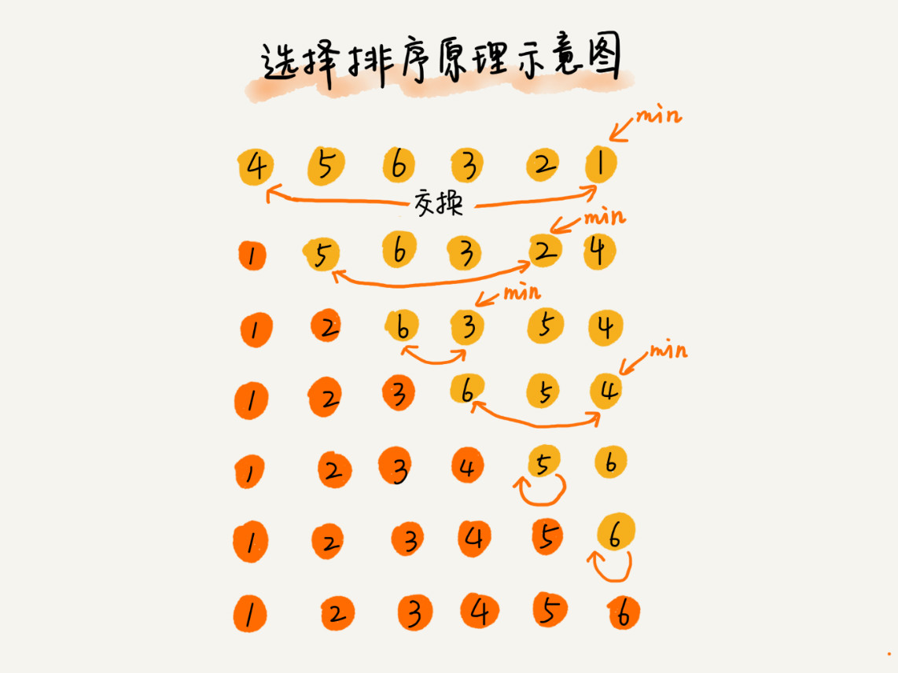
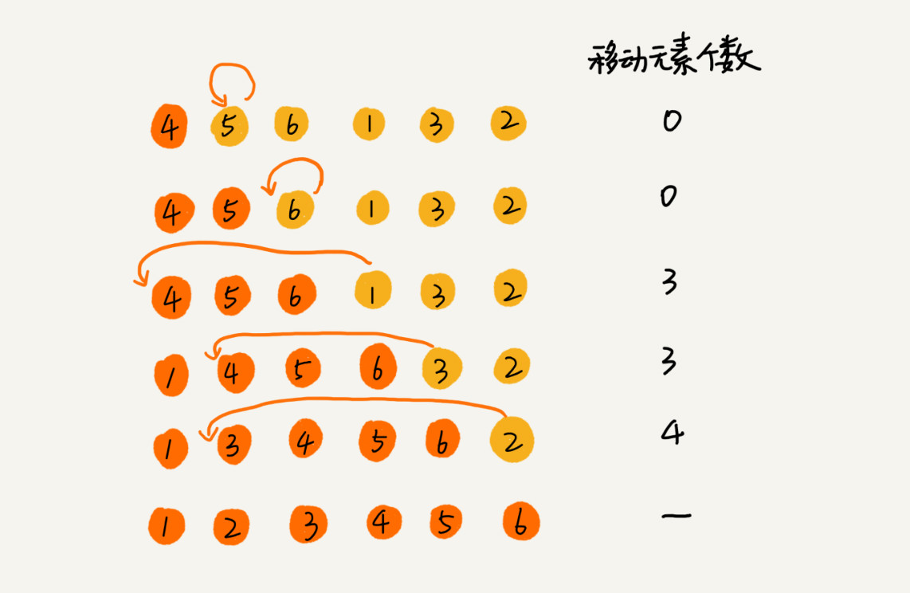
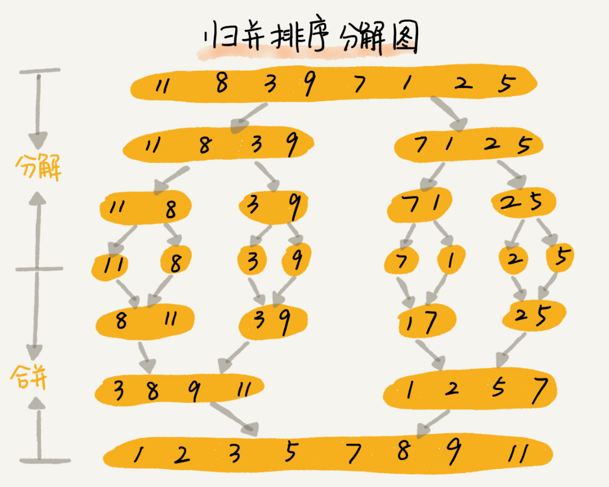
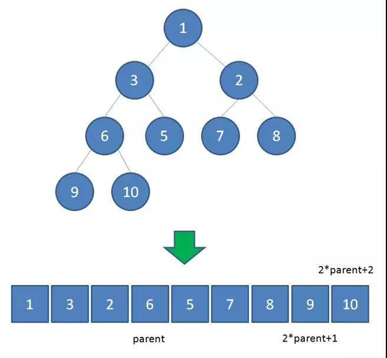
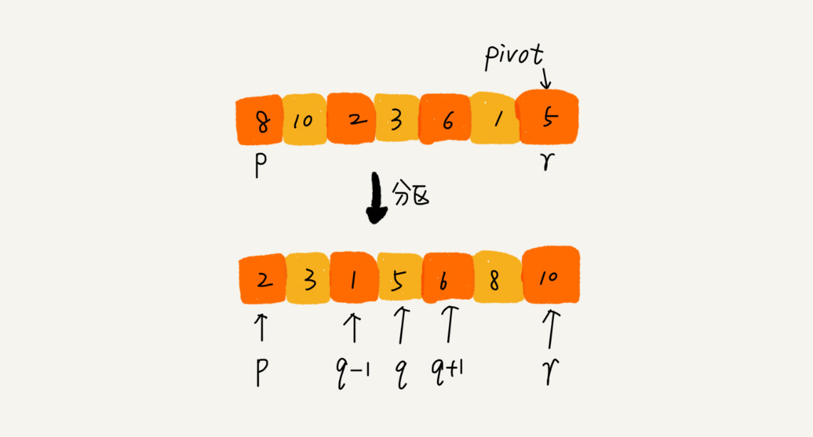
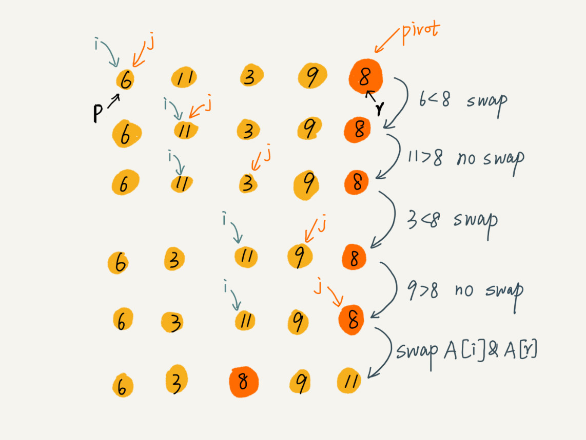
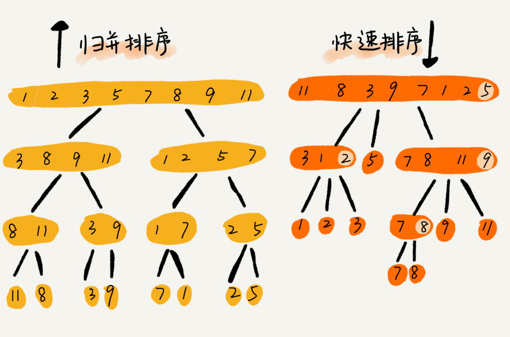
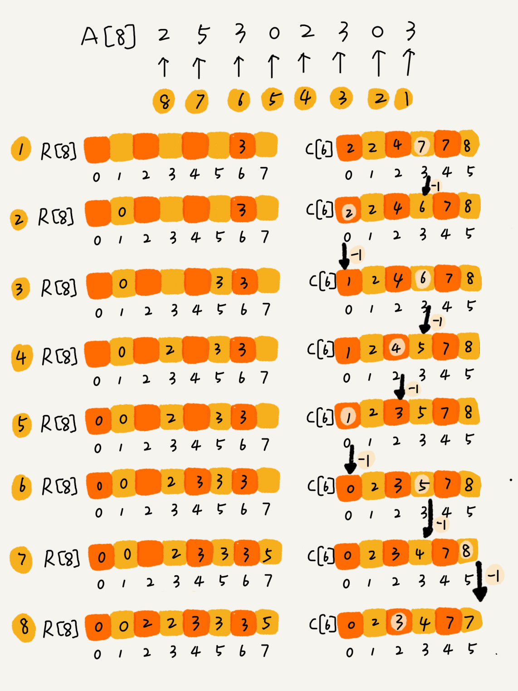
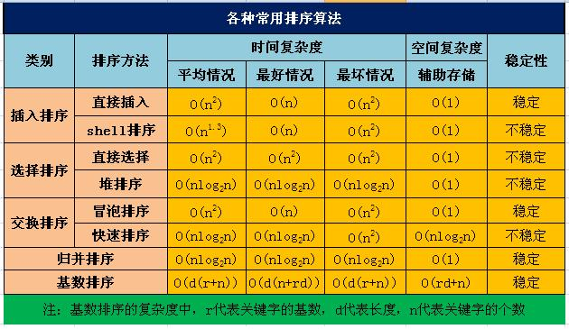

本文是数据结构与算法系列的第8篇

### 如何分析一个“排序算法”？

**排序算法的执行效率**

1. 最好情况、最坏情况、平均情况时间复杂度

对于要排序的数据，有的接近有序，有的完全无序。有序度不同的数据，对于排序的执行时间肯定是有影响的，我们要知道排序算法在不同数据下的性能表现。

2. 时间复杂度的系数、常数 、低阶

实际的软件开发中，我们排序的可能是 10 个、100 个、1000 个这样规模很小的数据，所以，在对同一阶时间复杂度的排序算法性能对比的时候，我们就要把系数、常数、低阶也考虑进来。

3. 比较次数和交换（或移动）次数

基于比较的排序算法的执行过程，会涉及两种操作，一种是元素比较大小，另一种是元素交换或移动。所以，如果我们在分析排序算法的执行效率的时候，应该把比较次数和交换（或移动）次数也考虑进去。

**排序算法的内存消耗**

算法的内存消耗可以通过空间复杂度来衡量，排序算法也不例外。不过，针对排序算法的空间复杂度，我们还引入了一个新的概念，原地排序（Sorted in place）。

原地排序算法，就是特指空间复杂度是 O(1) 的排序算法。

**排序算法的稳定性**

稳定性是说，如果待排序的序列中存在值相等的元素，经过排序之后，相等元素之间原有的先后顺序不变。

比如说，我们现在要给电商交易系统中的“订单”排序。订单有两个属性，一个是下单时间，另一个是订单金额。如果我们现在有 10 万条订单数据，我们希望按照金额从小到大对订单数据排序。对于金额相同的订单，我们希望按照下单时间从早到晚有序。对于这样一个排序需求，我们怎么来做呢？最先想到的方法是：我们先按照金额对订单数据进行排序，然后，再遍历排序之后的订单数据，对于每个金额相同的小区间再按照下单时间排序。这种排序思路理解起来不难，但是实现起来会很复杂。借助稳定排序算法，这个问题可以非常简洁地解决。解决思路是这样的：我们先按照下单时间给订单排序，注意是按照下单时间，不是金额。排序完成之后，我们用稳定排序算法，按照订单金额重新排序。两遍排序之后，我们得到的订单数据就是按照金额从小到大排序，金额相同的订单按照下单时间从早到晚排序的。


### 冒泡排序（Bubble Sort）

**冒泡排序只会操作相邻的两个数据。**

冒泡操作是指，比较相邻的两个元素，看是否满足大小关系的要求，如果不满足就将它们互换。

因为越小(或越大)的元素会经由交换慢慢“浮”到数列的顶端，所以一次冒泡会让至少一个元素移动到它应该在的位置，重复 n 次，就完成了 n 个数据的排序工作。

冒泡过程还可以优化一下，当某次冒泡操作已经没有数据交换时，说明已经达到完全有序，不用再继续执行后续的冒泡操作。

冒泡排序的代码如下（从小到大排序）

```
# 冒泡排序，a 表示数组，n 表示数组大小
def bubbleSort(a, n):
    if n <= 1:
        return
    for i in range(n):
    	# 提前退出冒泡循环的标志位
    	flag = False;
    	for j in range(n-i-1):
    		if a[j] > a[j+1]:
    			# 交换
    			a[j], a[j+1] = a[j+1], a[j]
    			flag = True  # 表示有数据交换
    	if not flag:   # 没有数据交换，提前退出
    		break
```

**1.是否原地排序算法？**

冒泡的过程只涉及相邻数据的交换操作，只需要常量级的临时空间，所以它的空间复杂度为 O(1)，是一个原地排序算法。

**2.是否稳定排序？**

因为比较的时候我们用的是a[j]>a[j+1]才会交换，即两个元素相等时不会进行交换，所以冒泡排序是一个稳定的排序。

**3.时间复杂度分析**

最好情况下，要排序的数据已经是有序的了，我们只需要进行一次冒泡操作，就可以结束了，所以最好情况时间复杂度是 O(n)。

最坏的情况是，要排序的数据刚好是倒序排列的，我们需要进行 n 次冒泡操作：

$ (n-1)+(n-2)+...+2+1=n(n-1)/2=n^2/2-n/2$

所以最坏情况时间复杂度为 $O(n^2)$。

那么平均情况下的时间复杂度呢？

对于包含 n 个数据的数组，这 n 个数据就有 n! 种排列方式。不同的排列方式，冒泡排序执行的时间是不同的。如果用概率论方法定量分析平均时间复杂度，涉及的数学推理和计算就会很复杂。**有一种思路是通过"有序度"和"逆序度"来分析平均时间复杂度**。

有序度是数组中具有有序关系的元素对的个数。完全有序的数组的有序度叫做满有序度。

- 有序元素对：a[i]<=a[j]，如果i<j

- 逆序元素对：a[i]>a[j]，如果i<j

- 逆序度=满有序度-有序度，满有序度=n(n-1)/2

排序的过程就是一种增加有序度，减少逆序度的过程，最后达到满有序度，说明排序完成。

冒泡排序包含两个操作原子，比较和交换。每交换一次，有序度就加 1。不管算法怎么改进，交换次数总是确定的，即为逆序度，也就是n*(n-1)/2–初始有序度。

最好情况，交换次数为0，最坏情况，交换次数为n(n-1)/2，我们可以取个中间值 n*(n-1)/4，来表示初始有序度既不是很高也不是很低的平均情况。

也就是说，平均情况下，需要n(n-1)/4次交换操作，比较操作肯定比交换操作多，而复杂度的上限是 $O(n^2)$，所以平均情况下的时间复杂度就是 $O(n^2)$。

这个推导过程并不严格，但很多时候很实用。


### 鸡尾酒排序

鸡尾酒排序，也叫**定向冒泡排序**，是冒泡排序的一种改进。此算法与冒泡排序的不同处在于**从低到高然后从高到低**，而冒泡排序则仅从低到高去比较序列里的每个元素。他可以得到比冒泡排序稍微好一点的效能。

```
def CocktailSort(a, n):
    left = 0                            # 初始化边界
    right = n - 1
    while left < right:
        for i in range(left, right):   # 前半轮,将最大元素放到后面
            if a[i] > a[i + 1]:
                a[i], a[i+1] = a[i+1], a[i]
        right -= 1
        for i in range(right,left,-1): # 后半轮,将最小元素放到前面
            if (a[i - 1] > a[i])
                a[i-1], a[i] = a[i], a[i-1]
        left += 1
```

以序列(2,3,4,5,1)为例，鸡尾酒排序只需要访问一次序列就可以完成排序，但如果使用冒泡排序则需要四次。但是在乱数序列的状态下，鸡尾酒排序与冒泡排序的效率都很差劲。

最好时间复杂度O(n)，最坏时间复杂度$O(n^2)$，平均时间复杂度$O(n^2)$，是一个稳定的排序算法，也是原地排序算法。


### 选择排序（Selection Sort）

工作原理：初始时在序列中找到最小（大）元素，放到序列的起始位置作为已排序序列；然后，再从剩余未排序元素中继续寻找最小（大）元素，放到已排序序列的末尾。以此类推，直到所有元素均排序完毕。



**简单选择排序法：就是通过n-1次关键字间的比较，从n-i+1个记录中选出关键字最小的记录，并和第i（1<=i<=n）个记录交换之。**

　　注意选择排序与冒泡排序的区别：冒泡排序通过依次交换相邻两个顺序不合法的元素位置，从而将当前最小（大）元素放到合适的位置；而选择排序每遍历一次都记住了当前最小（大）元素的位置，最后仅需一次交换操作即可将其放到合适的位置。

```
def SelectionSort(A, n):
    for i in range(0,n-1):         # i为已排序序列的末尾
        min = i
        for i in range(i+1,n):     # 未排序序列
            if A[j] < A[min]:     # 找出未排序序列中的最小值
                min = j
        if min != i:
        	A[i], A[min] = A[min], A[i]    # 放到已排序序列的末尾，该操作很有可能把稳定性打乱，所以选择排序是不稳定的排序算法
```

选择排序空间复杂度为 O(1)，是一种原地排序算法。

选择排序的最好情况时间复杂度、最坏情况和平均情况时间复杂度都为 $O(n^2)$。

**选择排序是不稳定的排序算法，不稳定发生在最小元素与A[i]交换的时刻。**

比如序列：{ 5, 8, 5, 2, 9 }，一次选择的最小元素是2，然后把2和第一个5进行交换，从而改变了两个元素5的相对次序。


### 插入排序（Insertion Sort）

**插入排序适用处理数据量比较少或者部分有序的数据。**

插入算法的核心思想是取未排序区间中的元素，在已排序区间中找到合适的插入位置将其插入，并保证已排序区间数据一直有序。重复这个过程，直到未排序区间中元素为空，算法结束。

插入排序也包含两种操作，一种是元素的比较，一种是元素的移动。

对于不同的查找插入点方法（从头到尾、从尾到头），元素的比较次数是有区别的。但对于一个给定的初始序列，移动操作的次数总是固定的，就等于逆序度。



插入排序在实现上，通常采用in-place排序（即只需用到O(1)的额外空间的排序），因而在从后向前扫描过程中，需要反复把已排序元素逐步向后挪位，为最新元素提供插入空间。

代码实现：

```python
def insertionSort(a, n):
    if n <= 1:
        return
    for i in range(1, n):
        value = a[i]
        for j in range(i-1, -1, -1):
            if a[j] > value:
                a[j+1] = a[j]  # 数据移动
            else:
                break
        a[j+1] = value
```

**1.是否原地排序算法？**

插入排序算法的运行并不需要额外的存储空间，空间复杂度是 O(1)，是一个原地排序算法。

**2.是否稳定排序？**

在插入排序中，对于值相同的元素，我们可以选择将后面出现的元素，插入到前面出现元素的后面，这样就可以保持原有的前后顺序不变，所以插入排序是稳定的排序算法。

**3.时间复杂度分析**

如果要排序的数据已经是有序的，我们并不需要搬移任何数据。如果我们**从尾到头**在有序数据组里面查找插入位置，每次只需要比较一个数据就能确定插入的位置。所以这种情况下，最好是时间复杂度为 O(n)。

如果数组是倒序的，每次插入都相当于在数组的第一个位置插入新的数据，所以需要移动大量的数据，所以最坏情况时间复杂度为 $O(n^2)$。

对于插入排序来说，每次插入操作都相当于在数组中插入一个数据，循环执行 n 次插入操作，而插入一个数据的平均时间复杂度是 O(n)，所以平均时间复杂度为 $O(n^2)$。

插入排序不适合对于数据量比较大的排序应用。但是，如果需要排序的数据量很小，比如量级小于千，那么插入排序还是一个不错的选择。 插入排序在工业级库中也有着广泛的应用，在STL的sort算法和stdlib的qsort算法中，都将插入排序作为快速排序的补充，用于少量元素的排序（通常为8个或以下）。

**冒泡排序和插入排序的时间复杂度都是 O(n2)，都是原地排序算法，为什么插入排序要比冒泡排序更受欢迎呢？**

冒泡排序不管怎么优化，元素交换的次数是一个固定值，是原始数据的逆序度。插入排序是同样的，不管怎么优化，元素移动的次数也等于原始数据的逆序度。

但是，从代码实现上来看，冒泡排序的数据交换要比插入排序的数据移动要复杂。

冒泡排序中数据的交换操作：

```python
if a[j] > a[j+1]:
    a[j], a[j+1] = a[j+1], a[j]
    flag = True
```

如果是C、Java中的实现，则需要3个赋值语句才能完成上述的交换操作。

插入排序中数据的移动操作：

```python
if a[j] > value:
    a[j+1] = a[j]
else:
    break
```

我们把执行一个赋值语句的时间粗略地计为单位时间（unit_time），然后分别用冒泡排序和插入排序对同一个逆序度是 K 的数组进行排序。用冒泡排序，需要 K 次交换操作，每次需要 3 个赋值语句，所以交换操作总耗时就是 3*K 单位时间。而插入排序中数据移动操作只需要 K 个单位时间。

这个只是我们非常理论的分析，为了实验，针对上面的冒泡排序和插入排序的 Java 代码，我写了一个性能对比测试程序，随机生成 10000 个数组，每个数组中包含 200 个数据，然后在我的机器上分别用冒泡和插入排序算法来排序，冒泡排序算法大约 700ms 才能执行完成，而插入排序只需要 100ms 左右就能搞定！

所以，虽然冒泡排序和插入排序在时间复杂度上是一样的，都是 $O(n^2)$，但是如果我们希望把性能优化做到极致，那肯定首选插入排序。

冒泡排序、选择排序，可能就纯粹停留在理论的层面了，学习的目的也只是为了开拓思维，实际开发中应用并不多，但是插入排序还是挺有用的。

这三种排序算法对于小规模数据的排序，用起来非常高效。但是在大规模数据排序的时候，这个时间复杂度还是稍微有点高，更倾向于用时间复杂度为 O(nlogn) 的排序算法。

**特定算法是依赖特定的数据结构的。这三种排序算法，都是基于数组实现的。如果数据存储在链表中，这三种排序算法还能工作吗？如果能，那相应的时间、空间复杂度又是多少呢？**

对于老师所提课后题，觉得应该有个前提，是否允许修改链表的节点value值，还是只能改变节点的位置。一般而言，考虑只能改变节点位置，冒泡排序相比于数组实现，比较次数一致，但交换时操作更复杂；插入排序，比较次数一致，不需要再有后移操作，找到位置后可以直接插入，但排序完毕后可能需要倒置链表；选择排序比较次数一致，交换操作同样比较麻烦。综上，时间复杂度和空间复杂度并无明显变化，若追求极致性能，冒泡排序的时间复杂度系数会变大，插入排序系数会减小，选择排序无明显变化。


### 二分插入排序

对于插入排序，如果比较操作的代价比交换操作大的话，可以采用**二分查找法**来减少比较操作的次数，我们称为**二分插入排序**，代码如下：

```python
# 分类 -------------- 内部比较排序
# 数据结构 ---------- 数组
# 最差时间复杂度 ---- O(n^2)
# 最优时间复杂度 ---- O(nlogn)
# 平均时间复杂度 ---- O(n^2)
# 所需辅助空间 ------ O(1)
# 稳定性 ------------ 稳定

def InsertionSortDichotomy(A, n):
    for i in range(i, n):
        get = A[i]   # 右手抓到一张扑克牌
        left = 0   # 拿在左手上的牌总是排序好的，所以可以用二分法
        right = i -1   # 手牌左右边界进行初始化
        while left <= right:  # 采用二分法定位新牌的位置
            mid = (left + right) / 2
            if A[mid] > get:
                right = mid - 1
            else
                left = mid + 1
        for j in range(i-1, left-1, -1):   # 将欲插入新牌位置右边的牌整体向右移动一个单位
            A[j+1] = A[j]
        A[left] = get   # 将抓到的牌插入手牌
```

当n较大时，二分插入排序的比较次数比直接插入排序的最差情况好得多，但比直接插入排序的最好情况要差，所以当元素初始序列已经接近升序时，直接插入排序比二分插入排序比较次数少。二分插入排序元素移动次数与直接插入排序相同，依赖于元素初始序列。


### 希尔排序

希尔排序，也叫**递减增量排序**，是插入排序的一种更高效的改进版本。希尔排序是**不稳定**的排序算法。

　　希尔排序是基于插入排序的以下两点性质而提出改进方法的：

- **插入排序在对几乎已经排好序的数据操作时，效率高，即可以达到线性排序的效率**
- **但插入排序一般来说是低效的，因为插入排序每次只能将数据移动一位**

　　希尔排序通过将比较的全部元素分为几个区域来提升插入排序的性能。这样可以让一个元素可以一次性地朝最终位置前进一大步。然后算法再取越来越小的步长进行排序，算法的最后一步就是普通的插入排序，但是到了这步，需排序的数据几乎是已排好的了（此时插入排序较快）。 

假设有一个很小的数据在一个已按升序排好序的数组的末端。如果用复杂度为$O(n^2)$的排序（冒泡排序或直接插入排序），可能会进行n次的比较和交换才能将该数据移至正确位置。而希尔排序会用较大的步长移动数据，所以小数据只需进行少数比较和交换即可到正确位置。

希尔排序（ShellSort）是以它的发明者Donald Shell名字命名的，希尔排序是插入排序的改进版，实现简单，对于中等规模数据的性能表现还不错。而插入排序在小规模数据数据或者基本有序或者时十分高效。

首先它把较大的数据集合分割成若干个小组（逻辑上分组），然后对每一个小组分别进行插入排序，此时，插入排序所作用的数据量比较小（每一个小组），插入的效率比较高。比如a[0]与a[4]是一组、a[1]与a[5]是一组...，这里的差值（距离）被称为增量。

每个分组进行插入排序后，各个分组就变成了有序的了（整体不一定有序），此时，整个数组变的部分有序了（有序程度可能不是很高）。

然后缩小增量为上个增量的一半，继续划分分组，此时，每个分组元素个数多了，但是，数组变的部分有序了，插入排序效率同样比较高。同理对每个分组进行排序（插入排序），使其每个分组各自有序。

最后设置增量为上一个增量的一半，则整个数组被分为一组，此时，整个数组已经接近有序了，插入排序效率高。同理，对这仅有的一组数据进行排序，排序完成。

对各个组进行插入的时候并不是先对一个组进行排序完再对另一个组进行排序，而是轮流对每个组进行插入排序。

**复杂度**

希尔排序的复杂度和增量序列是相关的

{1,2,4,8,...}这种序列并不是很好的增量序列，使用这个增量序列的时间复杂度（最坏情形）是$O(n^2)$

Hibbard提出了另一个增量序列{1,3,7，...,2^k-1}， 这种序列的时间复杂度(最坏情形)为$O(n^1.5)$

Sedgewick提出了几种增量序列，其最坏情形运行时间为$O（n^1.3）$,其中最好的一个序列是{1,5,19,41,109,...}

对不同增量的复杂度感兴趣可以参考《数据结构与算法分析》一书或其他相关论文

**稳定性**

不是稳定的，虽然插入排序是稳定的，但是希尔排序在插入的时候是跳跃性插入的，有可能破坏稳定性.

比如序列：{ 3, 5, 10, 8, 7, 2, 8, 1, 20, 6 }，h=2时分成两个子序列 { 3, 10, 7, 8, 20 } 和  { 5, 8, 2, 1, 6 } ，未排序之前第二个子序列中的8在前面，现在对两个子序列进行插入排序，得到 { 3, 7, 8, 10, 20 } 和 { 1, 2, 5, 6, 8 } ，即 { 3, 1, 7, 2, 8, 5, 10, 6, 20, 8 } ，两个8的相对次序发生了改变。

代码实现

```python
def shellSort(arr):
    N = len(arr)
    # 进行分组，最开始时的增量(gap)为数组长度的一半
    gap = N/2
    while gap>0:
        # 对各个分组进行插入排序
        for i in range(gap, N):
            # 将arr[i]插入到所在分组的正确位置上
            insertI(arr, gap, i)
        gap /= 2

# 将arr[i]插入到所在分组的正确位置上
# arr[i]所在分组为：
# ...arr[i-2*gap]、arr[i-gap]、arr[i]、arr[i+gap]、arr[i+2*gap]...
def insertI(arr, gap, i):
    inserted = arr[i]
    # 插入的时候按组进行插入(组内元素两两相隔gap)
    for j in range(i-gap, -1, -gap):
        if inserted < arr[j]:
            arr[j+gap] = arr[j]
        else:
            break
    arr[j+gap] = inserted
```


### 归并排序（Merge Sort）

归并排序是创建在归并操作上的一种有效的排序算法，效率为O(nlogn)，1945年由冯·诺伊曼首次提出。

归并排序的实现分为**递归实现**与**非递归(迭代)实现**。递归实现的归并排序是算法设计中分治策略的典型应用，我们将一个大问题分割成小问题分别解决，然后用所有小问题的答案来解决整个大问题。非递归(迭代)实现的归并排序首先进行是两两归并，然后四四归并，然后是八八归并，一直下去直到归并了整个数组。



归并排序使用的就是分治思想。**分治是一种解决问题的处理思想，递归是一种编程技巧，这两者并不冲突。**

**如何用递归代码实现归并排序？**

要想写出归并排序的代码，我们先写出归并排序的递推公式，有了递推公式，转化成代码就简单多了。

递推公式：

merge_sort(p…r) = merge(merge_sort(p…q), merge_sort(q+1…r))

终止条件：

p >= r 不用再继续分解

归并排序算法主要依赖归并(Merge)操作。归并操作指的是将两个已经排序的序列合并成一个序列的操作，**归并操作**步骤如下：

1. **申请空间**，使其大小为两个已经排序序列之和，该空间用来存放合并后的序列
2. 设定两个指针，最初位置分别为两个已经排序序列的起始位置
3. 比较两个指针所指向的元素，选择相对小的元素放入到合并空间，并移动指针到下一位置
4. 重复步骤3直到某一指针到达序列尾
5. 将另一序列剩下的所有元素直接复制到合并序列尾

```python
# 合并两个已排好序的数组A[left...mid]和A[mid+1...right]
def Merge(A, left, mid, right):
    len = right - left + 1
    temp = []
    i, j, index = left, mid + 1, 0
    while i <= mid and j <= right:
        # 带等号保证归并排序的稳定性
        if A[i] <= A[j]:
            temp[index+1] = A[i]
            i += 1
        else:
            temp[index+1] = A[j]
            j += 1
        index += 1
    while i <= mid:
        temp[index] = A[i]
        index += 1
        i += 1
    while j <= right:
        temp[index] = A[j]
        index += 1
        j += 1
    for k in range(len):
        A[left+k] = temp[k]

# 递归实现的归并排序(自顶向下)
def MergeSortRecursion(A, left, right):
    # 当待排序的序列长度为1时，递归开始回溯，进行merge操作
    if left == right:
        return
    mid = (left + right) / 2
    MergeSortRecursion(A, left, mid)
    MergeSortRecursion(A, mid + 1, right)
    Merge(A, left, mid, right)


# 非递归(迭代)实现的归并排序(自底向上)
def MergeSortIteration(A, len):
    # 子数组索引,前一个为A[left...mid]，后一个子数组为A[mid+1...right]
    i = 1
    while i < len:
        left = 0
        # 后一个子数组存在(需要归并)
        while left + i < len:             
            mid = left + i - 1
            # 后一个子数组大小可能不够
            if mid + i < len:
                right = mid + i
            else:
                right = len - 1
            Merge(A, left, mid, right)
            # 前一个子数组索引向后移动
            left = right + 1          
        i *= 2


def main():
    A1 = [6, 5, 3, 1, 8, 7, 2, 4]   # 从小到大归并排序
    A2 = [6, 5, 3, 1, 8, 7, 2, 4]
    n1 = len(A1)
    n2 = len(A1)
    MergeSortRecursion(A1, 0, n1 - 1)     # 递归实现
    MergeSortIteration(A2, n2)           # 非递归实现
    print("递归实现的归并排序结果：")
    for i in range(n1):
        print("%d ", A1[i])
    print("\n")
    print("非递归实现的归并排序结果：")
    for i in range(n2):
        print("%d ", A2[i])
    print("\n")
```

**1.是稳定的排序算法吗？**

归并排序稳不稳定关键要看 merge() 函数，也就是两个有序子数组合并成一个有序数组的那部分代码。

在合并的过程中，如果 A[p…q] 和 A[q+1…r] 之间有值相同的元素，那我们可以像代码中那样，先把 A[p…q] 中的元素放入 tmp 数组。这样就保证了值相同的元素，在合并前后的先后顺序不变。所以，归并排序是一个**稳定的排序算法**。

归并排序除了可以对数组进行排序，还可以高效的求出数组小和（即单调和）以及数组中的逆序对，详见这篇[博文](http://www.jianshu.com/p/3ab5033074f1)。

**2.时间复杂度分析**

递归的适用场景是，一个问题 a 可以分解为多个子问题 b、c，那求解问题 a 就可以分解为求解问题 b、c。问题 b、c 解决之后，我们再把 b、c 的结果合并成 a 的结果。

如果我们定义求解问题 a 的时间是 T(a)，求解问题 b、c 的时间分别是 T(b) 和 T( c)，那我们就可以得到这样的递推关系式：T(a) = T(b) + T(c) + K

其中 K 等于将两个子问题 b、c 的结果合并成问题 a 的结果所消耗的时间。

不仅递归求解的问题可以写成递推公式，递归代码的时间复杂度也可以写成递推公式。

我们假设对 n 个元素进行归并排序需要的时间是 T(n)，那分解成两个子数组排序的时间都是 T(n/2)。我们知道，merge() 函数合并两个有序子数组的时间复杂度是 O(n)。所以，套用前面的公式，归并排序的时间复杂度的计算公式就是：

```python
T(1) = C； n=1时，只需要常量级的执行时间，所以表示为C。

T(n) = 2*T(n/2) + n； n>1
```

求解T(n)的过程：

```
T(n) = 2*T(n/2) + n

= 2(2T(n/4) + n/2) + n = 4T(n/4) + 2n

= 4(2T(n/8) + n/4) + 2n = 8T(n/8) + 3*n

= 8(2T(n/16) + n/8) + 3n = 16T(n/16) + 4*n

......

= 2^k * T(n/2^k) + k * n

......
```

通过这样一步一步分解推导，我们可以得到 T(n) = 2^k \*T(n/2^k)+k*n。当 T(n/2^k)=T(1) 时，也就是 n/2^k=1，我们得到 k=log_2n 。我们将 k 值代入上面的公式，得到 T(n)=Cn+nlog_2n 。如果我们用大 O 标记法来表示的话，T(n) 就等于 O(nlogn)。所以归并排序的时间复杂度是 O(nlogn)。

从我们的原理分析和伪代码可以看出，归并排序的执行效率与要排序的原始数组的有序程度无关，所以其时间复杂度是非常稳定的，不管是最好情况、最坏情况，还是平均情况，时间复杂度都是 O(nlogn)。

归并排序的时间复杂度任何情况下都是 O(nlogn)，看起来非常优秀。即便是快速排序，最坏情况下，时间复杂度也是 $O(n^2)$。但是，归并排序并没有像快排那样，应用广泛，这是为什么呢？因为它有一个致命的“弱点”，那就是归并排序**不是原地排序算法**。

这是因为归并排序的合并函数，在合并两个有序数组为一个有序数组时，需要借助额外的存储空间。

尽管每次合并操作都需要申请额外的内存空间，但在合并完成之后，临时开辟的内存空间就被释放掉了。在任意时刻，CPU 只会有一个函数在执行，也就只会有一个临时的内存空间在使用。临时内存空间最大也不会超过 n 个数据的大小，所以**空间复杂度是 O(n)**。


### 堆排序（Heap Sort）

堆排序是指利用堆这种数据结构所设计的一种选择排序算法。堆排序是一种**选择排序**。

堆是一种近似完全二叉树的结构，每个结点的值都大于或等于其左右孩子结点的值，称为最大堆（也叫大根堆、大顶堆）；每个结点的值都小于或等于其左右孩子结点的值，称为最小堆（也叫小顶堆）。

对堆中的结点按层进行编号（前序遍历），映射到数组中就能得到一维数组。如图所示



简单来说：

- 前序遍历：先输出当前结点，再输出其左孩子，然后输出其右孩子。递归这个过程。

- 中序遍历：先输出当前结点的左孩子，再输出当前结点，然后输出其右孩子。递归这个过程。

- 后序遍历：先输出当前结点的左孩子，再输出其右孩子，然后输出其左孩子。递归这个过程。

可以发现，一个结点i的左右孩子结点的索引分别是2i+1，2i+2。

**大顶堆：arr[i] >= arr[2i+1] && arr[i] >= arr[2i+2]**  

**小顶堆：arr[i] <= arr[2i+1] && arr[i] <= arr[2i+2]**  

堆排序的基本思想是（以从小到大排序为例）：将输入的无需数组构造一个最大堆，此时，整个数组的最大值就是堆顶的根结点。把堆顶元素和堆尾元素互换，此时堆尾元素为最大值。然后将剩余n-1个元素重新构造成一个堆，这样得到第二大的值。如此反复，得到一个有序序列。

建立最大堆的过程就是从**最后一个非叶子节点**开始从下往上调整的过程。

```python
def Swap(A, i, j):
    A[i], A[j] = A[j], A[i]

def Heapify(A, i, size):  # 从A[i]向下进行堆调整
    left_child = 2 * i + 1         # 左孩子索引
    right_child = 2 * i + 2       # 右孩子索引
    max = i                       # 选出当前结点与其左右孩子三者之中的最大值
    if left_child < size and A[left_child] > A[max]:
        max = left_child
    if right_child < size and A[right_child] > A[max]:
        max = right_child
    if max != i:
        Swap(A, i, max)          # 把当前结点和它的最大(直接)子节点进行交换
        Heapify(A, max, size)    # 递归调用，继续从当前结点向下进行堆调整

def BuildHeap(A, n):           # 建堆，时间复杂度O(n)
    heap_size = n
    # 从每一个非叶结点开始向下进行堆调整
    for i in range(heap_size/2-1, -1, -1):
        Heapify(A, i, heap_size)
    return heap_size


def HeapSort(A, int n):
    heap_size = BuildHeap(A, n)   # 建立一个最大堆
    while heap_size > 1:    　　　# 堆（无序区）元素个数大于1，未完成排序
        # 将堆顶元素与堆的最后一个元素互换，并从堆中去掉最后一个元素
        # 此处交换操作很有可能把后面元素的稳定性打乱，所以堆排序是不稳定的排序算法
        Swap(A, 0, heap_size)
        heap_size -= 1
        Heapify(A, 0, heap_size)     # 从新的堆顶元素开始向下进行堆调整，时间复杂度O(logn)


def main():
    A = [5, 2, 9, 4, 7, 6, 1, 3, 8]  # 从小到大堆排序
    n = len(A)
    HeapSort(A, n)
    print("堆排序结果：")
    for i in range(n):
        print("%d ", A[i])
    print("\n")
```

**1.是稳定排序算法吗？**

堆排序是不稳定的排序算法，不稳定发生在堆顶元素与A[i]交换的时刻。

　　比如序列：{ 9, 5, 7, 5 }，堆顶元素是9，堆排序下一步将9和第二个5进行交换，得到序列 { 5, 5, 7, 9 }，再进行堆调整得到{ 7, 5, 5, 9 }，重复之前的操作最后得到{ 5, 5, 7, 9 }从而改变了两个5的相对次序。

**2.时间复杂度**

堆排序的平均、最好、最坏时间复杂度都是O(nlogn)，空间复杂度为O(1)


参考资料：

https://www.cnblogs.com/chengxiao/p/6129630.html


### 快速排序（Quick Sort）

快速排序是由东尼·霍尔所发展的一种排序算法。在平均状况下，排序n个元素要O(nlogn)次比较。在最坏状况下则需要$O(n^2)$次比较，但这种状况并不常见。事实上，快速排序通常明显比其他O(nlogn)算法更快，因为它的内部循环可以在大部分的架构上很有效率地被实现出来。

快速排序使用分治策略(Divide and Conquer)来把一个序列分为两个子序列。步骤为：

1. 从序列中挑出一个元素，作为"基准"(pivot).
2. 把所有比基准值小的元素放在基准前面，所有比基准值大的元素放在基准的后面（相同的数可以到任一边），这个称为分区(partition)操作。
3. 对每个分区递归地进行步骤1~2，递归的结束条件是序列的大小是0或1，这时整体已经被排好序了。



递推公式：quick_sort(p…r) = quick_sort(p…q-1) + quick_sort(q+1… r)

终止条件：p >= r

快速排序的代码如下：

```python
def Swap(A, i, j):
    A[i], A[j] = A[j], A[i]


def Partition(A, left, right):  # 划分函数
    pivot = A[right]               # 这里每次都选择最后一个元素作为基准
    tail = left - 1                # tail为小于基准的子数组最后一个元素的索引
    for i in range(left,right):  # 遍历基准以外的其他元素
        if A[i] <= pivot:            # 把小于等于基准的元素放到前一个子数组末尾
            tail += 1
            Swap(A, tail, i)
    # 最后把基准放到前一个子数组的后边，剩下的子数组既是大于基准的子数组
    # 该操作很有可能把后面元素的稳定性打乱，所以快速排序是不稳定的排序算法
    Swap(A, tail + 1, right) 
    return tail + 1                    # 返回基准的索引


def QuickSort(A, left, right):
    if left >= right:
        return
    pivot_index = Partition(A, left, right) # 基准的索引
    QuickSort(A, left, pivot_index - 1)
    QuickSort(A, pivot_index + 1, right)


def main()
    A = [5, 2, 9, 4, 7, 6, 1, 3, 8] # 从小到大快速排序
    n = len(A)
    QuickSort(A, 0, n - 1)
    print("快速排序结果：")
    for i in range(n):
        printf("%d ", A[i])
    printf("\n")
```

**1.快速排序是稳定的排序算法吗？**

快速排序是不稳定的排序算法，不稳定发生在基准元素与A[tail+1]交换的时刻。

比如序列：{ 1, 3, 4, 2, 8, 9, 8, 7, 5 }，基准元素是5，一次划分操作后5要和第一个8进行交换，从而改变了两个元素8的相对次序。



**2.快排和归并用的都是分治思想，递推公式和递归代码也非常相似，那它们的区别在哪里呢？**



归并排序的处理过程是由下到上的，先处理子问题，然后再合并。而快排正好相反，它的处理过程是由上到下的，先分区，然后再处理子问题。归并排序虽然是稳定的、时间复杂度为 O(nlogn) 的排序算法，但是它是非原地排序算法，主要原因是合并函数无法在原地执行。快速排序通过设计巧妙的原地分区函数，可以实现原地排序，解决了归并排序占用太多内存的问题。

归并排序算法是一种在任何情况下时间复杂度都比较稳定的排序算法，这也使它存在致命的缺点，即归并排序不是原地排序算法，空间复杂度比较高，是 O(n)。正因为此，它也没有快排应用广泛。

快速排序算法虽然最坏情况下的时间复杂度是 O(n2)，但是平均情况下时间复杂度都是 O(nlogn)。不仅如此，快速排序算法时间复杂度退化到 O(n2) 的概率非常小，我们可以通过合理地选择 pivot 来避免这种情况。

**3.性能分析**

最差时间复杂度——每次选取的基准都是最大（或最小）的元素，导致每次只划分出了一个分区，需要进行n-1次划分才能结束递归，时间复杂度为$O(n^2)$

最优时间复杂度——每次选取的基准都是中位数，这样每次都均匀的划分出两个分区，只需要logn次划分就能结束递归，时间复杂度为O(nlogn)

平均时间复杂度——O(nlogn)

空间复杂度——主要是递归造成的栈空间的使用(用来保存left和right等局部变量)，取决于递归树的深度，一般为O(logn)，最差为O(n)  

快排也是用递归来实现的。如果每次分区操作，都能正好把数组分成大小接近相等的两个小区间，那快排的时间复杂度递推求解公式跟归并是相同的。所以，快排的时间复杂度也是 O(nlogn)。

但实际上这种情况是很难实现的。举一个比较极端的例子。如果数组中的数据原来已经是有序的了，比如 1，3，5，6，8。如果我们每次选择最后一个元素作为 pivot，那每次分区得到的两个区间都是不均等的。我们需要进行大约 n 次分区操作，才能完成快排的整个过程。每次分区我们平均要扫描大约 n/2 个元素，这种情况下，**快排的时间复杂度就从 O(nlogn) 退化成了 O(n^2)。**

两个极端情况下的时间复杂度，一个是分区极其均衡，一个是分区极其不均衡。它们分别对应快排的最好情况时间复杂度和最坏情况时间复杂度。那快排的平均情况时间复杂度是多少呢？

我们假设每次分区操作都将区间分成大小为 9:1 的两个小区间。我们继续套用递归时间复杂度的递推公式，就会变成这样：

T(1) = C； n=1时，只需要常量级的执行时间，所以表示为C。

T(n) = T(n/10) + T(9*n/10) + n； n>1

这个公式的递推求解的过程非常复杂，虽然可以求解，但我不推荐用这种方法。实际上，递归的时间复杂度的求解方法除了递推公式之外，还有递归树，在树那一节再讲。我这里直接给你结论：T(n) 在大部分情况下的时间复杂度都可以做到 O(nlogn)，只有在极端情况下，才会退化到 O(n^2)。而且，我们也有很多方法将这个概率降到很低，如何来做？我们后面章节再讲。


**如何在 O(n) 的时间复杂度内查找一个无序数组中的第 K 大元素？**

比如，4， 2， 5， 12， 3 这样一组数据，第 3 大元素就是 4。

我们选择数组区间 A[0…n-1] 的最后一个元素 A[n-1] 作为 pivot，对数组 A[0…n-1] 原地分区，这样数组就分成了三部分，A[0…p-1]、A[p]、A[p+1…n-1]。

如果 p+1=K，那 A[p] 就是要求解的元素；如果 K>p+1, 说明第 K 大元素出现在 A[p+1…n-1] 区间，我们再按照上面的思路递归地在 A[p+1…n-1] 这个区间内查找。同理，如果 K<p+1，那我们就在 A[0…p-1] 区间查找。

我们再来看，为什么上述解决思路的时间复杂度是 O(n)？

第一次分区查找，我们需要对大小为 n 的数组执行分区操作，需要遍历 n 个元素。第二次分区查找，我们只需要对大小为 n/2 的数组执行分区操作，需要遍历 n/2 个元素。依次类推，分区遍历元素的个数分别为、n/2、n/4、n/8、n/16.……直到区间缩小为 1。

如果我们把每次分区遍历的元素个数加起来，就是：n+n/2+n/4+n/8+…+1。这是一个等比数列求和，最后的和等于 2n-1。所以，上述解决思路的时间复杂度就为 O(n)。

你可能会说，我有个很笨的办法，每次取数组中的最小值，将其移动到数组的最前面，然后在剩下的数组中继续找最小值，以此类推，执行 K 次，找到的数据不就是第 K 大元素了吗？

不过，时间复杂度就并不是 O(n) 了，而是 O(K * n)。你可能会说，时间复杂度前面的系数不是可以忽略吗？O(K * n) 不就等于 O(n) 吗？

这个可不能这么简单地划等号。当 K 是比较小的常量时，比如 1、2，那最好时间复杂度确实是 O(n)；但当 K 等于 n/2 或者 n 时，这种最坏情况下的时间复杂度就是 O(n^2) 了。


**现在你有 10 个接口访问日志文件，每个日志文件大小约 300MB，每个文件里的日志都是按照时间戳从小到大排序的。你希望将这 10 个较小的日志文件，合并为 1 个日志文件，合并之后的日志仍然按照时间戳从小到大排列。如果处理上述排序任务的机器内存只有 1GB，你有什么好的解决思路，能“快速”地将这 10 个日志文件合并吗？**

每次从各个文件中取一条数据，在内存中根据数据时间戳构建一个最小堆，然后每次把最小值给写入新文件，同时将最小值来自的那个文件再出来一个数据，加入到最小堆中。这个空间复杂度为常数，但没能很好利用1g内存，而且磁盘单个读取比较慢，所以考虑每次读取一批数据，没了再从磁盘中取，时间复杂度还是一样O(n)。


### 桶排序（Bucket Sort）

桶排序也叫箱排序。工作的原理是将数组元素映射到有限数量个桶里，每个桶各自进行桶内排序，最后将多个桶的排序结果合并。

桶排序的实现代码如下：

```python
def bucketSort(arr, bucketSize):
    if len(arr) < 2:
        return

    # 数组最小值
    minValue = arr[0]
    # 数组最大值
    maxValue = arr[1]
    for i in range(len(arr)):
        if arr[i] < minValue:
            minValue = arr[i]
        elif arr[i] > maxValue:
            maxValue = arr[i]

    # 桶数量
    bucketCount = (maxValue - minValue) // bucketSize + 1
    # [bucketCount, bucketSize]维度的数组
    buckets = [[0 for i in range(bucketCount)] for j in range(bucketSize)]
    indexArr = [0 for i in range(bucketCount)]

    # 将数组中的值分配到各个桶里
    for i in range(len(arr)):
        # 分配到哪个桶
        bucketIndex = (arr[i] - minValue) // bucketSize
        # 如果桶里已经装满了,扩容
        if indexArr[bucketIndex] == len(buckets[bucketIndex]):
            ensureCapacity(buckets, bucketIndex)
        # 把元素加到桶里，并记录桶中元素的个数
        buckets[bucketIndex][indexArr[bucketIndex]] = arr[i]
        indexArr[bucketIndex] += 1

    # 对每个桶进行排序，这里使用了快速排序
    k = 0
    for i in range(len(buckets)):
        if indexArr[i] == 0:
            continue
        quickSortC(buckets[i], 0, indexArr[i] - 1)
        for j in range(indexArr[i]):
            arr[k] = buckets[i][j]
            k += 1

# 扩容函数
def ensureCapacity(buckets, bucketIndex):
    tempArr = buckets[bucketIndex]
    newArr = [0 for i in range(len(tempArr)*2)]
    newArr[:len(tempArr)] = tempArr[:]
    buckets[bucketIndex] = newArr

# 快速排序递归函数
def quickSortC(arr, p, r):
    if p >= r:
        return

    q = partition(arr, p, r)
    quickSortC(arr, p, q - 1)
    quickSortC(arr, q + 1, r)

# 分区函数
# 返回分区点位置
def partition(arr, p, r):
    pivot = arr[r]
    i = p
    for j in range(p,r):
        if arr[j] <= pivot:
            swap(arr, i, j)
            i += 1

    swap(arr, i, r)
    return i

# 交换
def swap(arr, i, j):
    arr[i], arr[j] = arr[j], arr[i]
```

**1.时间复杂度和稳定性**

如果要排序的数据有 n 个，我们把它们均匀地划分到 m 个桶内，每个桶里就有 k=n/m 个元素。每个桶内部使用快速排序，时间复杂度为 O(k * logk)。m 个桶排序的时间复杂度就是 O(m * k * logk)，因为 k=n/m，所以整个桶排序的时间复杂度就是 O(n*log(n/m))。当桶的个数 m 接近数据个数 n 时，log(n/m) 就是一个非常小的常量，这个时候桶排序的时间复杂度接近 O(n)。

桶排序不是比较排序，不受到O(nlogn)下限的影响，它是鸽巢排序的一种归纳结果，当所要排序的数组值分散均匀的时候，桶排序拥有线性的时间复杂度。

最差时间复杂度 ---- O(nlogn)或O(n^2)，只有一个桶，取决于桶内排序方式
最优时间复杂度 ---- O(n)，每个元素占一个桶
平均时间复杂度 ---- O(n)，保证各个桶内元素个数均匀即可
稳定性 ----------- 稳定

**2.特性**

桶排序对要排序数据的要求是非常苛刻的。

首先，要排序的数据需要很容易就能划分成 m 个桶，并且，桶与桶之间有着天然的大小顺序。这样每个桶内的数据都排序完之后，桶与桶之间的数据不需要再进行排序。

其次，数据在各个桶之间的分布是比较均匀的。如果数据经过桶的划分之后，有些桶里的数据非常多，有些非常少，很不平均，那桶内数据排序的时间复杂度就不是常量级了。在极端情况下，如果数据都被划分到一个桶里，那就退化为 O(nlogn) 的排序算法了。

桶排序比较适合用在外部排序中。所谓的外部排序就是数据存储在外部磁盘中，数据量比较大，内存有限，无法将数据全部加载到内存中。

**3.应用**

**比如说我们有 10GB 的订单数据，我们希望按订单金额（假设金额都是正整数）进行排序，但是我们的内存有限，只有几百 MB，没办法一次性把 10GB 的数据都加载到内存中。这个时候该怎么办呢？**

我们可以先扫描一遍文件，看订单金额所处的数据范围。假设经过扫描之后我们得到，订单金额最小是 1 元，最大是 10 万元。我们将所有订单根据金额划分到 100 个桶里，第一个桶我们存储金额在 1 元到 1000 元之内的订单，第二桶存储金额在 1001 元到 2000 元之内的订单，以此类推。每一个桶对应一个文件，并且按照金额范围的大小顺序编号命名（00，01，02…99）。

理想的情况下，如果订单金额在 1 到 10 万之间均匀分布，那订单会被均匀划分到 100 个文件中，每个小文件中存储大约 100MB 的订单数据，我们就可以将这 100 个小文件依次放到内存中，用快排来排序。等所有文件都排好序之后，我们只需要按照文件编号，从小到大依次读取每个小文件中的订单数据，并将其写入到一个文件中，那这个文件中存储的就是按照金额从小到大排序的订单数据了。

不过，订单按照金额在 1 元到 10 万元之间并不一定是均匀分布的 ，所以 10GB 订单数据是无法均匀地被划分到 100 个文件中的。有可能某个金额区间的数据特别多，划分之后对应的文件就会很大，没法一次性读入内存。这又该怎么办呢？

针对这些划分之后还是比较大的文件，我们可以继续划分，比如，订单金额在 1 元到 1000 元之间的比较多，我们就将这个区间继续划分为 10 个小区间，1 元到 100 元，101 元到 200 元，201 元到 300 元…901 元到 1000 元。如果划分之后，101 元到 200 元之间的订单还是太多，无法一次性读入内存，那就继续再划分，直到所有的文件都能读入内存为止。

**如何根据年龄给 100 万用户排序？**

实际上，根据年龄给 100 万用户排序，就类似按照成绩给 50 万考生排序。我们假设年龄的范围最小 1 岁，最大不超过 120 岁。我们可以遍历这 100 万用户，根据年龄将其划分到这 120 个桶里，然后依次顺序遍历这 120 个桶中的元素。这样就得到了按照年龄排序的 100 万用户数据。


### 计数排序（Counting Sort）

计数排序其实是桶排序的一种特殊情况。当要排序的 n 个数据，所处的范围并不大的时候，比如最大值是 k，我们就可以把数据划分成 k 个桶。每个桶内的数据值都是相同的，省掉了桶内排序的时间。

　　通俗地理解，例如有10个年龄不同的人，假如统计出有8个人的年龄不比小明大（即小于等于小明的年龄，这里也包括了小明），那么小明的年龄就排在第8位，通过这种思想可以确定每个人的位置，也就排好了序。当然，年龄一样时需要特殊处理（保证稳定性）：通过反向填充目标数组，填充完毕后将对应的数字统计递减，可以确保计数排序的稳定性。

**举例：**

假设只有 8 个考生，分数在 0 到 5 分之间。这 8 个考生的成绩我们放在一个数组 A[8] 中，它们分别是：2，5，3，0，2，3，0，3。

考生的成绩从 0 到 5 分，我们使用大小为 6 的数组 C[6] 表示桶，其中下标对应分数。不过，C[6] 内存储的并不是考生，而是对应的考生个数。像我刚刚举的那个例子，我们只需要遍历一遍考生分数，就可以得到 C[6] 的值。C[6] = [2, 0, 2, 3, 0, 1]

那我们如何快速计算出，每个分数的考生在有序数组中对应的存储位置呢？这个处理方法非常巧妙，很不容易想到。思路是这样的：我们对 C[6] 数组顺序求和，C[6] 存储的数据就变成了下面这样子。C[k] 里存储小于等于分数 k 的考生个数。C[6] = [2, 2, 4, 7, 7, 8]

我们从后到前依次扫描数组 A。比如，当扫描到 3 时，我们可以从数组 C 中取出下标为 3 的值 7，也就是说，到目前为止，包括自己在内，分数小于等于 3 的考生有 7 个，也就是说 3 是数组 R 中的第 7 个元素（也就是数组 R 中下标为 6 的位置）。当 3 放入到数组 R 中后，小于等于 3 的元素就只剩下了 6 个了，所以相应的 C[3] 要减 1，变成 6。

以此类推，当我们扫描到第 2 个分数为 3 的考生的时候，就会把它放入数组 R 中的第 6 个元素的位置（也就是下标为 5 的位置）。当我们扫描完整个数组 A 后，数组 R 内的数据就是按照分数从小到大有序排列的了。



计数排序的步骤如下：

1. 统计数组A中每个值A[i]出现的次数，存入C[A[i]]
2. 从前向后，使数组C中的每个值等于其与前一项相加，这样数组C[A[i]]就变成了代表数组A中小于等于A[i]的元素个数
3. 反向填充目标数组B：将数组元素A[i]放在数组B的第C[A[i]]个位置（下标为C[A[i]] - 1），每放一个元素就将C[A[i]]递减

对应的代码：

```python
# 计数排序，a是数组，n是数组大小。假设数组中存储的都是非负整数。
def countingSort(a, n):
	if n <= 1: return

    # 查找数组中数据的范围
    max = max(a)

    c = [0 for i in range(max+1)]  # 申请一个计数数组c，下标大小[0,max]

    # 计算每个元素的个数，放入c中
    for i in range(n):
        c[a[i]] += 1

    # 依次累加
    for i in range(1,max+1):
    	c[i] = c[i-1] + c[i]

    # 临时数组r，存储排序之后的结果
    r = [0 for i in range(n)]
    # 计算排序的关键步骤，有点难理解
    for i in range(n-1,-1,-1):
        index = c[a[i]]-1  # a[i]应该所处的位置
        r[index] = a[i]
        c[a[i]] -= 1   # 放好后把这个元素剔除

    # 将结果拷贝给a数组
    a = r
```

 最差时间复杂度 —— O(n + k)

 最优时间复杂度 —— O(n + k)

 平均时间复杂度 —— O(n + k)

 所需辅助空间 —— O(n + k)

 稳定性 —— 稳定

计数排序的时间复杂度和空间复杂度与数组A的数据范围（A中元素的最大值与最小值的差加上1）有关，因此对于数据范围很大的数组（数据范围 k 比要排序的数据 n 大很多），计数排序需要大量时间和内存，就不适合用计数排序了。

例如：对0到99之间的数字进行排序，计数排序是最好的算法，然而计数排序并不适合按字母顺序排序人名，**将计数排序用在基数排序算法中，能够更有效的排序数据范围很大的数组。**

计数排序只能给非负整数排序，如果要排序的数据是其他类型的，要将其在不改变相对大小的情况下，转化为非负整数。比如如果排序的数字精确到小数后一位，我们就需要将所有的数字都先乘以 10，转化成整数，然后再放到桶内。再比如，如果要排序的数据中有负数，数据的范围是 [-1000, 1000]，那我们就需要先对每个数据都加 1000，转化成非负整数。


### 基数排序（Radix Sort）

基数排序的发明可以追溯到1887年赫尔曼·何乐礼在打孔卡片制表机上的贡献。它是这样实现的：将所有待比较正整数统一为同样的数位长度，数位较短的数前面补零。然后，从最低位开始进行基数为10的计数排序，一直到最高位计数排序完后，数列就变成一个有序序列（利用了计数排序的稳定性）。

基数排序的实现代码如下：

```python
dn = 3                # 待排序的元素为三位数及以下
k = 10                # 基数为10，每一位的数字都是[0,9]内的整数


def GetDigit(x, d):          # 获得元素x的第d位数字
    radix = [1, 1, 10, 100] # 最大为三位数，所以这里只要到百位就满足了
    return (x // radix[d]) % 10


def CountingSort(A, n, d):   # 依据元素的第d位数字，对A数组进行计数排序
    C = [0 for i in range(k)]
    for i in range(n):
        C[GetDigit(A[i], d)] += 1
    for i in range(1, k):
        C[i] = C[i] + C[i - 1]
    B = [0 for i in range(n)]
    for i in range(n-1,-1,-1):
        dight = GetDigit(A[i], d)  # 元素A[i]当前位数字为dight
        B[C[dight]] = A[i]        # 根据当前位数字，把每个元素A[i]放到它在输出数组B中的正确位置上
        C[dight] -= 1    # 当再遇到当前位数字同为dight的元素时，会将其放在当前元素的前一个位置上保证计数排序的稳定性
    A = B

def LsdRadixSort(A, n):     # 最低位优先基数排序
    for d in range(1,dn+1):     # 从低位到高位
        CountingSort(A, n, d)        # 依据第d位数字对A进行计数排序


def main():
    A = [20, 90, 64, 289, 998, 365, 852, 123, 789, 456] # 针对基数排序设计的输入
    n = len(A)
    LsdRadixSort(A, n)
    print("基数排序结果：")
    print(A)
```

**1.性能分析**
最差时间复杂度 ---- O(n * dn)
最优时间复杂度 ---- O(n * dn)
平均时间复杂度 ---- O(n * dn)
所需辅助空间 ------ O(n * dn)
稳定性 ----------- 稳定

基数排序的时间复杂度是O(n * dn)，其中n是待排序元素个数，dn是数字位数。这个时间复杂度不一定优于O(n log n)，dn的大小取决于数字位的选择（比如比特位数），和待排序数据所属数据类型的全集的大小；dn决定了进行多少轮处理，而n是每轮处理的操作数目。

如果考虑和比较排序进行对照，基数排序的形式复杂度虽然不一定更小，但由于不进行比较，因此其基本操作的代价较小，而且如果适当的选择基数，dn一般不大于log n，所以基数排序一般要快过基于比较的排序，比如快速排序。由于整数也可以表达字符串（比如名字或日期）和特定格式的浮点数，所以基数排序并不是只能用于整数排序。

基数排序对要排序的数据是有要求的，需要可以分割出独立的“位”来比较，而且位之间有递进的关系，如果 a 数据的高位比 b 数据大，那剩下的低位就不用比较了。除此之外，每一位的数据范围不能太大，要可以用线性排序算法来排序，否则，基数排序的时间复杂度就无法做到 O(n) 了。

**2.应用**

**假设我们有 10 万个手机号码，希望将这 10 万个手机号码从小到大排序，你有什么比较快速的排序方法呢？**

这个问题里有这样的规律：假设要比较两个手机号码 a，b 的大小，如果在前面几位中，a 手机号码已经比 b 手机号码大了，那后面的几位就不用看了。

借助稳定排序算法，这里有一个巧妙的实现思路。先按照最后一位来排序手机号码，然后，再按照倒数第二位重新排序，以此类推，最后按照第一位重新排序。经过 11 次排序之后，手机号码就都有序了。

根据每一位来排序，桶排序或者计数排序的时间复杂度可以做到 O(n)。如果要排序的数据有 k 位，那我们就需要 k 次桶排序或者计数排序，总的时间复杂度是 O(k*n)。当 k 不大的时候，比如手机号码排序的例子，k 最大就是 11，所以基数排序的时间复杂度就近似于 O(n)。

实际上，有时候要排序的数据并不都是等长的，比如我们排序牛津字典中的 20 万个英文单词，最短的只有 1 个字母，最长有 45 个字母。对于这种不等长的数据，基数排序还适用吗？

实际上，我们可以把所有的单词补齐到相同长度，位数不够的可以在后面补“0”，因为根据ASCII 值，所有字母都大于“0”，所以补“0”不会影响到原有的大小顺序。这样就可以继续用基数排序了。


**Java系统提供的Arrays.sort函数。对于基础类型，底层使用快速排序。对于非基础类型，底层使用归并排序。请问是为什么？**

答：这是考虑到排序算法的稳定性。对于基础类型，相同值是无差别的，排序前后相同值的相对位置并不重要，所以选择更为高效的快速排序，尽管它是不稳定的排序算法；而对于非基础类型，排序前后相等实例的相对位置不宜改变，所以选择稳定的归并排序。

**思考**

实际上，还有很多看似是排序但又不需要使用排序算法就能处理的排序问题。

假设我们现在需要对 D，a，F，B，c，A，z 这个字符串进行排序，要求将其中所有小写字母都排在大写字母的前面，但小写字母内部和大写字母内部不要求有序。比如经过排序之后为 a，c，z，D，F，B，A，这个如何来实现呢？如果字符串中存储的不仅有大小写字母，还有数字。要将小写字母的放到前面，大写字母放在最后，数字放在中间，不用排序算法，又该怎么解决呢？

用两个指针a、b：a指针从头开始往后遍历，遇到大写字母就停下，b从后往前遍历，遇到小写字母就停下，交换a、b指针对应的元素；重复如上过程，直到a、b指针相交。

对于小写字母放前面，数字放中间，大写字母放后面，可以先将数据分为小写字母和非小写字母两大类，进行如上交换后再在非小写字母区间内分为数字和大写字母做同样处理

## 总结

###分析一个排序算法的三个指标

1.执行效率

- 最好、最坏、平均情况时间复杂度
- 时间复杂度的系数、常数、低阶
- 比较次数和交换（或移动）次数

2.内存消耗

我们通常所说的排序算法往往指的是**内部排序算法**，即数据记录在内存中进行排序，与存储方式无关。

**外部排序**就是数据存储在外部磁盘中，数据量比较大，内存有限，无法将数据全部加载到内存中。

算法的空间复杂度需要通过原地排序来分析。**原地排序算法**指的是空间复杂度是O(1)的排序算法。

3.稳定性

排序算法**稳定性**的简单形式化定义为：如果Ai = Aj，排序前Ai在Aj之前，排序后Ai还在Aj之前，则称这种排序算法是稳定的。通俗地讲就是保证排序前后两个相等的数的相对顺序不变。

对于不稳定的排序算法，只要举出一个实例，即可说明它的不稳定性；而对于稳定的排序算法，必须对算法进行分析从而得到稳定的特性。需要注意的是，排序算法是否为稳定的是由具体算法决定的，**不稳定的算法在某种条件下可以变为稳定的算法，而稳定的算法在某种条件下也可以变为不稳定的算法**。

例如，对于冒泡排序，原本是稳定的排序算法，如果将记录交换的条件改成A[i] >= A[i + 1]，则两个相等的记录就会交换位置，从而变成不稳定的排序算法。

其次，说一下排序算法稳定性的好处。**排序算法如果是稳定的，那么从一个键上排序，然后再从另一个键上排序，前一个键排序的结果可以为后一个键排序所用。**基数排序就是这样，先按低位排序，逐次按高位排序，低位排序后元素的顺序在高位也相同时是不会改变的。

### 排序算法的性能比较

排序算法大体可分为两种：

一种是**比较排序**，时间复杂度O(nlogn) ~ O(n^2)，主要有：冒泡排序，选择排序，插入排序，归并排序，堆排序，快速排序等。

另一种是**非比较排序**，时间复杂度可以达到O(n)，主要有：计数排序，基数排序，桶排序等。因为这些排序算法的时间复杂度是线性的，所以我们把这类排序算法叫作**线性排序**（Linear sort）。


常用比较排序算法的性能：

| 排序方法     | 平均情况        | 最好情况 | 最坏情况 | 空间复杂度    | 稳定性 |
| ------------ | --------------- | -------- | -------- | ------------- | ------ |
| 冒泡排序     | O(n^2)          | O(n)     | O(n^2)   | O(1)          | 稳定   |
| 简单选择排序 | O(n^2)          | O(n^2)   | O(n^2)   | O(1)          | 不稳定 |
| 直接插入排序 | O(n^2)          | O(n)     | O(n^2)   | O(1)          | 稳定   |
| 希尔排序     | O(nlogn)~O(n^2) | O(n^1.3) | O(n^2)   | O(1)          | 不稳定 |
| 堆排序       | O(nlogn)        | O(nlogn) | O(nlogn) | O(1)          | 不稳定 |
| 归并排序     | O(nlogn)        | O(nlogn) | O(nlogn) | O(n)          | 稳定   |
| 快速排序     | O(nlogn)        | O(nlogn) | O(n^2)   | O(nlogn)~O(n) | 不稳定 |


| 排序方法 | 平均情况 | 最好情况 | 最坏情况         | 空间复杂度 | 稳定性 |
| -------- | -------- | -------- | ---------------- | ---------- | ------ |
| 计数排序 | O(n+k)   | O(n+k)   | O(n+k)           | O(n+k)     | 稳定   |
| 基数排序 | O(n*dn)  | O(n*dn)  | O(n * dn)        | O(n*dn)    | 稳定   |
| 桶排序   | O(n)     | O(n)     | O(nlogn)或O(n^2) | O(n+bn)    | 稳定   |


### 如何实现一个通用的、高性能的排序函数？

**如何选择合适的排序算法？**

小规模的数据，可以选择时间复杂度为O(n^2)的算法；

大规模的数据，可以选择时间复杂度为O(nlogn)的算法。

兼顾任意规模数据的排序，一般首选O(nlogn)的算法。这样的算法有归并排序、快速排序、堆排序。堆排序和快速排序都有比较多的应用，比如java用堆排序实现排序函数，C语言用快速排序实现。

使用归并排序的情况并不多，虽然归并排序在平均、最坏情况下的时间复杂度都是O(nlogn)，但它并不是原地排序算法，空间复杂度是O(n)。除了数据本身占用的内存之外，排序算法还要额外再占用内存空间。

快速排序适合实现排序函数，但是在最坏情况下的时间复杂度是O(n^2)，如何解决这个"复杂度恶化"的问题呢？

**如何优化快速排序？**

首先要分析原因。如果数据原来就是有序的或者接近有序的，每次分区点都选择最后一个数据，那快速排序就会变得非常糟糕，时间复杂度退化为O(n^2)。实际上，这种情况出现的主要原因还是分区点选的不够合理。

最理想的分区点是：被分区点分开的两个分区中，数据的数量差不多。

两个比较常用、简单的分区算法

1.三数取中法

从区间的首、尾、中间，分别取出一个数，然后对比大小，取这3个数的中间值作为分区点。如果要排序的数组比较大，那"三数取中法"可能就不够了，可能要"五数取中"或者"十数取中"。

2.随机法

每次从要排序的区间中，随机选择一个元素作为分区点。这种方法并不能保证每次分区点都选的比较好，但是从概率的角度来看，也不大可能会出现每次分区点都选的很差的情况，所以平均情况下，这样选的分区点是比较好的。

快速排序是用递归来实现的。递归要警惕堆栈溢出。为了避免快速排序里，递归过深而堆栈过小，导致堆栈溢出，有两种解决办法：第一种是限制递归深度。一旦递归过深，超过了我们事先设定的阈值，就停止递归。第二种是通过在堆上模拟实现一个函数调用栈，手动模拟递归压栈、出栈的过程，这样就没有了系统栈大小的限制。

举例：Glibc中的qsort()，用到了快速排序（三数取中法、实现堆上的栈）、归并排序（小数据量时）、插入排序（快速排序的区间中元素个数比较小如4时）

qsort() 会优先使用归并排序来排序输入数据，因为归并排序的空间复杂度是 O(n)，所以对于小数据量的排序，比如 1KB、2KB 等，归并排序额外需要 1KB、2KB 的内存空间，这个问题不大。

要排序的数据量比较大的时候，qsort() 会改为用快速排序算法来排序。选择分区点的方法就是“三数取中法”，qsort() 是通过自己实现一个堆上的栈，手动模拟递归来解决递归太深会导致堆栈溢出的问题的。

在快速排序的过程中，当要排序的区间中，元素的个数小于等于 4 时，qsort() 就退化为插入排序，不再继续用递归来做快速排序，因为在小规模数据面前，O(n2) 时间复杂度的算法并不一定比 O(nlogn) 的算法执行时间长。

注意：对于小规模数据的排序，O(n^2)的排序算法并不一定比O(nlogn)排序算法执行的时间长。因为复杂度分析是比较偏理论的，实际上时间复杂度并不等于代码实际的运行时间。比如O(nlogn)在没有省略低阶、系数和常数之前可能是O(knlogn+c)，而且k和c有可能还是一个比较大的数。

在 qsort() 插入排序的算法实现中，还利用了哨兵来简化代码，提高执行效率。虽然哨兵可能只是少做一次判断，但是毕竟排序函数是非常常用、非常基础的函数，性能的优化要做到极致。

思考：自己熟悉的语言的排序算法是如何实现的？都有哪些优化技巧？

### 例题

**有字符序列 ｛Q,H,C,Y,P,A,M,S,R,D,F,X｝ ,新序列{F,H,C,D,P,A,M,Q,R,S,Y,X}，是下列排序算法一趟扫描的结果。**

A.二路归并排序		B.快速排序

C.步长为 4 的希尔排序		D.步长为 2 的希尔排序

E.冒泡排序		F.堆排序

答案解析：

如果是二路归并的话，那么第一趟结束后每四个都是有序的。排序结果：H Q C Y A P M S D R F X

如果是快速排序的话，第一个元素将会被放到一个最准确的位置，且第一个元素前面的都比它小，后面的都比它大。这里的快排使用的是留空法实现，不是一般的交换法。排序结果：F,H,C,D,P,A,M,Q,R,S,Y,X

如果是shell排序的话，那么每个小分组内将会是有序的

如果是堆排序的话，那么把它构成一颗二叉树的时候，该堆要么就是大根堆，要么就是小根堆，第一趟Y排在最后

如果是冒泡的话，那么肯定会有数据下沉的动作，第一趟有A在第一位


**用希尔(Shell)方法排序时,若关键字的初始排序杂乱无序,则排序效率就低()**

错，时间复杂度受增量序列的影响明显大于其他因素，最坏的情况是$o(n^2)$，好的情况在$o(n^{1.3})$，与增量序列选择有关。


**序列{49, 33, 55, 80, 20, 15, 49}用堆排序使其递增，输出第一个数后，调整之后新堆的层序遍历是（）**

20, 55, 49, 80, 30, 49

20, 30, 49, 80, 55, 49

20, 49, 49, 30, 80, 55

20, 30, 49, 49, 55, 80

B，应该是20,33,49,80,49,55 ？


**下面的排序算法中，初始数据集的排列顺序对算法的性能无影响的是**

A.插入排序	B.堆排序	C.冒泡排序	D.快速排序

有影响就是这个排序算法最好情况和最差情况的时间复杂度不同。对于无影响，我们只要找最好情况和最差情况时间复杂度一样的算法就可以了，所以是堆排序



**下列选项中，不可能是快速排序第2趟排序结果的是 （）**

2,3,5,4,6,7,9

2,7,5,6,4,3,9

3,2,5,4,7,6,9

4,2,3,5,7,6,9

四个选项都是同样的数组元素，若完全有序，应为2345679 每经过一趟快排，轴点元素都必然就位，也就是说，一趟下来至少有1个元素在其最终位置 所以考察各个选项，看有几个元素就位即可。 A：2、3、6、7、9 B：2、9 C：9 D：5、9 第二趟至少应有2个元素就位，所以C不对。


**已知数组元素基本有序的情况下，下面采用那个算法对数组排序时间复杂度最低()**

A.直接选择排序	B.堆排序	C.快速排序	D.插入排序

因为数组元素，基本有序，所以快速排序是最慢的，因为会退化成冒泡排序

选择排序时间复杂度都是O（n^2),堆排序都是O(nlogn),但是基本有序对插入排序是最好的

因为这样只需要比较大小，不需要移动，时间复杂度趋近于O(n)


### 参考资料：

极客时间专栏《数据结构与算法之美》

插入排序：

https://mp.weixin.qq.com/s/36sux9cAfBls0rEvBqc5-w

希尔排序

https://mp.weixin.qq.com/s/hGD4iZza5XsRiool6ZTMEw

其它

https://www.cnblogs.com/eniac12/p/5329396.html