最近刷到Leetcode的[28. 实现 strStr()](https://leetcode-cn.com/problems/implement-strstr/)这道题，了解到KMP算法，花了很长时间去理解它，在这里记录一下。

我们需要解决的问题是：**如何快速在「原字符串」中找到「匹配字符串」。** 即给定原字符串a和匹配字符串b，我们希望在a中找出b字符串出现的第一个位置（下标从0开始）。例如a="aabba", b="ab"，我们找到的位置就是1。

最简单也最容易想到的方法是遍历字符串a，每次拿2个字符去和b字符串比较看是否相同，如果相同就说明找到了，如果不相同就转到a的接下来的2个字符去比较。写成代码就是：

```python
class Solution:
    def strStr(self, haystack: str, needle: str) -> int:
        if len(needle) < 1:
            return 0
        n = len(haystack)
        m = len(needle)
        for i in range(n-m+1):
            if haystack[i:i+m] == needle:
                return i
        return -1
```

这里我直接用了Python的切片函数和==去进行字符串的比较，其它不支持这种用法的语言需要用到两个指针，分别指向原字符串和匹配字符串。

```python
class Solution:
    def strStr(self, haystack: str, needle: str) -> int:
        if len(needle) < 1:
            return 0
        n = len(haystack)
        m = len(needle)
        pa = 0
        pb = 0
        for i in range(n-m+1):
            pa = i
            pb = 0
            while pb < m and haystack[pa] == needle[pb]:
                pa += 1
                pb += 1
            if pb == m:
                return i
        return -1
```

这种解法的时间复杂度是O((n-m)×m)，如果不考虑剪枝（即`for i in range(n-m+1)`改成`for i in range(n)`）的话就是O(nxm)。

这种解法太简单粗暴了，有没有效率更高的办法呢？有，其中一个就是著名的KMP算法。

KMP（Knuth-Morris-Pratt） 算法是一个快速查找匹配串的算法，其时间复杂度为 O(m + n)。KMP 之所以能够在 O(m + n)复杂度内完成查找，是因为其能在「非完全匹配」的过程中提取到有效信息进行复用，以减少「重复匹配」的消耗。

下面我们来一步一步分析它是如何进行匹配的。

### 1.匹配过程

在模拟 KMP 匹配过程之前，我们先建立两个概念：

- **前缀**：对于字符串 `abcxxxxefg`，我们称 abc 属于 `abcxxxxefg` 的某个前缀（不等于自身）。
- **后缀**：对于字符串 `abcxxxxefg`，我们称 efg 属于 `abcxxxxefg`的某个后缀（不等于自身）。

我们假设原串为 `abeababeabf`，匹配串为 `abeabf`。匹配过程是这样的：

- 有两个指针pa和pb分别指向原串和匹配串。
- 首次匹配的「发起点」是第一个字符 a。字符abeab 都是匹配的，两个指针会同时往右移动。

直到出现第一个不同的位置，「朴素匹配」和「KMP」的做法就不一样了：

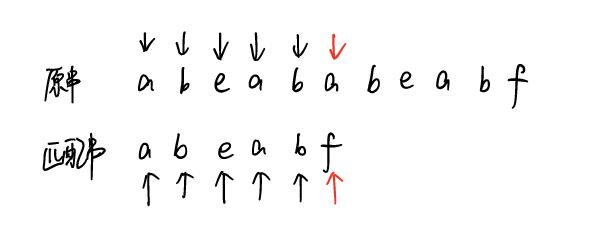

先看下==「朴素匹配」逻辑==：

1. 将原串的指针移动至本次「发起点」的下一个位置（b 字符处）；匹配串的指针移动至起始位置。
2. 尝试匹配，发现对不上，原串的指针会一直往后移动，直到能够与匹配串对上位置。

如图：

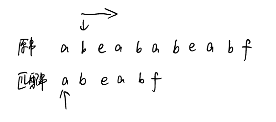

也就是说，对于「朴素匹配」而言，**一旦匹配失败，将会将原串指针调整至下一个「发起点」，匹配串的指针调整至起始位置，然后重新尝试匹配**。

然后我们再看看==「KMP 匹配」过程==：

首先匹配串会检查之前已经匹配成功的部分中里是否存在**最长的相同的「前缀」和「后缀」**。如果存在，则跳转到该「前缀」的下一个位置继续往下匹配。

跳转到下一匹配位置后，尝试匹配，发现两个指针的字符对不上，并且此时匹配串指针前面不存在相同的「前缀」和「后缀」，这时候只能回到匹配串的起始位置重新开始：

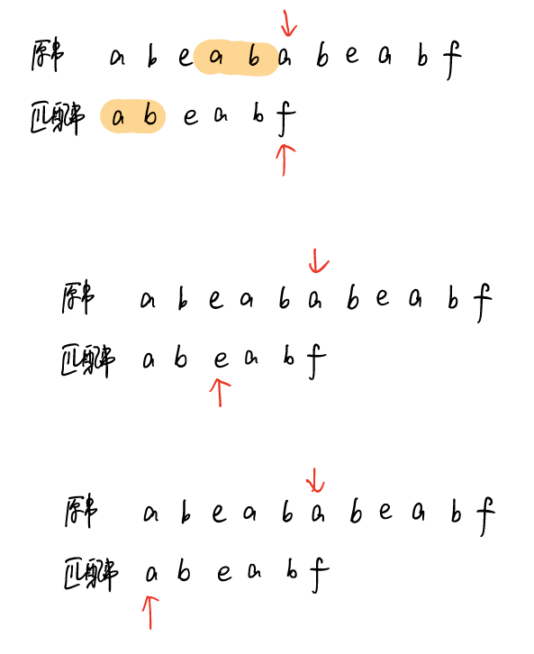

到这里，你应该清楚 KMP 为什么相比于朴素解法更快：

- 因为 KMP 利用已匹配部分中相同的「前缀」和「后缀」来加速下一次的匹配。
- 因为 KMP 的原串指针不会进行回溯（没有朴素匹配中回到下一个「发起点」的过程）。

这里涉及一个最长的相同的前缀和后缀，我们分别定义它们为最长可匹配前缀和最长可匹配后缀。

看到这里，你会不会有个疑问，KMP算法为什么是可行的，也就是说，KMP算法的原串指针不会进行回溯，这样不会漏掉正确的答案吗？

我们用反证法来证明KMP算法不会漏掉正确答案。

假设最长可匹配前后缀是A这一部分。前面都匹配成功，到X（其实我画的是叉...没画好）这里匹配失败。

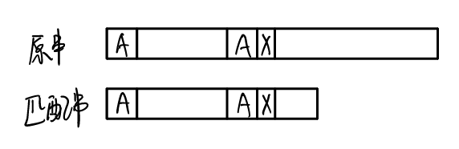

KMP的做法就是直接跳过原串中间的空白部分，将匹配串“滑动”到下图所示位置，直接比较A后面的字符。

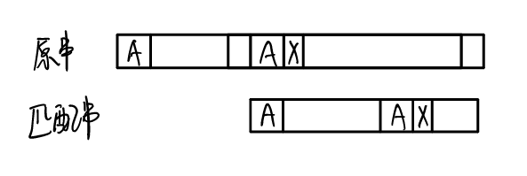

那么被跳过的空白部分有没有可能存在一个正确答案呢？假设有这样一个答案，就是红色方框框出来的部分，我们称这个正确答案的部分为假设串，它与匹配串完全匹配。

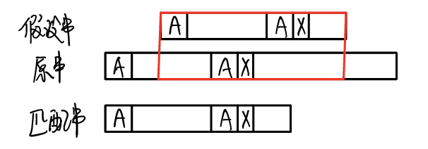

那么很容易推出下面的图：我们假设A与A之间的部分为B

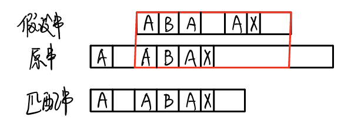

从这个图中你发现了什么？X前面部分的最长可匹配前后缀是ABA这一部分！这不就与我们一开始的假设（A是最长可匹配前后缀）矛盾了吗？所以不存在漏掉正确答案的情况。

知道了KMP算法的匹配过程，那么我们如何实现它呢？

### 2.分析实现

首先我们需要扫描整个原串，这个步骤是必不可少的。然后我们在每次匹配失败的时候，要去检查已匹配部分的最长的相同「前缀」和「后缀」，跳转到相应的位置（如果没有这样的前缀和后缀，就跳转到第0个位置）。如果还是匹配失败就再次检查，跳转。重复这个过程。

这其中有没有可以优化的地方呢？注意到每次检查都是为了跳转到合适的位置，而检查已匹配部分的最长的相同「前缀」和「后缀」其实与原串无关，只需要用匹配串就可以得到这样的前缀和后缀。

举个 例子，对于匹配串 abcabd 的字符 d 而言，由它发起的下一个匹配点跳转必然是字符 c 的位置。因为字符 d 位置的相同「前缀」和「后缀」字符 ab 的下一位置就是字符 c。

**可见从匹配串某个位置跳转下一个匹配位置这一过程是与原串无关的，我们将这一过程称为找 next 点。**

显然我们可以预处理出 next 数组，数组的每个元素next(i)就表示子串 s[0:i]（都是闭区间）的最长的相等的前缀与后缀的长度（也可以说是前缀的结尾下标+1）。next(i)的值就是下标i+1应该跳转的目标位置（ next 点）。对于没有相同前缀和后缀的情况，next点的值为0（即跳转到位置0）。

例如：字符串 aabaaab的next数组

- next(0) = 0，因为 a 没有前缀和后缀，根据规定为 0（可以发现对于任意字符串 next(0)=0 必定成立）；

- next(1)=1，因为 aa 最长的一对相等的前后缀为 a，长度为 1；

- next(2) = 0，因为 aab 没有对应前缀和后缀，根据规定为 0；

- next(3) = 1，因为 aaba 最长的一对相等的前后缀为 a，长度为 1；

- next(4) = 2，因为 aabaa 最长的一对相等的前后缀为 aa，长度为 2；

- next(5) = 2，因为 aabaaa 最长的一对相等的前后缀为 aa，长度为 2；

- next(6) = 3，因为 aabaaab 最长的一对相等的前后缀为 aab，长度为 3。

那么，重点来了，next数组如何构建？

### 3.next 数组的构建

我们采用类似于数学归纳法的方法来看如何构建next数组，假设next[0], ..., next[i-1]都已经构建好了，字符串是b，我们如何计算出next[i]的值呢。

如果 next[i-1]=k，也就是说，子串 b[0, k-1]是 b[0, i-1]的最长可匹配前缀，对应的也有一个最长可匹配后缀，如图所示，为阴影部分。

- 如果子串 b[0, k-1]的下一个字符 b[k]，与 b[0, i-1]的下一个字符 b[i]匹配，那子串 b[0, k]就是 b[0, i]的最长可匹配前缀。所以，next[i]等于 k+1。
- 如果 b[0, k-1]的下一字符 b[k]跟 b[0, i-1]的下一个字符 b[i]不相等呢？

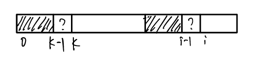

我们倒过来想，假设已知 b[0, i]的最长可匹配后缀是 b[r, i]（对应图中的阴影部分）。如果我们把最后一个字符去掉，那 b[r, i-1]肯定是 b[0, i-1]的可匹配后缀，但不一定是最长可匹配后缀。也就是说，如果我们能找到b[0, i-1]的一个可匹配前后缀（当然要尽可能长），其前缀的下一个字符刚好等于b[i]，那么我们就找到了b[0,i]的最长可匹配后缀了。

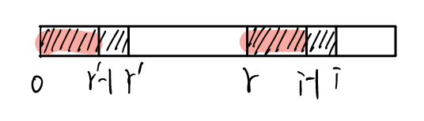

按照尽可能长的原则，我们考察 b[0, i-1]的次长可匹配后缀 b[x, i-1]对应的可匹配前缀 b[0, i-1-x]的下一个字符 b[i-x]是否等于 b[i]。如果等于，那 b[x, i]就是 b[0, i]的最长可匹配后缀。如果不等于，我们再去考察b[0, i-1]的次次长可匹配后缀。

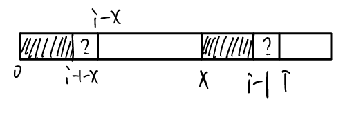

如何求得 b[0, i-1]的次长可匹配后缀（涂色部分）呢？次长可匹配后缀肯定被包含在最长可匹配后缀b[y, i-1]中，而最长可匹配后缀b[y, i-1]又对应最长可匹配前缀 b[0, y']（阴影部分）。我们将后半部分和前半部分进行对比，发现了什么？涂色部分（即b[0, i-1]的次长可匹配后缀）就是b[0, y']的最长可匹配前后缀啊！（为什么是最长？可以反证，如果还有更长的，那么涂色部分就不是b[0, i-1]的次长可匹配后缀了）

于是，查找 b[0, i-1]的次长可匹配后缀，这个问题就变成，查找 b[0, y']的最长可匹配后缀的问题了。由于0到i-1的next值都已经计算出来了，直接取数组的值next[y']就可以。

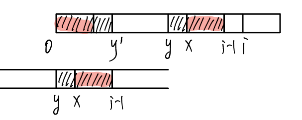

按照这个思路，我们可以考察完所有的 b[0, i-1]的可匹配后缀 b[y, i-1]，直到找到一个可匹配的后缀，它对应的前缀的下一个字符等于 b[i]，那这个 b[y, i]就是 b[0, i]的最长可匹配后缀。

如何考察所有的 b[0, i-1]的可匹配后缀 b[y, i-1]呢？上面我们已经分析了如何找到其次长可匹配后缀，那次次长怎么找呢？其实同样的道理分析， b[0, i-1]的次次长可匹配后缀就是b[0, i-1]的次长可匹配后缀的次长可匹配后缀。所以这是个递归过程。

**关键点：查找 b[0, i-1]的次长可匹配后缀，等价于查找 b[0, i-1]的最长可匹配前缀b[0, j-1]的最长可匹配后缀，即有j=next[j-1]**

### 4 代码实现

理解了上面的过程，代码就很好写了。

```python
class Solution:
	def strStr(self, haystack: str, needle: str) -> int:
        n = len(haystack)
        m = len(needle)
        if m == 0:
            return 0
        # next数组
        pi = [0] * m
        j = 0
        # 构建next数组，只需要用到模式串needle
        # 注意这里是从1开始，因为next[0]=0恒成立
        for i in range(1, m):
            # 只要指针指向的两个字符不相等，就一直循环
            # j就是b[0, i-1]的可匹配后缀的对应前缀的下一个字符（也等于前缀长度），必须大于0，即前缀不为空
            # i的轮次结束后，j=next[i]（正好是下一轮i+1开始时需要的）
            while j >0 and needle[i] != needle[j]:
                j = pi[j-1]
            # 如果相等，直接加1
            if needle[i] == needle[j]:
                j += 1
            # 更新next数组
            pi[i] = j
        j = 0
        # 开始匹配模式串和原串
        for i in range(n):
            # 匹配不成功，j=next(j-1)
            while j > 0 and haystack[i] != needle[j]:
                j = pi[j-1]
            # 匹配成功，移到下一个字符
            if haystack[i] == needle[j]:
                j += 1
            # 整个模式串匹配成功
            if j == m:
                return i-m+1
        return -1
```

整个 KMP 匹配过程复杂度是 O(m + n) 

## 参考资料

https://leetcode-cn.com/problems/implement-strstr/solution/shua-chuan-lc-shuang-bai-po-su-jie-fa-km-tb86/

王争老师《数据结构与算法》专栏