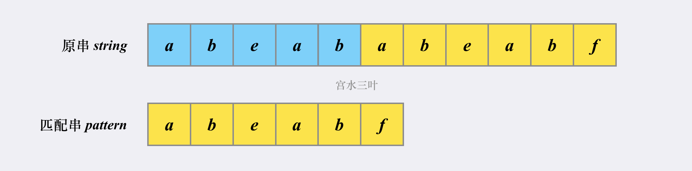
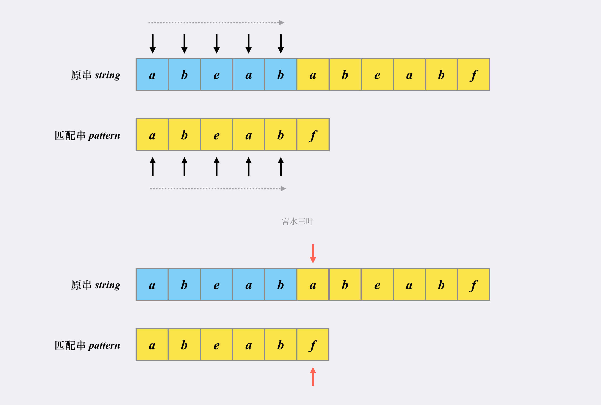
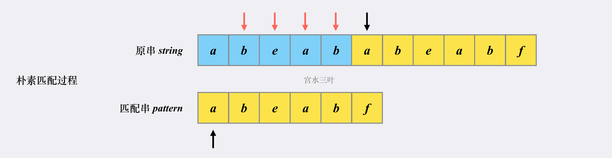
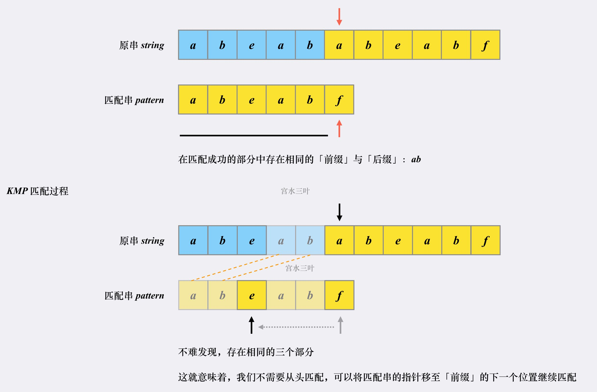
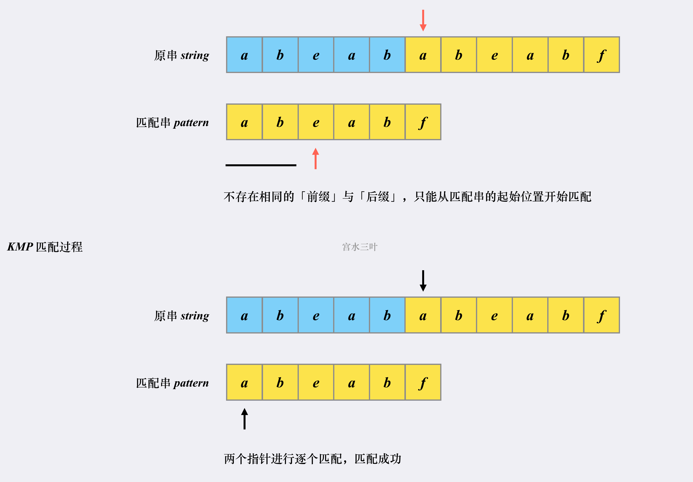

KMP 算法是一个快速查找匹配串的算法，它的作用其实就是本题问题：**如何快速在「原字符串」中找到「匹配字符串」。**

上述的朴素解法，不考虑剪枝的话复杂度是 O(m * n) 的，而 KMP 算法的复杂度为 O(m + n)。

**KMP 之所以能够在 O(m + n)复杂度内完成查找，是因为其能在「非完全匹配」的过程中提取到有效信息进行复用，以减少「重复匹配」的消耗。**

1.匹配过程

在模拟 KMP 匹配过程之前，我们先建立两个概念：

- **前缀**：对于字符串 `abcxxxxefg`，我们称 abc 属于 `abcxxxxefg` 的某个前缀（不等于自身）。
- **后缀**：对于字符串 `abcxxxxefg`，我们称 efg 属于 `abcxxxxefg`的某个后缀（不等于自身）。

然后我们假设原串为 `abeababeabf`，匹配串为 `abeabf`：

如果不使用 KMP，会如何进行匹配（不使用 substring 函数的情况下）。

- 首先在「原串」和「匹配串」分别各自有一个指针指向当前匹配的位置。

- 首次匹配的「发起点」是第一个字符 a。显然，后面的 abeab 都是匹配的，两个指针会同时往右移动（黑标）。

在都能匹配上 abeab 的部分，「朴素匹配」和「KMP」并无不同。

直到出现第一个不同的位置（红标）：

接下来，正是「朴素匹配」和「KMP」出现不同的地方：

先看下==「朴素匹配」逻辑==：

1. 将原串的指针移动至本次「发起点」的下一个位置（b 字符处）；匹配串的指针移动至起始位置。
2. 尝试匹配，发现对不上，原串的指针会一直往后移动，直到能够与匹配串对上位置。

如图：

也就是说，对于「朴素匹配」而言，**一旦匹配失败，将会将原串指针调整至下一个「发起点」，匹配串的指针调整至起始位置，然后重新尝试匹配**。

这也就不难理解为什么「朴素匹配」的复杂度是 O(m x n) 了。

然后我们再看看==「KMP 匹配」过程==：

首先匹配串会检查之前已经匹配成功的部分中里是否存在**最长的相同的「前缀」和「后缀」**。如果存在，则跳转到「前缀」的下一个位置继续往下匹配：

跳转到下一匹配位置后，尝试匹配，发现两个指针的字符对不上，并且此时匹配串指针前面不存在相同的「前缀」和「后缀」，这时候只能回到匹配串的起始位置重新开始：

到这里，你应该清楚 KMP 为什么相比于朴素解法更快：

- 因为 KMP 利用已匹配部分中相同的「前缀」和「后缀」来加速下一次的匹配。

- 因为 KMP 的原串指针不会进行回溯（没有朴素匹配中回到下一个「发起点」的过程）。

第一点很直观，也很好理解。

我们可以把重点放在第二点上，原串不回溯至「发起点」意味着什么？

其实是意味着：随着匹配过程的进行，原串指针的不断右移，我们本质上是在不断地在否决一些「不可能」的方案。

当我们的原串指针从 i 位置后移到 j 位置，不仅仅代表着「原串」下标范围为 [i,j) 的字符与「匹配串」匹配或者不匹配，更是在否决那些以「原串」下标范围为 [i,j) 为「匹配发起点」的子集。

2.分析实现

我们可以先分析一下复杂度。如果严格按照上述解法的话，最坏情况下我们需要扫描整个原串，复杂度为 O(n)。同时在每一次匹配失败时，去检查已匹配部分的相同「前缀」和「后缀」，跳转到相应的位置，如果不匹配则再检查前面部分是否有相同「前缀」和「后缀」，再跳转到相应的位置 ... 这部分的复杂度是 O(m^2) ，因此整体的复杂度是 O(n * m^2)，而我们的朴素解法是 O(m * n) 的。

说明还有一些性质我们没有利用到。

显然，扫描完整原串操作这一操作是不可避免的，我们可以优化的只能是「检查已匹配部分的相同前缀和后缀」这一过程。

再进一步，我们检查「前缀」和「后缀」的目的其实是「为了确定匹配串中的下一段开始匹配的位置」。

同时我们发现，对于匹配串的任意一个位置而言，由该位置发起的下一个匹配点位置其实与原串无关。

举个 🌰，对于匹配串 abcabd 的字符 d 而言，由它发起的下一个匹配点跳转必然是字符 c 的位置。因为字符 d 位置的相同「前缀」和「后缀」字符 ab 的下一位置就是字符 c。

**可见从匹配串某个位置跳转下一个匹配位置这一过程是与原串无关的，我们将这一过程称为找 next 点。**

显然我们可以预处理出 next 数组，数组的每个元素next(i)就表示子串 s[0:i]的最长的相等的真前缀与真后缀的长度（也可以说是真前缀的结尾下标+1）。next(i)的值就是下标i+1应该跳转的目标位置（ next 点）。

举例：字符串 aabaaab的next数组

- next(0) = 0，因为 a 没有真前缀和真后缀，根据规定为 0（可以发现对于任意字符串 next(0)=0 必定成立）；

- next(1)=1，因为 aa 最长的一对相等的真前后缀为 a，长度为 1；

- next(2) = 0，因为 aab 没有对应真前缀和真后缀，根据规定为 0；

- next(3) = 1，因为 aaba 最长的一对相等的真前后缀为 a，长度为 1；

- next(4) = 2，因为 aabaa 最长的一对相等的真前后缀为 aa，长度为 2；

- next(5) = 2，因为 aabaaa 最长的一对相等的真前后缀为 aa，长度为 2；

- next(6) = 3，因为 aabaaab 最长的一对相等的真前后缀为 aab，长度为 3。

3.next 数组的构建

接下来，我们看看 next 数组是如何在 O(m) 的复杂度内被预处理出来的。

如果 next[i-1]=k，也就是说，子串 b[0, k-1]和b[i-1-k+1, i-1]是 b[0, i-1]的最长的相同的一对真前缀和真后缀。

- 如果子串 b[0, k-1]的下一个字符 b[k]，与 b[0, i-1]的下一个字符 b[i]匹配，那子串 b[0, k]就是 b[0, i]的最长可匹配前缀子串。所以，next[i]等于 k+1。
- 如果 b[0, k-1]的下一字符 b[k]跟 b[0, i-1]的下一个字符 b[i]不相等呢？

我们假设 b[0, i]的最长可匹配后缀子串是 b[r, i]。如果我们把最后一个字符去掉，那 b[r, i-1]肯定是 b[0, i-1]的可匹配后缀子串，但不一定是最长可匹配后缀子串。

考察 b[0, i-1]的次长可匹配后缀子串 b[x, i-1]对应的可匹配前缀子串 b[0, i-1-x]的下一个字符 b[i-x]是否等于 b[i]。如果等于，那 b[x, i]就是 b[0, i]的最长可匹配后缀子串。

如何求得 b[0, i-1]的次长可匹配后缀子串呢？次长可匹配后缀子串肯定被包含在最长可匹配后缀子串中，而最长可匹配后缀子串又对应最长可匹配前缀子串 b[0, y]。于是，查找 b[0, i-1]的次长可匹配后缀子串，这个问题就变成，查找 b[0, y]的最长匹配后缀子串的问题了。

按照这个思路，我们可以考察完所有的 b[0, i-1]的可匹配后缀子串 b[y, i-1]，直到找到一个可匹配的后缀子串，它对应的前缀子串的下一个字符等于 b[i]，那这个 b[y, i]就是 b[0, i]的最长可匹配后缀子串。

假设有匹配串 aaabbab，我们来看看对应的 next 是如何被构建出来的。

这就是整个 next 数组的构建过程，时空复杂度均为 O(m)。

至此整个 KMP 匹配过程复杂度是 O(m + n) 的。

## 参考资料

KMP解析见https://leetcode-cn.com/problems/implement-strstr/solution/shua-chuan-lc-shuang-bai-po-su-jie-fa-km-tb86/