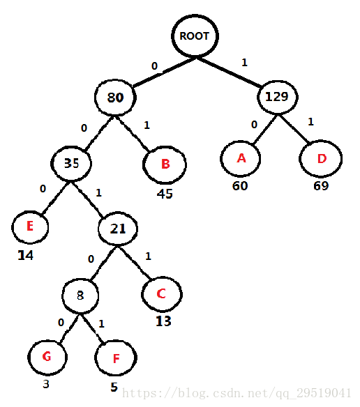
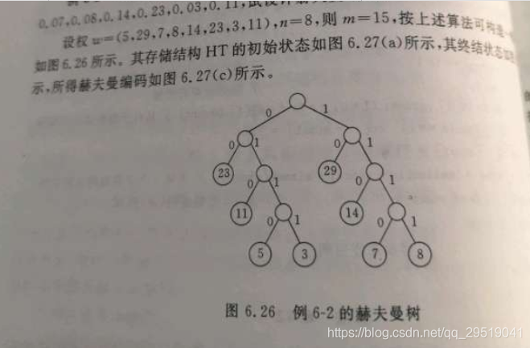
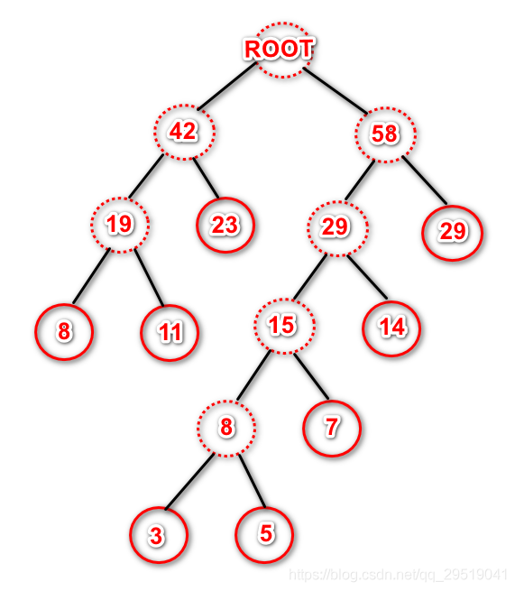

## **哈夫曼树（最优二叉树）**

目的：找出存放一串字符所需的最少的二进制编码

**首先统计出每种字符出现的\**频率\**！（也可以是概率）//权值**

**例如：\**频率表\** A：60,  B:45,  C:13  D:69  E:14  F:5 G:3**

第一步：找出字符中最小的两个，小的在左边，大的在右边，组成二叉树。在***\*频率表\****中删除**此次找到的两个数，并加入此次最小两个数的频率和。**

***\*F\**和\**G\**最小，因此如图，从字符串频率计数中删除\**F\**与\**G，\**并返回\**G\**与\**F\**的和 \**8\**给\**频率表\****

 **重复第一步：**

***\*频率表\** A：60,  B:45,  C:13  D:69  E:14  FG:8**

最小的是 ***\*FG：8\****与***\*C：13，\**因此如图，并返回\**FGC\**的和：\**21\**给\**频率表。\****

重复第一步：

***\*频率表\** A：60  B: 45  D: 69  E: 14  FGC: 21**

***\*频率表\** A：60  B: 45  D: 69 FGCE: 35**

***\*频率表\** A：60  D: 69 FGCEB: 80**

***\*频率表\** AD：129 FGCEB: 80**

**添加 0 和 1，规则左0 右1**

频率表 A：60,    B:45,   C:13   D:69   E:14   F:5  G:3

每个 字符 的 二进制编码 为（从根节点 数到对应的叶子节点，路径上的值拼接起来就是叶子节点字母的应该的编码）

字符	编码
A	10
B	01
C	0011
D	11
E	000
F	00101
G	00100
出现得越多的字母，他的编码越短 ，出现频率越少的字母，他的编码越长。

在信息传输过程中，如果这个字母越多，那么我们希望他越瘦小（编码短）这样占用的编码越少，其实编码长的字母也是让频率比它多的字母把编码短的位子都占用后，他才去占用当前最短的编码。至此让总的编码长度最短。

且要保证长编码的不与短编码的字母冲突：

比如 不能出现 读码 读到 01  还有长编码的 字母为011，如果短编码为一个长编码的左起子串，这就是冲突，意思就是说读到当前位置已经能确定是什么字母时不能因为再读取一位或几位让这个编码能表示另外的字母，

但哈夫曼树（最优二叉树）在构造的时候就避免了这个问题。为什么能避免呢，因为哈夫曼树的它的字母都在叶子节点上，因此不会出现一个字母的编码为另一个字母编码左起子串的情况。

**哈夫曼树的构造并不是唯一的**。

考虑如下情况：

有权值分别为 5,29,7,8,14,23,3,11的情况，可以如下图一样构造。

带权路径长度：

(5+3+7+8)*4+

(11+14)*3+

(23+29)*2

=271

也可以如下图构造：

带权路径长度：

（3+5)*5+

7*4+

(8+11+14)*3+

(23+29)*2

=271

这两种不同的方式构造出来的哈夫曼树，得出的带权路径长度相等，那么选哪颗树都可以，这就叫**同权不同构**。

## 参考资料

[哈夫曼树原理，及构造方法](https://blog.csdn.net/qq_29519041/article/details/81428934)

