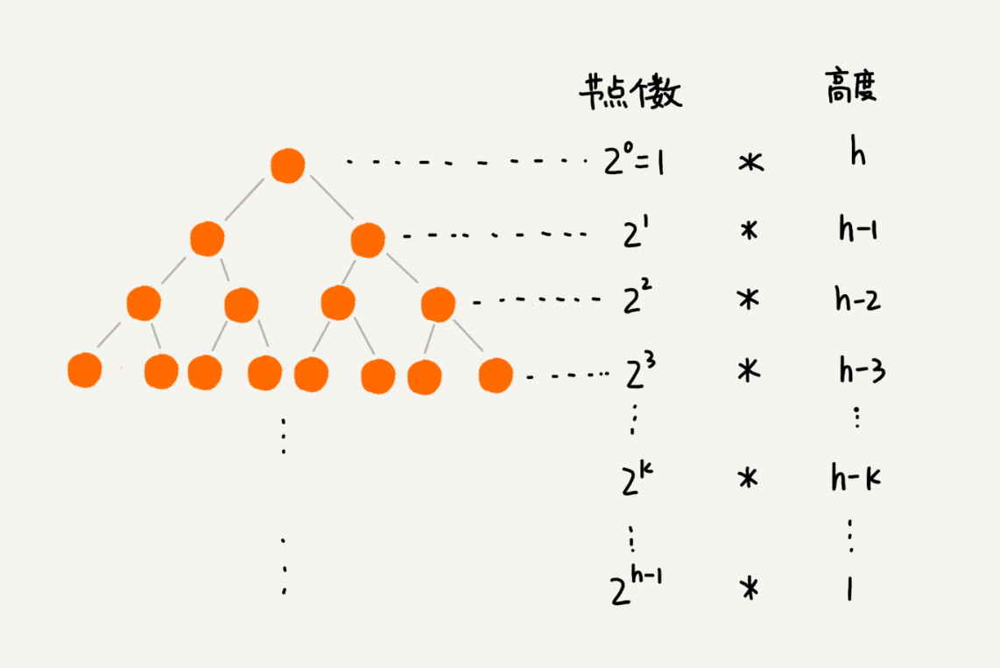
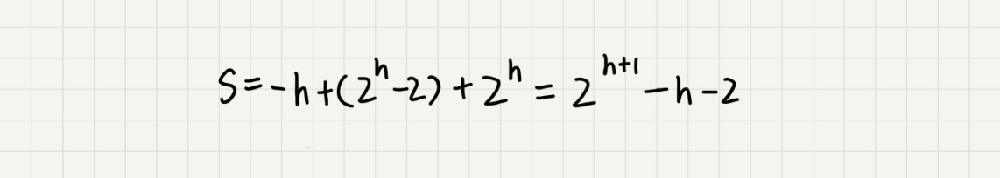

**如何理解“堆”？**
堆是一种特殊的树。只要满足这两点，它就是一个堆。堆是一个完全二叉树；堆中每一个节点的值都必须大于等于（或小于等于）其子树中每个节点的值。对于每个节点的值都大于等于子树中每个节点值的堆，我们叫作“大顶堆”。对于每个节点的值都小于等于子树中每个节点值的堆，我们叫作“小顶堆”。
**如何实现一个堆？**
要实现一个堆，我们先要知道，堆都支持哪些操作以及如何存储一个堆。
完全二叉树比较适合用数组来存储。用数组来存储完全二叉树是非常节省存储空间的。因为我们不需要存储左右子节点的指针，单纯地通过数组的下标，就可以找到一个节点的左右子节点和父节点。
堆上的操作有哪些呢？这里罗列了几个非常核心的操作，分别是往堆中插入一个元素和删除堆顶元素。（如果没有特殊说明，下面都是拿大顶堆来讲解）。
**1. 往堆中插入一个元素**

往堆中插入一个元素后，我们需要继续满足堆的两个特性。如果我们把新插入的元素放到堆的最后，是不是不符合堆的特性了？如果是，我们就需要进行调整，让其重新满足堆的特性，这个过程我们起了一个名字，就叫作**堆化**（heapify）。堆化实际上有两种，从下往上和从上往下。这里先讲从下往上的堆化方法。


堆化非常简单，就是顺着节点所在的路径，向上或者向下，对比，然后交换。这里画了一张堆化的过程分解图。我们可以让新插入的节点与父节点对比大小。如果不满足子节点小于等于父节点的大小关系，我们就互换两个节点。一直重复这个过程，直到父子节点之间满足刚说的那种大小关系。


上面讲的往堆中插入数据的过程，翻译成了代码

```c
public class Heap {
  private int[] a; // 数组，从下标1开始存储数据
  private int n;  // 堆可以存储的最大数据个数
  private int count; // 堆中已经存储的数据个数


  public Heap(int capacity) {
    a = new int[capacity + 1];
    n = capacity;
    count = 0;
  }


  public void insert(int data) {
    if (count >= n) return; // 堆满了
    ++count;
    a[count] = data;
    int i = count;
    while (i/2 > 0 && a[i] > a[i/2]) { // 自下往上堆化
      swap(a, i, i/2); // swap()函数作用：交换下标为i和i/2的两个元素
      i = i/2;
    }
  }
}
```


**2. 删除堆顶元素**从堆的定义的第二条中，任何节点的值都大于等于（或小于等于）子树节点的值，我们可以发现，堆顶元素存储的就是堆中数据的最大值或者最小值。假设我们构造的是大顶堆，堆顶元素就是最大的元素。当我们删除堆顶元素之后，就需要把第二大的元素放到堆顶，那第二大元素肯定会出现在左右子节点中。然后我们再迭代地删除第二大节点，以此类推，直到叶子节点被删除。不过这种方法有点问题，就是最后堆化出来的堆并不满足完全二叉树的特性。


实际上，我们稍微改变一下思路，就可以解决这个问题。我们把最后一个节点放到堆顶，然后利用同样的父子节点对比方法。对于不满足父子节点大小关系的，互换两个节点，并且重复进行这个过程，直到父子节点之间满足大小关系为止。这就是**从上往下**的堆化方法。因为我们移除的是数组中的最后一个元素，而在堆化的过程中，都是交换操作，不会出现数组中的"空洞"，所以这种方法堆化之后的结果，肯定满足完全二叉树的特性。删除过程的代码：

```c
public void removeMax() {
  if (count == 0) return -1; // 堆中没有数据
  a[1] = a[count];
  --count;
  heapify(a, count, 1);
}


private void heapify(int[] a, int n, int i) { // 自上往下堆化
  while (true) {
    int maxPos = i;
    if (i*2 <= n && a[i] < a[i*2]) maxPos = i*2;
    if (i*2+1 <= n && a[maxPos] < a[i*2+1]) maxPos = i*2+1;
    if (maxPos == i) break;
    swap(a, i, maxPos);
    i = maxPos;
  }
}
```


我们知道，一个包含 n 个节点的完全二叉树，树的高度不会超过 log_2n。堆化的过程是顺着节点所在路径比较交换的，所以堆化的时间复杂度跟树的高度成正比，也就是 O(logn)。插入数据和删除堆顶元素的主要逻辑就是堆化，所以，往堆中插入一个元素和删除堆顶元素的时间复杂度都是 O(logn)。

**如何基于堆实现排序？**借助于堆这种数据结构实现的排序算法，就叫作堆排序。这种排序方法的时间复杂度非常稳定，是 O(nlogn)，并且它还是原地排序算法。如此优秀，它是怎么做到的呢？我们可以把堆排序的过程大致分解成两个大的步骤，建堆和排序。1. 建堆我们首先将数组原地建成一个堆。所谓“原地”就是，不借助另一个数组，就在原数组上操作。建堆的过程，有两种思路。第一种是借助我们前面讲的，在堆中插入一个元素的思路。尽管数组中包含 n 个数据，但是我们可以假设，起初堆中只包含一个数据，就是下标为 1 的数据。然后，我们调用前面讲的插入操作，将下标从 2 到 n 的数据依次插入到堆中。这样我们就将包含 n 个数据的数组，组织成了堆。第二种实现思路，跟第一种截然相反。第一种建堆思路的处理过程是从前往后处理数组数据，并且每个数据插入堆中时，都是从下往上堆化。而第二种实现思路，是从后往前处理数组，并且每个数据都是从上往下堆化。举例第二种实现思路的建堆分解步骤图，因为叶子节点往下堆化只能自己跟自己比较，所以我们直接从第一个非叶子节点开始，依次堆化就行了。


相应的代码

```c
private static void buildHeap(int[] a, int n) {
  for (int i = n/2; i >= 1; --i) {
    heapify(a, n, i);
  }
}


private static void heapify(int[] a, int n, int i) {
  while (true) {
    int maxPos = i;
    if (i*2 <= n && a[i] < a[i*2]) maxPos = i*2;
    if (i*2+1 <= n && a[maxPos] < a[i*2+1]) maxPos = i*2+1;
    if (maxPos == i) break;
    swap(a, i, maxPos);
    i = maxPos;
  }
}
```


你可能已经发现了，在这段代码中，我们对下标从 n/2 开始到 1 的数据进行堆化，下标是 n/2+1 到 n 的节点是叶子节点，我们不需要堆化。实际上，对于完全二叉树来说，下标从n/2+1 到 n 的节点都是叶子节点。现在，我们来看，建堆操作的时间复杂度是多少呢？每个节点堆化的时间复杂度是 O(logn)，那 n/2+1 个节点堆化的总时间复杂度是不是就是 O(nlogn) 呢？这个答案虽然也没错，但是这个值还是不够精确。实际上，堆排序的建堆过程的时间复杂度是 O(n)。我带你推导一下。因为叶子节点不需要堆化，所以需要堆化的节点从倒数第二层开始。每个节点堆化的过程中，需要比较和交换的节点个数，跟这个节点的高度 k 成正比。我把每一层的节点个数和对应的高度画了出来，你可以看看。我们只需要将每个节点的高度求和，得出的就是建堆的时间复杂度。



我们将每个非叶子节点的高度求和，就是下面这个公式：


这个公式的求解稍微有点技巧，不过我们高中应该都学过：把公式左右都乘以 2，就得到另一个公式 S2。我们将 S2 错位对齐，并且用 S2 减去 S1，可以得到 S。


S 的中间部分是一个等比数列，所以最后可以用等比数列的求和公式来计算，最终的结果就是下面图中画的这个样子。



因为 h=log_2n，代入公式 S，就能得到 S=O(n)，所以，建堆的时间复杂度就是 O(n)。
\2. 排序建堆结束之后，数组中的数据已经是按照大顶堆的特性来组织的。数组中的第一个元素就是堆顶，也就是最大的元素。我们把它跟最后一个元素交换，那最大元素就放到了下标为 n 的位置。这个过程有点类似上面讲的"删除堆顶元素”的操作，当堆顶元素移除之后，我们把下标为 n 的元素放到堆顶，然后再通过堆化的方法，将剩下的 n−1 个元素重新构建成堆。堆化完成之后，我们再取堆顶的元素，放到下标是 n−1 的位置，一直重复这个过程，直到最后堆中只剩下标为 1 的一个元素，排序工作就完成了。


代码

```c
// n表示数据的个数，数组a中的数据从下标1到n的位置。
public static void sort(int[] a, int n) {
  buildHeap(a, n);
  int k = n;
  while (k > 1) {
    swap(a, 1, k);
    --k;
    heapify(a, k, 1);
  }
}
```


现在，我们再来分析一下堆排序的时间复杂度、空间复杂度以及稳定性。整个堆排序的过程，都只需要极个别临时存储空间，所以堆排序是原地排序算法。堆排序包括建堆和排序两个操作，建堆过程的时间复杂度是 O(n)，排序过程的时间复杂度是 O(nlogn)，所以，堆排序整体的时间复杂度是 O(nlogn)。堆排序不是稳定的排序算法，因为在排序的过程，存在将堆的最后一个节点跟堆顶节点互换的操作，所以就有可能改变值相同数据的原始相对顺序。在前面的讲解以及代码中，我都假设，堆中的数据是从数组下标为 1 的位置开始存储。那如果从 0 开始存储，实际上处理思路是没有任何变化的，唯一变化的，可能就是，代码实现的时候，计算子节点和父节点的下标的公式改变了。如果节点的下标是 i，那左子节点的下标就是 2∗i+1，右子节点的下标就是 2∗i+2，父节点的下标就是 (i-1)/2。

在实际开发中，为什么快速排序要比堆排序性能好？第一点，堆排序数据访问的方式没有快速排序友好。对于快速排序来说，数据是顺序访问的。而对于堆排序来说，数据是跳着访问的。 比如，堆排序中，最重要的一个操作就是数据的堆化。比如下面这个例子，对堆顶节点进行堆化，会依次访问数组下标是 1，2，4，8 的元素，而不是像快速排序那样，局部顺序访问，所以，这样对 CPU 缓存是不友好的。


第二点，对于同样的数据，在排序过程中，堆排序算法的数据交换次数要多于快速排序。我们在讲排序的时候，提过两个概念，有序度和逆序度。对于基于比较的排序算法来说，整个排序过程就是由两个基本的操作组成的，比较和交换（或移动）。快速排序数据交换的次数不会比逆序度多。但是堆排序的第一步是建堆，建堆的过程会打乱数据原有的相对先后顺序，导致原数据的有序度降低。比如，对于一组已经有序的数据来说，经过建堆之后，数据反而变得更无序了。


对于第二点，你可以自己做个试验看下。我们用一个记录交换次数的变量，在代码中，每次交换的时候，我们就对这个变量加一，排序完成之后，这个变量的值就是总的数据交换次数。这样你就能很直观地理解我刚刚说的，堆排序比快速排序交换次数多。

在讲堆排序建堆的时候，我说到，对于完全二叉树来说，下标从n/2+1 到 n 的都是叶子节点，这个结论是怎么推导出来的呢？使用数组存储表示完全二叉树时，从数组下标为1开始存储数据，数组下标为i的节点，左子节点为2i, 右子节点为2i + 1. 这个结论很重要（可以用数学归纳法证明)，将此结论记为『原理1』，以下证明会用到这个原理。

为什么，对于完全二叉树来说，下标从n/2 + 1 到 n的节点都是叶子节点？ 使用反证法证明即可：

如果下标为n/2 + 1的节点不是叶子节点，即它存在子节点，按照『原理1』，它的左子节点为：2(n/2 + 1) = n + 2，大家明显可以看出，这个数字已经大于n + 1，超出了实现完全二叉树所用数组的大小（数组下标从1开始记录数据，对于n个节点来说，数组大小是n + 1），左子节点都已经超出了数组容量，更何况右子节点。以此类推，很容易得出：下标大于n/2 + 1的节点肯定都是也叶子节点了，故而得出结论：对于完全二叉树来说，下标从n/2 + 1 到 n的节点都是叶子节点

备注下：用数组存储表示完全二叉树时，也可以从下标为0开始，只是这样做的话，计算左子节点时，会多一次加法运算

我们今天讲了堆的一种经典应用，堆排序。关于堆，你还能想到它的其他应用吗？

堆的应用除了堆排以外，还有如下一些应用：1. 从大数量级数据中筛选出top n 条数据； 比如：从几十亿条订单日志中筛选出金额靠前的1000条数据2. 在一些场景中，会根据不同优先级来处理网络请求，此时也可以用到优先队列(用堆实现的数据结构)；比如：网络框架Volley就用了Java中PriorityBlockingQueue，当然它是线程安全的3. 可以用堆来实现多路归并，从而实现有序，leetcode上也有相关的一题：Merge K Sorted Lists应用:1.topK2.流里面的中值3.流里面的中位数

**堆的应用：如何快速获取到Top 10最热门的搜索关键词？**

假设现在我们有一个包含 10 亿个搜索关键词的日志文件，如何能快速获取到热门榜 Top 10 的搜索关键词呢？

堆的应用一：优先级队列

优先级队列，顾名思义，它首先应该是一个队列。我们前面讲过，队列最大的特性就是先进先出。不过，在优先级队列中，数据的出队顺序不是先进先出，而是按照优先级来，优先级最高的，最先出队。如何实现一个优先级队列呢？方法有很多，但是用堆来实现是最直接、最高效的。这是因为，堆和优先级队列非常相似。一个堆就可以看作一个优先级队列。很多时候，它们只是概念上的区分而已。往优先级队列中插入一个元素，就相当于往堆中插入一个元素；从优先级队列中取出优先级最高的元素，就相当于取出堆顶元素。你可别小看这个优先级队列，它的应用场景非常多。我们后面要讲的很多数据结构和算法都要依赖它。比如，赫夫曼编码、图的最短路径、最小生成树算法等等。不仅如此，很多语言中，都提供了优先级队列的实现，比如，Java 的 PriorityQueue，C++ 的 priority_queue 等。

只讲这些应用场景比较空泛，现在，我举两个具体的例子，让你感受一下优先级队列具体是怎么用的。

1.合并有序小文件

假设我们有 100 个小文件，每个文件的大小是 100MB，每个文件中存储的都是有序的字符串。我们希望将这些 100 个小文件合并成一个有序的大文件。这里就会用到优先级队列。整体思路有点像归并排序中的合并函数。我们从这 100 个文件中，各取第一个字符串，放入数组中，然后比较大小，把最小的那个字符串放入合并后的大文件中，并从数组中删除。假设，这个最小的字符串来自于 13.txt 这个小文件，我们就再从这个小文件取下一个字符串，放到数组中，重新比较大小，并且选择最小的放入合并后的大文件，将它从数组中删除。依次类推，直到所有的文件中的数据都放入到大文件为止。

这里我们用数组这种数据结构，来存储从小文件中取出来的字符串。每次从数组中取最小字符串，都需要循环遍历整个数组，显然，这不是很高效。有没有更加高效方法呢？这里就可以用到优先级队列，也可以说是堆。我们将从小文件中取出来的字符串放入到小顶堆中，那堆顶的元素，也就是优先级队列队首的元素，就是最小的字符串。我们将这个字符串放入到大文件中，并将其从堆中删除。然后再从小文件中取出下一个字符串，放入到堆中。循环这个过程，就可以将 100 个小文件中的数据依次放入到大文件中。我们知道，删除堆顶数据和往堆中插入数据的时间复杂度都是 O(logn)，n 表示堆中的数据个数，这里就是 100。是不是比原来数组存储的方式高效了很多呢？

2.高性能定时器

假设我们有一个定时器，定时器中维护了很多定时任务，每个任务都设定了一个要触发执行的时间点。定时器每过一个很小的单位时间（比如 1 秒），就扫描一遍任务，看是否有任务到达设定的执行时间。如果到达了，就拿出来执行。


但是，这样每过 1 秒就扫描一遍任务列表的做法比较低效，主要原因有两点：第一，任务的约定执行时间离当前时间可能还有很久，这样前面很多次扫描其实都是徒劳的；第二，每次都要扫描整个任务列表，如果任务列表很大的话，势必会比较耗时。

针对这些问题，我们就可以用优先级队列来解决。我们按照任务设定的执行时间，将这些任务存储在优先级队列中，队列首部（也就是小顶堆的堆顶）存储的是最先执行的任务。这样，定时器就不需要每隔 1 秒就扫描一遍任务列表了。它拿队首任务的执行时间点，与当前时间点相减，得到一个时间间隔 T。这个时间间隔 T 就是，从当前时间开始，需要等待多久，才会有第一个任务需要被执行。这样，定时器就可以设定在 T 秒之后，再来执行任务。从当前时间点到（T-1）秒这段时间里，定时器都不需要做任何事情。

当 T 秒时间过去之后，定时器取优先级队列中队首的任务执行。然后再计算新的队首任务的执行时间点与当前时间点的差值，把这个值作为定时器执行下一个任务需要等待的时间。这样，定时器既不用间隔 1 秒就轮询一次，也不用遍历整个任务列表，性能也就提高了。

堆的应用二：利用堆求 Top K

刚刚我们学习了优先级队列，我们现在来看，堆的另外一个非常重要的应用场景，那就是"求 Top K 问题”。我把这种求 Top K 的问题抽象成两类。一类是针对静态数据集合，也就是说数据集合事先确定，不会再变。另一类是针对动态数据集合，也就是说数据集合事先并不确定，有数据动态地加入到集合中。针对静态数据，如何在一个包含 n 个数据的数组中，查找前 K 大数据呢？我们可以维护一个大小为 K 的小顶堆，顺序遍历数组，从数组中取出数据与堆顶元素比较。如果比堆顶元素大，我们就把堆顶元素删除，并且将这个元素插入到堆中；如果比堆顶元素小，则不做处理，继续遍历数组。这样等数组中的数据都遍历完之后，堆中的数据就是前 K 大数据了。遍历数组需要 O(n) 的时间复杂度，一次堆化操作需要 O(logK) 的时间复杂度，所以最坏情况下，n 个元素都入堆一次，时间复杂度就是 O(nlogK)。针对动态数据求得 Top K 就是实时 Top K。怎么理解呢？我举一个例子。一个数据集合中有两个操作，一个是添加数据，另一个询问当前的前 K 大数据。如果每次询问前 K 大数据，我们都基于当前的数据重新计算的话，那时间复杂度就是 O(nlogK)，n 表示当前的数据的大小。实际上，我们可以一直都维护一个 K 大小的小顶堆，当有数据被添加到集合中时，我们就拿它与堆顶的元素对比。如果比堆顶元素大，我们就把堆顶元素删除，并且将这个元素插入到堆中；如果比堆顶元素小，则不做处理。这样，无论任何时候需要查询当前的前 K 大数据，我们都可以立刻返回给他。

堆的应用三：利用堆求中位数

前面我们讲了如何求 Top K 的问题，现在我们来讲下，如何求动态数据集合中的中位数。中位数，顾名思义，就是处在中间位置的那个数。如果数据的个数是奇数，把数据从小到大排列，那第 n/2+1 个数据就是中位数（注意：假设数据是从 0 开始编号的）；如果数据的个数是偶数的话，那处于中间位置的数据有两个，第 n/2个和第 n/2+1 个数据，这个时候，我们可以随意取一个作为中位数，比如取两个数中靠前的那个，就是第 n/2 个数据。


对于一组静态数据，中位数是固定的，我们可以先排序，第 2n 个数据就是中位数。每次询问中位数的时候，我们直接返回这个固定的值就好了。所以，尽管排序的代价比较大，但是边际成本会很小。但是，如果我们面对的是动态数据集合，中位数在不停地变动，如果再用先排序的方法，每次询问中位数的时候，都要先进行排序，那效率就不高了。借助堆这种数据结构，我们不用排序，就可以非常高效地实现求中位数操作。我们来看看，它是如何做到的？我们需要维护两个堆，一个大顶堆，一个小顶堆。大顶堆中存储前半部分数据，小顶堆中存储后半部分数据，且小顶堆中的数据都大于大顶堆中的数据。也就是说，如果有 n 个数据，n 是偶数，我们从小到大排序，那前 n/2 个数据存储在大顶堆中，后 n/2 个数据存储在小顶堆中。这样，大顶堆中的堆顶元素就是我们要找的中位数。如果 n 是奇数，情况是类似的，大顶堆就存储 n/2+1 个数据，小顶堆中就存储 n/2 个数据。


我们前面也提到，数据是动态变化的，当新添加一个数据的时候，我们如何调整两个堆，让大顶堆中的堆顶元素继续是中位数呢？如果新加入的数据小于等于大顶堆的堆顶元素，我们就将这个新数据插入到大顶堆；否则，我们就将这个新数据插入到小顶堆。这个时候就有可能出现，两个堆中的数据个数不符合前面约定的情况：如果 n 是偶数，两个堆中的数据个数都是 n/2；如果 n 是奇数，大顶堆有 n/2+1 个数据，小顶堆有n/2个数据。这个时候，我们可以从一个堆中不停地将堆顶元素移动到另一个堆，通过这样的调整，来让两个堆中的数据满足上面的约定。


于是，我们就可以利用两个堆，一个大顶堆、一个小顶堆，实现在动态数据集合中求中位数的操作。插入数据因为需要涉及堆化，所以时间复杂度变成了 O(logn)，但是求中位数我们只需要返回大顶堆的堆顶元素就可以了，所以时间复杂度就是 O(1)。实际上，利用两个堆不仅可以快速求出中位数，还可以快速求其他百分位的数据，原理是类似的。还记得我们在"为什么要学习数据结构与算法”里的这个问题吗？“如何快速求接口的 99% 响应时间？”我们现在就来看下，利用两个堆如何来实现。在开始这个问题的讲解之前，我先解释一下，什么是“99% 响应时间"。中位数的概念就是将数据从小到大排列，处于中间位置，就叫中位数，这个数据会大于等于前面 50% 的数据。99 百分位数的概念可以类比中位数，如果将一组数据从小到大排列，这个 99 百分位数就是大于前面 99% 数据的那个数据。如果你还是不太理解，我再举个例子。假设有 100 个数据，分别是 1，2，3，……，100，那 99 百分位数就是 99，因为小于等于 99 的数占总个数的 99%。


弄懂了这个概念，我们再来看 99% 响应时间。如果有 100 个接口访问请求，每个接口请求的响应时间都不同，比如 55 毫秒、100 毫秒、23 毫秒等，我们把这 100 个接口的响应时间按照从小到大排列，排在第 99 的那个数据就是 99% 响应时间，也叫 99 百分位响应时间。我们总结一下，如果有 n 个数据，将数据从小到大排列之后，99 百分位数大约就是第 n*99% 个数据，同类，80 百分位数大约就是第 n*80% 个数据。弄懂了这些，我们再来看如何求 99% 响应时间。我们维护两个堆，一个大顶堆，一个小顶堆。假设当前总数据的个数是 n，大顶堆中保存 n*99% 个数据，小顶堆中保存 n*1% 个数据。大顶堆堆顶的数据就是我们要找的 99% 响应时间。每次插入一个数据的时候，我们要判断这个数据跟大顶堆和小顶堆堆顶数据的大小关系，然后决定插入到哪个堆中。如果这个新插入的数据比大顶堆的堆顶数据小，那就插入大顶堆；如果这个新插入的数据比小顶堆的堆顶数据大，那就插入小顶堆。但是，为了保持大顶堆中的数据占 99%，小顶堆中的数据占 1%，在每次新插入数据之后，我们都要重新计算，这个时候大顶堆和小顶堆中的数据个数，是否还符合 99:1 这个比例。如果不符合，我们就将一个堆中的数据移动到另一个堆，直到满足这个比例。移动的方法类似前面求中位数的方法，这里我就不啰嗦了。通过这样的方法，每次插入数据，可能会涉及几个数据的堆化操作，所以时间复杂度是 O(logn)。每次求 99% 响应时间的时候，直接返回大顶堆中的堆顶数据即可，时间复杂度是 O(1)。

学懂了上面的一些应用场景的处理思路，我想你应该能解决开篇的那个问题了吧。假设现在我们有一个包含 10 亿个搜索关键词的日志文件，如何快速获取到 Top 10 最热门的搜索关键词呢？处理这个问题，有很多高级的解决方法，比如使用 MapReduce 等。但是，如果我们将处理的场景限定为单机，可以使用的内存为 1GB。那这个问题该如何解决呢？因为用户搜索的关键词，有很多可能都是重复的，所以我们首先要统计每个搜索关键词出现的频率。我们可以通过散列表、平衡二叉查找树或者其他一些支持快速查找、插入的数据结构，来记录关键词及其出现的次数。假设我们选用散列表。我们就顺序扫描这 10 亿个搜索关键词。当扫描到某个关键词时，我们去散列表中查询。如果存在，我们就将对应的次数加一；如果不存在，我们就将它插入到散列表，并记录次数为 1。以此类推，等遍历完这 10 亿个搜索关键词之后，散列表中就存储了不重复的搜索关键词以及出现的次数。然后，我们再根据前面讲的用堆求 Top K 的方法，建立一个大小为 10 的小顶堆，遍历散列表，依次取出每个搜索关键词及对应出现的次数，然后与堆顶的搜索关键词对比。如果出现次数比堆顶搜索关键词的次数多，那就删除堆顶的关键词，将这个出现次数更多的关键词加入到堆中。以此类推，当遍历完整个散列表中的搜索关键词之后，堆中的搜索关键词就是出现次数最多的 Top 10 搜索关键词了。不知道你发现了没有，上面的解决思路其实存在漏洞。10 亿的关键词还是很多的。我们假设 10 亿条搜索关键词中不重复的有 1 亿条，如果每个搜索关键词的平均长度是 50 个字节，那存储 1 亿个关键词起码需要 5GB 的内存空间，而散列表因为要避免频繁冲突，不会选择太大的装载因子，所以消耗的内存空间就更多了。而我们的机器只有 1GB 的可用内存空间，所以我们无法一次性将所有的搜索关键词加入到内存中。这个时候该怎么办呢？我们在哈希算法那一节讲过，相同数据经过哈希算法得到的哈希值是一样的。我们可以根据哈希算法的这个特点，将 10 亿条搜索关键词先通过哈希算法分片到 10 个文件中。具体可以这样做：我们创建 10 个空文件 00，01，02，……，09。我们遍历这 10 亿个关键词，并且通过某个哈希算法对其求哈希值，然后哈希值同 10 取模，得到的结果就是这个搜索关键词应该被分到的文件编号。对这 10 亿个关键词分片之后，每个文件都只有 1 亿的关键词，去除掉重复的，可能就只有 1000 万个，每个关键词平均 50 个字节，所以总的大小就是 500MB。1GB 的内存完全可以放得下。我们针对每个包含 1 亿条搜索关键词的文件，利用散列表和堆，分别求出 Top 10，然后把这个 10 个 Top 10 放在一块，然后取这 100 个关键词中，出现次数最多的 10 个关键词，这就是这 10 亿数据中的 Top 10 最频繁的搜索关键词了。

有一个访问量非常大的新闻网站，我们希望将点击量排名 Top 10 的新闻摘要，滚动显示在网站首页 banner 上，并且每隔 1 小时更新一次。如果你是负责开发这个功能的工程师，你会如何来实现呢？

1，对每篇新闻摘要计算一个hashcode，并建立摘要与hashcode的关联关系，使用map存储，以hashCode为key，新闻摘要为值

2，按每小时一个文件的方式记录下被点击的摘要的hashCode

3，当一个小时结果后，上一个小时的文件被关闭，开始计算上一个小时的点击top10

4，将hashcode分片到多个文件中，通过对hashCode取模运算，即可将相同的hashCode分片到相同的文件中

5，针对每个文件取top10的hashCode，使用Map<hashCode,int>的方式，统计出所有的摘要点击次数，然后再使用小顶堆（大小为10)计算top10,

6，再针对所有分片计算一个总的top10,最后合并的逻辑也是使用小顶堆，计算top10

7，如果仅展示前一个小时的top10,计算结束

8，如果需要展示全天，需要与上一次的计算按hashCode进行合并，然后在这合并的数据中取top10

9，在展示时，将计算得到的top10的hashcode，转化为新闻摘要显示即可

老师，你讲的这些例子，我觉得对我的工作和学习很有帮助，于是我花了一个周末将这一章节，将你所讲的堆的应用示例，全部翻译成了代码，并做了相关的验证，感觉自己收获很多，我也将这块代码上传了github，欢迎老师你的指正，需要的同学，也可以一起交流，

1，合并有序小文件

https://github.com/kkzfl22/datastruct/tree/master/src/main/java/com/liujun/datastruct/heap/solution/margeSmailFile

2，高性能定时器的应用

https://github.com/kkzfl22/datastruct/tree/master/src/main/java/com/liujun/datastruct/heap/solution/highTimeSchedule

3，求topk

https://github.com/kkzfl22/datastruct/tree/master/src/main/java/com/liujun/datastruct/heap/solution/topK

4，求中位数

https://github.com/kkzfl22/datastruct/tree/master/src/main/java/com/liujun/datastruct/heap/solution/midnum

5 ,大文件的关键字的统计

https://github.com/kkzfl22/datastruct/tree/master/src/main/java/com/liujun/datastruct/heap/solution/bigFileTopN