## 二叉堆

二叉堆本质上是一种**完全二叉树**，它分为两个类型：

**1.最大堆**，最大堆任何一个父节点的值，都**大于等于**它左右孩子节点的值。

**2.最小堆**，最小堆任何一个父节点的值，都**小于等于**它左右孩子节点的值。

二叉堆的根节点叫做**堆顶**。

最大堆和最小堆的特点，决定了在最大堆的堆顶是整个堆中的**最大元素**；最小堆的堆顶是整个堆中的**最小元素**。

对于二叉堆，如下有几种操作：

**插入节点**

**删除节点**

**构建二叉堆**

这几种操作都是基于堆的自我调整。

下面让我们以最小堆为例，看一看二叉堆是如何进行自我调整的。

**1.插入节点**

二叉堆的节点插入，插入位置是完全二叉树的最后一个位置。比如我们插入一个新节点，值是 0。

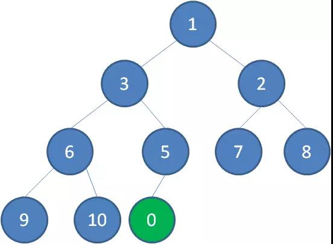

这时候，我们让节点0的它的父节点5做比较，如果0小于5，则让新节点“上浮”，和父节点交换位置。

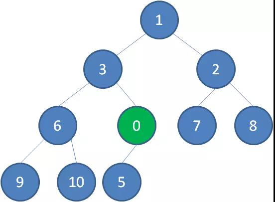

继续用节点0和父节点3做比较，如果0小于3，则让新节点继续“上浮”。

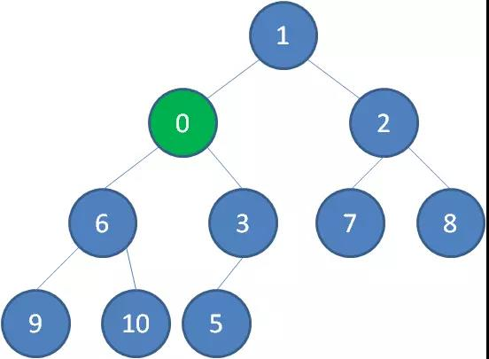

继续比较，最终让新节点0上浮到了堆顶位置。

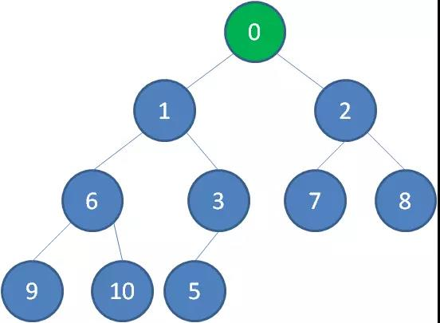

**2.删除节点**

二叉堆的节点删除过程和插入过程正好相反，所删除的是处于堆顶的节点。比如我们删除最小堆的堆顶节点1。

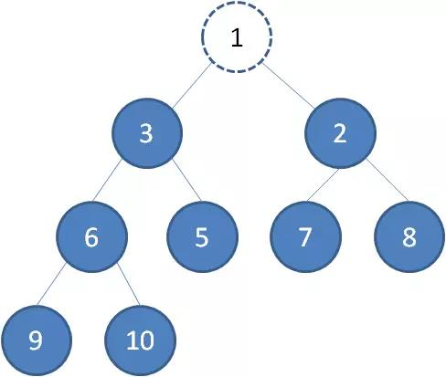

这时候，为了维持完全二叉树的结构，我们把堆的最后一个节点10补到原本堆顶的位置。

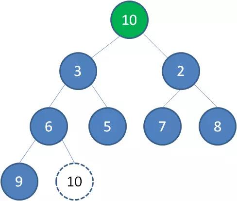

接下来我们让移动到堆顶的节点10和它的左右孩子进行比较，如果左右孩子中最小的一个（显然是节点2）比节点10小，那么让节点10“下沉”。

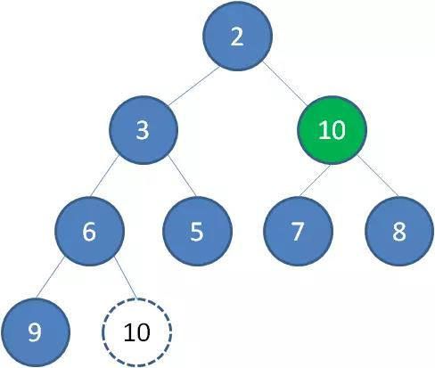

继续让节点10和它的左右孩子做比较，左右孩子中最小的是节点7，由于10大于7，让节点10继续“下沉”。

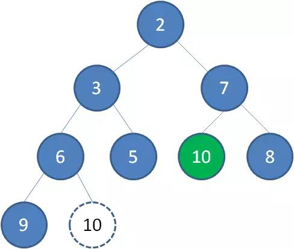

这样一来，二叉堆重新得到了调整。


**3.构建二叉堆**

构建二叉堆，也就是把一个无序的完全二叉树调整为二叉堆，本质上就是让**所有非叶子节点依次下沉**。

我们举一个无序完全二叉树的例子：

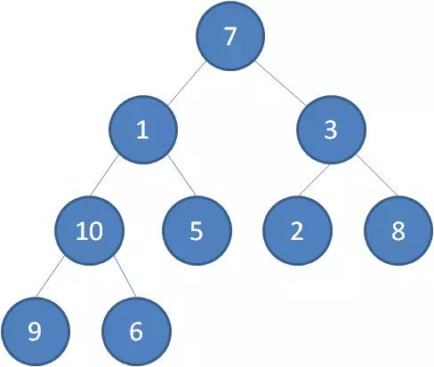

首先，我们从最后一个**非叶子**节点开始，也就是从节点10开始。如果节点10大于它左右孩子中最小的一个，则节点10下沉。

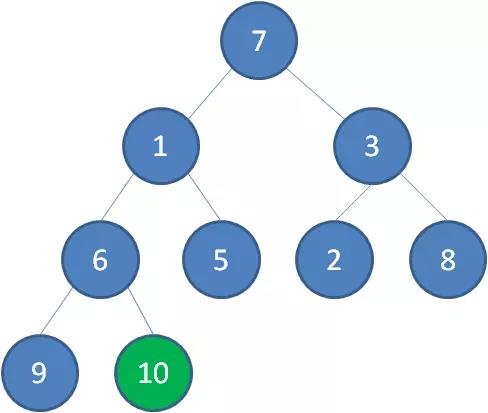

接下来轮到节点3，如果节点3大于它左右孩子中最小的一个，则节点3下沉。

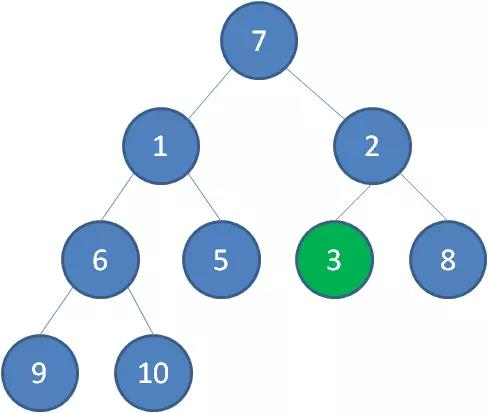

接下来轮到节点1，如果节点1大于它左右孩子中最小的一个，则节点1下沉。事实上节点1小于它的左右孩子，所以不用改变。

接下来轮到节点7，如果节点7大于它左右孩子中最小的一个，则节点7下沉。

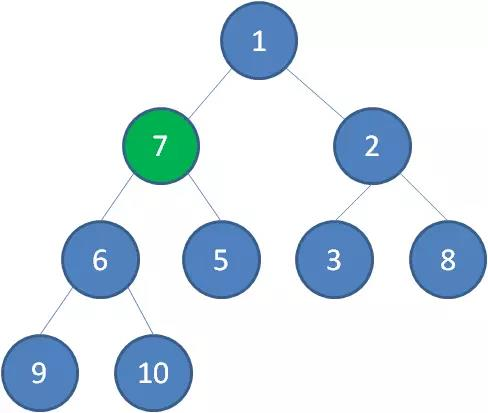

节点7继续比较，继续下沉。

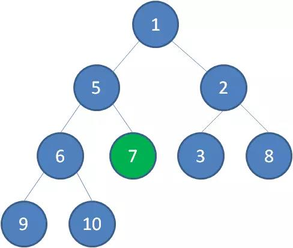

这样一来，一颗无序的完全二叉树就构建成了一个最小堆。

**堆的代码实现**

在撸代码之前，我们还需要明确一点：

二叉堆虽然是一颗完全二叉树，但它的存储方式并不是链式存储，而是顺序存储。换句话说，二叉堆的所有节点都存储在数组当中。


数组中，在没有左右指针的情况下，如何定位到一个父节点的左孩子和右孩子呢？

像图中那样，我们可以依靠数组下标来计算。

假设父节点的下标是parent，那么它的左孩子下标就是 **2\*parent+1**；它的右孩子下标就是  **2\*parent+2** 。

Python实现：

```

```


https://mp.weixin.qq.com/s/cq2EhVtOTzTVpNpLDXfeJg

## 二叉查找树

二叉查找树的特点：

1、若它的左子树不为空，则左子树上所有的节点值都小于它的根节点值。

2、若它的右子树不为空，则右子树上所有的节点值均大于它的根节点值。

3、它的左右子树也分别可以充当为二叉查找树。

优点：

可以快速找到想要找的值

缺点：

例如，初始的二叉查找树只有三个节点：9（根）-5（左）-13（右）

然后我们按照顺序陆续插入节点 4，3，2，1，0。所有的节点都会到左边，**这种形态的二叉查找树在查找的性能上，就大打折扣了，几乎变成了线性的。**

这个时候，就要用到平衡(AVL)二叉树。

## 平衡(AVL)二叉树

这种树就可以帮助我们解决二叉查找树刚才的那种所有节点都倾向一边的缺点的。具有如下特性：

1. 具有二叉查找树的全部特性。
2. 每个节点的左子树和右子树的高度差至多等于1。

在插入的过程中，会出现一下四种情况破坏AVL树的特性，我们可以采取如下相应的旋转。

1、左-左型：做右旋。

2、右-右型：做左旋转。

3、左-右型：先做左旋，后做右旋。

4、右-左型：先做右旋，再做左旋。


